# Express / XZ — the Indy's hardware-geometry graphics option

> The SGI Indy shipped with **two** mutually-exclusive graphics options on its GIO slot:
> **XL / Newport** (documented [here](index.md) — host does geometry, REX3 is raster-only) and
> **Express / XZ** (this page — a dedicated **hardware geometry** pipeline). Express is the
> "Elan-class" board: a SIMD array of floating-point **Geometry Engines** feeding a
> hyper-pipelined **Raster Engine**.
>
> **NOT needed for headless Henry** — like Newport, a headless Henry bus-errors the GIO aperture so
> IRIX never probes the slot (see [../peripherals/gio64.md](../peripherals/gio64.md)). This page is
> reference / future-work: it captures the architecture and maps it onto the real Indy ASICs. If you
> ever wanted Henry to do graphics, **Newport is the far smaller target** — Express adds a microcoded
> SIMD FP array *and* a command-FIFO front-end on top of a REX3-class rasterizer.

The canonical architecture reference is **Harrell & Fouladi, "Graphics Rendering Architecture for a High
Performance Desktop Workstation"** (ACM, 1993) — the SGI design paper for this pipeline, shipping as the
**IRIS Indigo Extreme** and (scaled) the **Indigo² Elan**. sgistuff.net cites the same paper as the
Express reference. The paper describes the *full* **8-GE / 2-RE** topology (that maximal config is
*Extreme*); the **Indy** runs the scaled **4-GE / 1-RE** Elan-class variant.

## Why it exists: hardware geometry vs Newport's host geometry

| | **XL / Newport** | **Express / XZ** |
|---|---|---|
| Geometry (transform + slope) | on the **host CPU FPU** | **in hardware** — SIMD array of GE7 Geometry Engines |
| Rasterization | REX3 | RE3 Raster Engine (hyper-pipelined) |
| Z-buffer | host system memory | **hardware** 24-bit Z (ZRB4) |
| CPU-facing interface | REX3 register writes | **command FIFO over GIO + FIFO-full interrupt** |
| Board form factor | single board | **two-board set, one GIO slot** (blocks other GIO options) |
| Indy config | XL8 / XL24 | **4× GE7 + 1× RE3**, 24-bit color + 24-bit Z |

Curiosity worth noting: on an **R5000 Indy the CPU is often faster than the GE7s**, so XL/Newport can
out-run XZ — Express only clearly wins when you need **hardware depth-buffering**. More silicon was not
automatically more speed; XZ was a Z-buffer/fill play.

## The pipeline and the real ASICs

The paper's abstract blocks map onto named Indy ASICs (the right column is what `gfxinfo` prints):

| Paper block | ASIC | `gfxinfo` (Indy) | Role |
|---|---|---|---|
| Command Parser (CP) | **HQ2** | **HQ2.1** | reads FIFO, distributes primitives to the GEs |
| Geometry Engine (GE) | **GE7** | — | custom FP core, **32 MFLOPS each**; per-vertex + slope calc |
| Raster Engine (RE) | **RE3** | **HQ3.1** | edge/span scan-conversion, per-pixel ops, framebuffer writes |
| *(output, not in paper)* | **VC1** | — | video timing (cf. Newport's VC2) |
| *(output, not in paper)* | **XMAP5 → XMAP7** | — | colormap / pixel-mode (cf. Newport's XMAP9) |
| *(output, not in paper)* | **ZRB4** | — | Z-buffer + RAMDAC |

```mermaid
flowchart LR
    HOST([host CPU]) -->|"writes render cmds<br/>over GIO (GIO32 on Indy)"| FIFO[["command FIFO<br/><small>full → IRQ to CPU</small>"]]
    FIFO --> HQ2["<b>HQ2</b> — Command Parser<br/><small>round-robin distribute · primitive-type compare</small>"]
    HQ2 -->|ping-pong buffers| SIMD["<b>GE7 ×4</b> — SIMD geometry<br/><small>shared sequencer + microcode + globals</small>"]
    SIMD -->|output FIFO| RE3["<b>RE3</b> — Raster Engine<br/><small>edge + span + per-pixel ops</small>"]
    RE3 --> FB[("framebuffer<br/>+ 24-bit Z (ZRB4)")]
    FB -->|scanout| VID["VC1 timing · XMAP5/7 colormap · RAMDAC"]
    VID -->|R/G/B| CRT([CRT])
```

Flow (matches sgistuff's functional description beat-for-beat): a **command token + data** is written into
the **FIFO**; **HQ2** reads it, detects primitive boundaries, and round-robins data into the **GE7** input
ping-pong buffers; the GE7s do per-vertex and slope math and write an **output FIFO**; **RE3** reads that
FIFO, does edge + span scan-conversion and per-pixel operations, and writes pixels (and Z) to the
framebuffer; the output chain (VC1 / XMAP / RAMDAC) scans it out.

## Geometry Engine (GE7) — the custom FP core

A single-chip microcoded floating-point processor, deliberately fused to do **both** per-vertex transform
**and** triangle/line slope calculation (their cycle costs are ~equal; slope math is too irregular to
hardwire). Design philosophy = *never starve the expensive FP units*:

- **1 FMPY + 1 FALU** (measured near-even multiply/add balance).
- **6 busses + 4 register-file ports** feed the 4 FMPY/FALU inputs; 2 busses are **result→input
  wrap-around** for single-thread dependency chains.
- **Multiple in-flight threads** of the same algorithm: when one thread stalls waiting on a result,
  another fills the unit; a multi-port register file parks intermediates.
- **3 vertex data stores** (input ping-pong + 2 "special" stores) because slope calc needs all three
  triangle vertices simultaneously and the register file is too small. A **6th bus** reaches off-chip
  **globals** memory.

## SIMD array (HQ2 + the GE7s)

The GE7s run as a **SIMD** array sharing one sequencer, one microcode store, and one globals memory —
chosen over a pipeline (unequal stages → sublinear) and MIMD (per-processor sequencer overhead). The
*only* cost over a uniprocessor is the **distribution function** in HQ2.

- **HQ2 (Command Parser)** round-robins primitives GE0→GEn and detects primitive-type boundaries via a
  **current-vs-previous command-token compare** (a different token → swap ping-pongs and fire the loaded
  GEs).
- **Load-bearing assumption:** primitives must arrive **clumped** (runs of all-triangles, then all-lines).
  Alternating lines/polys is the SIMD **worst case → collapses to uniprocessor** throughput. (SGI
  validated that CAD/CAE workloads clump.)
- **Input ping-pong buffer** (HQ2 fills one side while the GE runs the other) + **output FIFO** (lockstep
  writes) are both essential to the SIMD scheme. **Indirect addressing** into the data stores lets each
  lane address its vertices per its primitive's screen orientation while staying in lockstep; SIMD
  divergence (lighting / clip branches) is handled by **stalling the non-taken subset** during conditional
  subroutine calls.

## Raster Engine (RE3) — hyper-pipelined

Instead of replicating N parallel iterators (the era's default), Express **deep-pipelines a single
iterator** — **26 stages**, input ping-pong → color write — because pipe stages cost far fewer gates than
replicated iterators. The **DDA unit** (adder + 2:1 mux + feedback register) is the critical path that
sets the stage count; the clock is **5× DRAM page-mode rate**, matched to a **5-way interleaved color
buffer** (1 pixel/clock, contentionless along a span).

- **Edge processor** (10 stages, new span every other clock): decomposes a triangle into horizontal spans
  via major / first-minor / second-minor edge swap at the middle-Y vertex; emits per-span start
  R,G,B,A,X,Y,Z + pixel count.
- **Span processor** (6 iterators, 3-clock latency): **1 px/clk** when gouraud-shaded and/or Z-buffered;
  **4 px/clk** when flat-shaded and non-Z, using VRAM **block-write** → 4× on screen clears / flat 2D.
- **Per-pixel operators** (10 stages): 3 blend multipliers (R/G/B) + a logicop ALU; **Z-compare and
  stencil run in parallel** in the same stage count.
- **Memory interleave:** color buffer **5-way**, Z-buffer **10-way** — Z is read-modify-write (2× accesses,
  10-clock RMW), so 10 banks = no contention along a span. Z banks **share a page address** (single
  page-fault block) with a per-bank busy **scoreboard**; color blend/logicop RMW runs at **half** fill rate.
- In the maximal *Extreme* config there are **two** REs (odd RE → odd scanlines, even RE → even scanlines);
  the **Indy runs a single RE3**.

**Performance** (paper, full **8-GE / 2-RE Extreme** config): >1.3M depth-cued lines/s, >0.5M gouraud
Z-buffered triangles/s, 80M pixels/s sustained fill. The Indy's **4-GE / 1-RE** board is the scaled-down
fraction of this.

## Host programming interface (the FIFO token model)

The paper describes the *datapath*; it omits the *programming model* (the `sys/gr2hw.h` struct was never
open-sourced). That gap is filled by **Project CYAN's reverse-engineering** (NetBSD `grtworeg.h` + MAME's
`sgi_re2`) — see [Related work](../methodology.md#related-work). ⚠️ The addresses below are the **IP20
GR2** reconstruction; the Indy's **GR4** shares the chips and this programming model, but exact sub-offsets
may differ — treat as the model, not a verified GR4 register map.

**Key principle: the CPU never touches RE3 directly.** All rendering is a **token write into a FIFO**:
`base->fifo[TOKEN] = DATA`. The **HQ2** microcode reads the token, dispatches it to a **GE7**, which runs
geometry microcode that emits **RE3** raster commands. (For a software/HLE model you intercept at the FIFO
token level and skip the microcode entirely.)

**GIO slot-0 memory map** (base `0x1f000000`, 4 MB):

| Range | Region |
|---|---|
| `0x1f000000–0x1f01ffff` | shared data RAM (CPU↔GE communication, 128 KB) |
| `0x1f040000–0x1f05ffff` | **FIFO write port** (indexed by token number) |
| `0x1f060000` | HQ2 microcode RAM (32 KB) |
| `0x1f068000` | GE7 instances (×8) |
| `0x1f06a000` | **HQ2 registers** |
| `0x1f06c000…` | board rev / clock PLL / VC1 / Bt457 DACs / XMAP5 ×5 / RE3 register banks |

**HQ2 registers** (offset from `0x1f06a000`, selected):

| Off | Name | Notes |
|---|---|---|
| `0x40` | `VERSION` | RO; `[12:6]`=fifo_count, `[5]`=fifo_overflow, `[22:20]`=ge_ptr |
| `0x44` | `NUMGE` | number of GE7s (OR `FASTSHRAMCNT_4` for 8) |
| `0x5c/0x60` | `FIFO_FULL`/`FIFO_EMPTY` | high/low water marks (full → IRQ to CPU) |
| `0x64` | `GE7_LOAD_UCODE` | GE7 microcode word `[25:0]` (triggers load) |
| `0x74` | `INTR` | interrupt bit (host clears) |
| `0x78` | `UNSTALL` | WO; write 0 to start HQ+GE |
| `0x7c` | `MYSTERY` | RO; **must read `0xDEADBEEF`** — the board-presence probe |
| `0x80` | `REFRESH` | typ `0x10`/`0xf0` |

So Henry's board-probe contract for this option is concrete: **`MYSTERY` returns `0xDEADBEEF`**, `VERSION`
returns a sane version, and `ge[i].ram0[]` is read/write (the GE-count probe) — the equivalent of Newport's
GIO Product-ID handshake.

**PROM textport tokens** (`PUC_*`, FIFO base `0x1f040000`) — the minimal set the PROM uses for the console
*before* IRIX downloads its GL microcode:

| Token | Val | Operation |
|---|---|---|
| `PUC_INIT` | `0x191` | init GE7 for textport mode |
| `PUC_COLOR` | `0x192` | set drawing color (CI8) |
| `PUC_FINISH` | `0x193` | sync |
| `PUC_PNT2I` / `PUC_RECTI2D` | `0x194`/`0x195` | pixel / filled rect |
| `PUC_CMOV2I` / `PUC_LINE2I` | `0x196`/`0x197` | char-move / line |
| `PUC_DRAWCHAR` / `PUC_RECTCOPY` | `0x198`/`0x199` | glyph / rect copy-scroll |
| `PUC_DATA` | `0x1df` | data word for the previous command |

**RE3 `IR` (instruction register) commands** — what the GE microcode ultimately drives RE3 with (RE2 set,
the documented predecessor; RE3 is an evolution):

| IR | Op | Note |
|---|---|---|
| 1 | `SHADED` | Gouraud span |
| 2 | `FLAT` | 1×5 flat span |
| 3 | `FLAT4`/`BLOCKWRITE` | 1×20 flat span / block write |
| 4 / 5 | `TOPLINE` / `BOTLINE` | anti-aliased line halves |
| 6 / 7 | `READBUF` / `WRITEBUF` | framebuffer read / write |

Nice cross-check on the paper: `FLAT` writes **1×5** and `FLAT4`/`BLOCKWRITE` writes **1×20** — i.e. the
5-way color interleave × the 4-pixel VRAM block-write, exactly the paper's "1 px/clk shaded, 4 px/clk flat
block-write" span processor.

## Indy board set (GR4 Express)

Two boards in the Indy's **GIO32 slot** (occupies the slot; no other GIO option can coexist):

- **GP1** — the Geometry Engine board (the 4× GE7 + HQ2 + RE3 side).
- **VB3** — RAMDAC, the external **13W3** video connector, and the connector to the Indy mainboard.

General display features: 1280×1024 @ 60/72 Hz, 24-bit color, 24-bit Z, 4 stencil planes, 4 overlay + 4
window/clip-ID planes, accumulation buffer, hardware texture mapping, 8 light sources, full-scene
antialiasing, genlock/stereo. (Indigo² uses the analogous **GR3** boards: XZ = 2-GE, Elan = 4-GE.)

## Henry relevance

**Headless (current):** identical to Newport — Henry bus-errors the entire `0x1f000000–0x1fffffff` GIO
region, the slot reads empty, and IRIX never probes for HQ2/GE7/RE3. Nothing here is on the boot path.

**Future (graphics console):** Express is a **much bigger lift than Newport**, in roughly this order:

1. A **command-FIFO** front-end over GIO with a **FIFO-full interrupt** — a different (and larger) CPU
   contract than Newport's "write REX3 registers."
2. **HQ2** distribution + a **microcoded SIMD GE7 array** doing hardware geometry — there is no Newport
   equivalent; this is the part Newport deliberately pushed onto the host CPU.
3. An **RE3-class rasterizer** (comparable in scope to REX3) plus the **ZRB4** hardware Z-buffer.
4. The output chain (VC1 / XMAP / RAMDAC).

For a Henry graphics path, **Newport remains the recommended target** precisely because it omits items
1–2 (and 3's hardware Z). This page exists to document the high-end alternative and to tie the Harrell &
Fouladi paper to gfxinfo-visible Indy silicon — not as a build recommendation.

## Sources

- **Harrell, C. & Fouladi, F.**, "Graphics Rendering Architecture for a High Performance Desktop
  Workstation," *ACM* (Graphics Hardware), 1993 — local copy `chd-dumper/166117.166129.pdf`. The Express
  architecture spec (GE custom FP core, 8-GE SIMD, hyper-pipelined 26-stage RE, 5-way color / 10-way Z
  interleave). Ships as IRIS Indigo Extreme; scaled = Indigo² Elan.
- **sgistuff.net — Express graphics**, <http://www.sgistuff.net/hardware/graphics/express.html> — ASIC
  names (HQ2 / GE7 / RE3 / VC1 / XMAP5→7 / ZRB4), `gfxinfo` IDs (HQ2.1, HQ3.1), the Indy **GR4** board set
  (GP1 + VB3), per-system summary table, and the functional-flow description. (This page cites the same
  Harrell & Fouladi paper as its reference.)
- Henry GIO64 peripheral notes — [../peripherals/gio64.md](../peripherals/gio64.md) (slot map, Product-ID
  probe, empty-slot bus-error behavior).
- Newport overview (the other Indy graphics option) — [index.md](index.md).
