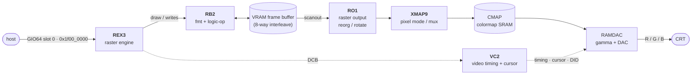

# Newport graphics board (overview)

> Intro: the Indy "XL" graphics board on GIO64 slot 0 (phys `0x1f000000`). NOT needed for a headless
> Henry boot (bus-error the aperture → IRIX skips it, see [../peripherals/gio64.md](../peripherals/gio64.md)).
> This is the future-work path for a Henry graphics console.

> **The Indy had two graphics options.** This page covers **XL / Newport** (host geometry, raster-only).
> The other was **Express / XZ** — a hardware-geometry pipeline (SIMD Geometry Engines + a hyper-pipelined
> Raster Engine); see [Express / XZ](express-xz.md). For a Henry graphics path, Newport is the far smaller
> target — Express adds a microcoded SIMD FP array and a command-FIFO front-end on top of a REX3-class
> rasterizer.

Newport is the entry-level (8-bit, upgradable to 24-bit) framebuffer graphics board for the SGI Indy.
SGI's own tagline for it was "the least graphics you'll ever need." There is **no geometry/transform
ASIC** — the host MIPS FPU is the geometry engine, and Z-buffering lives in host system memory. The
board is purely a 2D raster engine plus a framebuffer and the video-output backend. That makes it a
smaller (but still large) target than a full GE-class SGI pipe: the bulk of the work is REX3's drawing
command set, not a 3D pipeline.

## Board architecture

Five ASIC types (plus VRAM, a colormap SRAM, and an external RAMDAC) form a one-way pixel pipeline from
the host bus to the CRT. REX3 is the only host-facing chip; everything downstream is display/scanout.

Flow: **host → REX3** (programs primitives over GIO64) **→ framebuffer** (REX3 reads/writes VRAM
through RB2, which holds the read/write formatters + LogicOp) **→ RO1** (reads the VRAM serial/video
ports, merges overlay+color, undoes REX3's scanline stagger) **→ XMAP9** (selects pixel mode: RGB vs
color-index, picks the display ID) **→ CMAP** (colormap SRAM, in CI mode) **→ RAMDAC** (gamma + analog
RGB) **→ CRT**. **VC2** sits to the side as the video-timing/cursor/DID generator, driving sync and the
per-pixel cursor + display-ID streams; it is *not* in the pixel datapath but gates it. REX3 owns the
**Display Control Bus (DCB)**, an 8-bit side channel it uses to program VC2/XMAP9/RAMDAC (and read back).

## Address & host interface

Newport is the GIO64 **slot-0** device, based at phys `0x1f000000` (4 MB aperture). **REX3 is the only
host-programmable chip**: it is a GIO64 bus slave that decodes accesses into its own register file (and
into framebuffer PIO/DMA windows), and it forwards config to the rest of the board over the DCB. The
GIO bus interface runs at 33 MHz behind a 64-wide × 32-deep host FIFO; the framebuffer side is an 8-way
interleaved VRAM running at 66 MHz.

IRIX detects the board via the standard GIO64 **Product Identification Word** probe (word read at the
slot base; an empty slot bus-errors, a populated slot returns its product-ID). See
[../peripherals/gio64.md](../peripherals/gio64.md) for the probe protocol and the slot/address map.
For a headless Henry we make slot 0 answer "empty" by bus-erroring the aperture, so this REX3 ID never
appears and IRIX skips graphics entirely.

## The chips at a glance

| Chip   | Role                                                              | Doc                  | Pages |
|--------|-------------------------------------------------------------------|----------------------|-------|
| REX3   | Raster/rendering engine; host-facing GIO64 slave; DCB master      | [rex3.md](rex3.md)   | 149   |
| VC2    | Video timing generator, hardware cursor, display-ID (DID) encoder | [vc2.md](vc2.md)     | 42    |
| XMAP9  | Pixel-mode mux / colormap-index path (RGB vs CI, display IDs)      | [xmap9.md](xmap9.md) | 34    |
| RB2    | RAM Buffer: framebuffer read/write formatter + LogicOp (VRAM glue) | [rb2-ro1.md](rb2-ro1.md) | 16 |
| RO1    | ReOrganizer: VRAM serial-port readout, overlay merge, de-stagger  | [rb2-ro1.md](rb2-ro1.md) | 15 |

(CMAP is a colormap SRAM and the RAMDAC is an off-the-shelf part; neither has its own page here.)

## Henry relevance

**Headless (current):** Henry bus-errors the entire `0x1f000000–0x1fffffff` GIO region, so the graphics
slot reads as empty and IRIX never touches REX3. Nothing on this page is on the boot path. This is the
spec-correct "all slots empty" behavior, not a hack — see the gio64 doc.

**Future (graphics console):** to give Henry a display you would implement, at minimum, **REX3's GIO64
register face plus a framebuffer**, then a path from the framebuffer to a real (or emulated) video
output. Concretely:

1. Decode the slot-0 aperture and return a valid REX3 **Product-ID** so IRIX *finds* the board → verify:
   IRIX's GIO probe reports a Newport at slot 0 instead of bus-erroring.
2. Implement REX3's host-visible register file + the framebuffer PIO/DMA windows backed by real RAM →
   verify: the IRIX/PROM graphics init writes registers and clears the screen without faulting.
3. Implement the **rendering command set** (lines/spans/blocks via the Bresenham iterators, the DDA
   color iterators, dither/blend/LogicOp, fast-clear, screen-to-screen copy). **This is the bulk of the
   work** — it is most of the 149-page REX3 spec → verify: a known IRIX 2D workload draws correctly.
4. The scanout backend (VC2 timing, RO1/XMAP9/CMAP/RAMDAC) only matters if you drive a *physical* CRT;
   a software console can short-circuit to reading the framebuffer RAM directly. Treat VC2/XMAP9/RO1 as
   optional until real video output is a goal.

The big-ticket item is step 3: REX3 is where essentially all the complexity lives, because Newport
deliberately pushes geometry and Z onto the host and keeps everything downstream as fixed-function
scanout.

## Sources

- REX3 Specification, Rev 1.0 (SGI, Aug 1993) — `sgi/docs/indy_docs/newport/rex3.pdf` (§1.4 Newport
  architecture, §1.5 REX3 architecture, §3 programmer interface, §4 system interface).
- VC2 Specification, Rev 2.0 (SGI, May 1993) — `…/newport/vc2.pdf` (§2.1 system block diagram).
- XMAP9 Specification, Rev 2.1 (SGI, Oct 1993) — `…/newport/xmap9.pdf` (§1.2–1.4, Newport block diagram).
- RB2 (RAM Buffer) Specification, Rev 2.3 (SGI, 2000) — `…/newport/rb2.pdf` (§1.2 general description).
- RO1 (ReOrganizer) Specification (SGI) — `…/newport/ro1.pdf` (§1–2 functional description).
- Henry GIO64 peripheral notes — [../peripherals/gio64.md](../peripherals/gio64.md) (slot map, Product-ID
  probe, empty-slot bus-error behavior).
