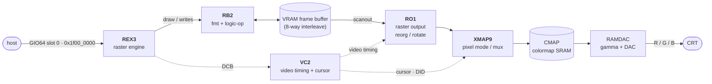

# Newport graphics board (overview)

> Intro: the Indy "XL" graphics board on GIO64 slot 0 (phys `0x1f000000`; REX3 registers at
> `0x1f0f0000`). **Henry does not implement any of it** — there is no REX3/VC2/XMAP9/RB2/RO1 logic in
> `rtl/` or `ip_hdl/`, and Henry boots headless on the serial console. These pages are (a) a reference
> description of the SGI hardware, (b) Henry's implementation status (none), and (c) the future-work
> path for a Henry graphics console.

> **The Indy had two graphics options.** This page covers **XL / Newport** (host geometry, raster-only).
> The other was **Express / XZ** — a hardware-geometry pipeline (SIMD Geometry Engines + a hyper-pipelined
> Raster Engine); see [Express / XZ](express-xz.md). For a Henry graphics path, Newport is the far smaller
> target — Express adds a microcoded SIMD FP array and a command-FIFO front-end on top of a REX3-class
> rasterizer.

Newport is the entry-level (8-bit, upgradable to 24-bit) framebuffer graphics board for the SGI Indy.
SGI's own tagline for it was "the least graphics you'll ever need." There is **no geometry/transform
ASIC** — the host MIPS FPU is the geometry engine, and Z-buffering lives in host system memory. The
board is purely a 2D raster engine plus a framebuffer and the video-output backend. That makes it a
smaller (but still large) target than a full GE-class SGI pipe: the bulk of the work is REX3's drawing
command set, not a 3D pipeline.

## Board architecture

Five ASIC types (plus VRAM, a colormap SRAM, and an external RAMDAC) form a one-way pixel pipeline from
the host bus to the CRT. REX3 is the only host-facing chip; everything downstream is display/scanout.

```mermaid
flowchart LR
    HOST([host]) -->|"GIO64 slot 0 · 0x1f00_0000"| REX3["<b>REX3</b><br/>raster engine"]
    REX3 -->|"draw / writes"| RB2["<b>RB2</b><br/>fmt + logic-op"]
    RB2 <--> VRAM[("VRAM frame buffer<br/>(8-way interleave)")]
    VRAM -->|scanout| RO1["<b>RO1</b><br/>raster output<br/>reorg / rotate"]
    RO1 --> XMAP9["<b>XMAP9</b><br/>pixel mode / mux"]
    XMAP9 --> CMAP[("CMAP<br/>colormap SRAM")]
    CMAP --> RAMDAC["RAMDAC<br/>gamma + DAC"]
    RAMDAC -->|"R / G / B"| CRT([CRT])
    REX3 -.->|"DCB"| VC2["<b>VC2</b><br/>video timing + cursor"]
    VC2 -.->|"cursor · DID"| XMAP9
    VC2 -.->|"video timing"| RO1
```

Flow: **host → REX3** (programs primitives over GIO64) **→ framebuffer** (REX3 reads/writes VRAM
through RB2, which holds the read/write formatters + LogicOp) **→ RO1** (reads the VRAM serial/video
ports, merges overlay+color, undoes REX3's scanline stagger) **→ XMAP9** (selects pixel mode: RGB vs
color-index, picks the display ID) **→ CMAP** (colormap SRAM, in CI mode) **→ RAMDAC** (gamma + analog
RGB) **→ CRT**. **VC2** sits to the side as the video-timing/cursor/DID generator, driving sync/blank timing and the
per-pixel cursor + display-ID streams (to XMAP9); it is *not* in the pixel datapath but gates it. REX3 owns the
**Display Control Bus (DCB)**, an 8-bit side channel it uses to program VC2/XMAP9/RAMDAC (and read back).

## Address & host interface

Newport is the GIO64 **slot-0** device, based at phys `0x1f000000` (4 MB aperture). **REX3 is the only
host-programmable chip**: it is a GIO64 bus slave whose registers sit at **slot base + `0xF0000`**
(`0x1f0f0000`; rex3.pdf p.20 gives the base as `0x1FnF0000`, and MAME maps `0x1f0f0000–0x1f0f1fff`).
Pixel PIO/DMA goes through the `HOSTRW` registers, not a separate memory window. REX3 forwards config
to the rest of the board over the DCB. The GIO bus interface runs at 33 MHz behind a 64-wide × 32-deep
host FIFO; the framebuffer side is an 8-way interleaved VRAM running at 66 MHz.

**Detection.** Newport has **no** GIO64 Product Identification Word at its slot base. Linux
(`arch/mips/sgi-ip22/ip22-gio.c`) first checks for Express (HQ2 `MYSTERY` register at slot + `0x6A07C`
reading `0xDEADBEEF`), then for a product-ID word, and finally treats a readable REX3 `USER_STATUS`
(slot + `0xF133C`) as "Newport present". How IRIX's own `ng1` driver probes is not documented here. See
[../peripherals/gio64.md](../peripherals/gio64.md) for the GIO64 slot/address map.

## The chips at a glance

| Chip   | Role                                                              | Doc                  | Pages |
|--------|-------------------------------------------------------------------|----------------------|-------|
| REX3   | Raster/rendering engine; host-facing GIO64 slave; DCB master      | [rex3.md](rex3.md)   | 149   |
| VC2    | Video timing generator, hardware cursor, display-ID (DID) encoder | [vc2.md](vc2.md)     | 42    |
| XMAP9  | Pixel-mode mux / colormap-index path (RGB vs CI, display IDs)      | [xmap9.md](xmap9.md) | 34    |
| RB2    | RAM Buffer: framebuffer read/write formatter + LogicOp (VRAM glue) | [rb2-ro1.md](rb2-ro1.md) | 16 |
| RO1    | ReOrganizer: VRAM serial-port readout, overlay merge, de-stagger  | [rb2-ro1.md](rb2-ro1.md) | 15 |

(CMAP is a colormap SRAM and the RAMDAC is an off-the-shelf part; neither has its own page here.)

## Henry relevance

**Implementation status (current RTL): nothing.** No Newport chip is modeled — a grep of `rtl/` and
`ip_hdl/` for rex3/newport/vc2/xmap finds only address-map comments. Henry boots IRIX and Linux headless
on the SCC serial console; nothing on this page is on the boot path. (Today's IRIX desktop is X11
forwarded over Ethernet / VNC, not a Henry framebuffer.)

What the graphics aperture actually does today: `henry_soc.sv` decodes only MC (`0x1fa…`), HPC3
(`0x1fb8…`–`0x1fbf…`) and IOC2; every other physical address, including `0x1f000000–0x1f3fffff`, falls
through to the external AXI memory port. In SGI mode `axi_is_the_worst_v1_0_M00_AXI.v` remaps
`0x1f000000–0x1fffffff` onto a 16 MB DRAM window (the same window that backs the boot-PROM image at
`0x1fc00000`), so **a load or store to the Newport aperture hits ordinary DRAM — it does not bus-error.**
(An out-of-range address returns `0xA5A5A5A5` with `mem_rsp_bad`, but the r9999 core ignores
`mem_rsp_bad`, and the IOC2 `buserr` input is tied to 0.) A graphics probe therefore sees whatever that
DRAM holds rather than an empty-slot bus error. Graphics interrupts (IOC2 Local1 VRETRACE etc.) are tied
to 0, and the MC graphics-DMA registers (`0x2000`+) are not implemented.

**Feasibility (study only, 2026-10-02; `NEWPORT_FEASIBILITY.md` at the repo root, not part of the
published docs).** The study recorded IRIX 6.5's Newport access stream under QEMU and compared three
designs:

- **Every access serviced by the Zynq ARM: not feasible** — 3–10× short on throughput even with a
  dedicated spinning A53, ~1000× short with today's polling loop.
- **Hybrid: feasible.** IRIX's stream is ~99.9% posted writes, so the PL can log writes into a DDR ring
  and answer STATUS/CONFIG/DCB-status reads from shadow registers, while an ARM thread runs a software
  REX3 (a port of MAME's) and does scanout. Estimated PL cost ~1–2K LUT.
- **REX3 rasterizer in PL: does not fit** Henry's current LUT budget.
- **Required by any design:** MC graphics DMA (Xsgi/GL use it for large Get/PutImage with no PIO
  fallback) and a vertical-retrace interrupt.

None of this is built; the measured rates are from QEMU traces, and the r9999 per-store cost was an
estimate, not a measurement.

**Generic scope of a Henry Newport** (independent of where the drawing runs):

1. Decode the REX3 register window (`0x1f0f0000–0x1f0f1fff`) and make the driver's probe succeed (e.g.
   a readable `USER_STATUS` at `0x1f0f133c`) → verify: the OS reports a Newport in slot 0.
2. Implement REX3's host-visible register file and the `HOSTRW` pixel path over a framebuffer in real
   RAM → verify: the IRIX/PROM graphics init writes registers and clears the screen without faulting.
3. Implement the **rendering command set** (lines/spans/blocks via the Bresenham iterators, the DDA
   color iterators, dither/blend/LogicOp, fast-clear, screen-to-screen copy). **This is the bulk of the
   work** — it is most of the 149-page REX3 spec → verify: a known IRIX 2D workload draws correctly.
4. The scanout hardware (VC2 timing, RO1/XMAP9/CMAP/RAMDAC) need not be rebuilt as chips — scanout can
   read the framebuffer RAM directly — but the driver still programs VC2/XMAP9/CMAP/RAMDAC over the DCB,
   so their register state (and correct DCB read replies) must exist, and a CI framebuffer must be
   displayed through the CMAP/XMAP9 mode state to look right.
5. **MC graphics DMA** and a **vertical-retrace interrupt** (VC2 VINTR → IOC2) — the feasibility study
   found IRIX depends on both (see above); neither exists in Henry today.

The big-ticket item is step 3: REX3 is where essentially all the drawing complexity lives, because
Newport deliberately pushes geometry and Z onto the host and keeps everything downstream as
fixed-function scanout.

## Sources

- REX3 Specification, Rev 1.0 (SGI, Aug 1993) — `sgi/docs/indy_docs/newport/rex3.pdf` (§1.4 Newport
  architecture, §1.5 REX3 architecture, §3 programmer interface, §4 system interface).
- VC2 Specification, Rev 2.0 (SGI, May 1993) — `…/newport/vc2.pdf` (§2.1 system block diagram).
- XMAP9 Specification, Rev 2.1 (SGI, Oct 1993) — `…/newport/xmap9.pdf` (§1.2–1.4, Newport block diagram).
- RB2 (RAM Buffer) Specification, Rev 2.3 (SGI; page footers dated 2000) — `…/newport/rb2.pdf` (§1.2 general description).
- RO1 (ReOrganizer) Specification (SGI) — `…/newport/ro1.pdf` (§1–2 functional description).
- Henry GIO64 peripheral notes — [../peripherals/gio64.md](../peripherals/gio64.md) (slot map).
- Linux `arch/mips/sgi-ip22/ip22-gio.c` (v6.12) — `ip22_check_gio()`: HQ2 `MYSTERY` / Newport `USTATUS`
  probe offsets.
- MAME `src/devices/bus/gio64/newport.cpp` — REX3 window `0xf0000–0xf1fff` within the slot.
- Henry RTL (implementation status): `rtl/henry_soc.sv` (device decode, `buserr(3'd0)`, Local1 sources
  tied 0), `ip_hdl/axi_is_the_worst_v1_0_M00_AXI.v` (SGI-mode `0x1f…` → DRAM remap).
- `NEWPORT_FEASIBILITY.md` (repo root, 2026-10-02 study; not published) — IRIX access-stream
  measurements and the ARM/hybrid/PL comparison.
