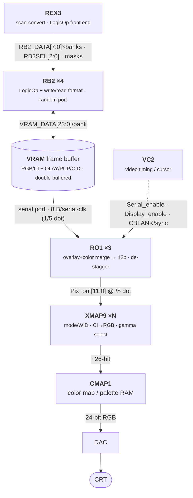

# RB2 (frame buffer) & RO1 (raster output) — Henry/Newport block spec

> Intro: the back-end of the Newport pixel pipeline — RB2 holds the framebuffer pixels (written by REX3,
> read for scanout), RO1 handles raster output toward the DAC/video. NOT needed for headless Henry.

Two small gate arrays sit at the tail of the Newport graphics board. **RB2** ("RAM Buffer 2") is the
read/write formatter + LogicOp engine that fronts the VRAM frame buffer; **RO1** ("ReOrganizer 1")
sits on the *serial* (scanout) side of that same VRAM, de-staggers and merges pixels, and feeds the
XMAP9 color-lookup chips on their way to the DAC. RB2 is the *random-port* path (REX3 ↔ VRAM);
RO1 is the *serial-port* path (VRAM ↔ display).

## RB2 — frame buffer

RB2 is a ~5K-gate LSI LCA-100K part (100-pin PQFP), located **between REX3 (the Raster Engine) and
the VRAM frame buffer**. It contains the read/write formatter and the LogicOp function of the pixel
pipe; the front end of the pixel pipe lives in REX3. It runs at up to 66 MHz internally
(`RB2_CLK`), generated by an on-chip PLL that 2× multiplies the 33 MHz `SYS_CLK` to minimize REX3↔RB2
clock skew (rb2.pdf p.2, p.11).

**Organization / banks / planes.** The frame buffer is 8 pixel ports = 4 memory banks × 2 pixels per
bank. Each RB2 handles **2 pixel ports**, so a full board uses **4 RB2 chips** (one each for BankA,
BankB, BankC, BankD); the two pixel datapaths inside one RB2 are identical (rb2.pdf p.8). Per RB2 the
buses are: `RB2_DATA_A0/A1[7:0]` to/from REX3 (8 bits/clock each side), and `VRAM_DATA_A0/A1[23:0]`
to/from VRAM0/VRAM1 of that bank (rb2.pdf p.4, Fig 3.1 p.7).

The plane set is the classic Newport layout — **RGB/CI color planes plus overlay (OLAY), pop-up (PUP),
and CID (window/context ID)** auxiliary planes — selected by the draw-register `planes[2:0]` field
(000 none, 001 RGB/CI, 010 RGBA, 100 OLAY, 101 PUP, 110 CID) (rb2.pdf p.9). Drawn depth is
`drawdepth[1:0]` = 4 / 8 / 12 / 24 bits (rb2.pdf p.9). Double-buffering is supported (`dblsrc` picks
source buffer0/buffer1; `dblbuf`/`rgbmode`/`fastclear` are draw-register bits) (rb2.pdf p.8).
The supported frame-buffer pixel formats (RGB-SB/DB 24-bit, CI-SB/DB 12-bit, 8-bit 3:3:2, RGBα 3324,
CID/AUX 2-bit-CID + 2-bit-PUP + 8-bit-AUX, etc.) are enumerated in rb2.pdf Table 4.4 (p.12).

**How REX3 writes it.** Color+alpha from REX3 is latched into RB2, goes down the pixel pipe, and is
written to VRAM. The function each cycle is set by `RB2SEL[2:0]` (decoded one clock earlier by the
DEC_CNTL block): 000 none, 001 write pixel/low OLAY-CID-PUP, 010 write high OLAY-CID-PUP, 011 load
write-mask + draw register, 100/101 read low/high, 110/111 CID-check low/high (rb2.pdf p.8). The
**LogicOp** block applies the full 16 raster ops (Clear / And / Xor / Or / Copy / … / Set) between
source (iterated) and destination (frame-buffer) pixels per `logicop[3:0]`; LogicOp is disabled
(plain Copy) when the field = 0011 (rb2.pdf p.9–10). RB2 also holds a **24-bit write-mask register**
and a **12-bit draw register**, loaded together by REX3 on `RB2SEL=011`; `RB2_SELWMSK` (driven by
REX3's `RAS_N`) muxes write-mask vs. write-data onto the VRAM bus — mask out during RAS precharge,
data out when RAS low (rb2.pdf p.8, p.10).

**Bandwidth / interface.** REX3↔RB2 runs at ¼ the VRAM page-mode cycle, 15 ns (66 MHz): 8 bits per
clock, so a 32-bit pixel takes 4 clocks (rb2.pdf p.6). On the VRAM side, each bank does a page-mode
read or write of two adjacent pixels in 60 ns — at max rate each bank takes/produces a new 24-bit
word every 60 ns (rb2.pdf p.6). Reads are reformatted from 24-bit frame-buffer format back to 32-bit
RGBA by the Read Format block before going to REX3 (rb2.pdf p.10).

## RO1 — raster output

RO1 is a ~10K-gate, 1 µm CMOS gate array (120-pin PQFP, ~97 signal pins, ~1 Kbit of FIFO), located
**between the frame buffer's serial port and the XMAP9 chips**, max 70 MHz (ro1.pdf p.1). It is the
scanout-side counterpart to RB2: where RB2 talks to the VRAM *random* port for REX3, RO1 reads the
VRAM **serial** port for display.

It reads the 8 banks of VRAM serial output (8 bytes per serial clock — `BANKA0..D1[7:0]`) and does two
jobs (ro1.pdf p.1):

1. **Overlay + color merge.** The frame buffer stores, per scanline segment, 32 bytes of overlay
   (4 bits/pixel) followed by 64 bytes of normal color (8 bits/pixel). RO1 reads 32 bytes of overlay
   in 4 serial cycles, then 64 normal-color bytes in 8 cycles, and **merges each 4-bit overlay with
   its 8-bit normal color** into a 12-bit pixel, 8 pixels in parallel. Two FIFOs (one overlay, one
   pixel; both 64 bits wide × 8 deep) buffer the data: they cross the serial-clock → dot-clock domain
   and keep ≥20 pixels queued so video never under-runs mid-scanline (ro1.pdf p.1, p.5).
2. **Scanline de-stagger (rotate).** REX3 draws with a per-scanline stagger; RO1 groups the 8 merged
   pixels into odd/even and **rotates each group by 0/1/2/3 pixels** under `SCANLINE[1:0]` (2 bits
   from REX3 tracking which line is in the VRAM shift register) to undo it (ro1.pdf p.1, Table 1 p.3).

Outputs are two 12-bit pixels per chip — `Pix_out_x0[11:0]` to XMAP9_0 and `Pix_out_x1[11:0]` to
XMAP9_1 — each "merged 8 bits normal color + 4 bits overlay," running at 1/2 the dot-clock rate
(odd/even interleave → effective 70 MHz). One RO1 serves 8 bit-planes, so a **24-bit system uses 3
RO1s** (ro1.pdf p.1–2, Table 2 p.4).

**Clocking.** RO1 takes `Pixclk_div2` (= 70 MHz, ½ dot clock) and **generates the VRAM serial clock
internally as 1/5 dot clock = 28 MHz** (`Serial_clk0/1`, each to 4 VRAM banks); FIFOs are stuffed at
the 1/5-dot serial rate and drained at the 1/8-dot rate (ro1.pdf p.2, p.5). The serial clock is gated
by **`Serial_enable` from VC2** and readout by **`Display_enable` from VC2**; VC2 must raise
`Display_enable` 60–65 dot clocks after `Serial_enable` so the FIFOs pre-fill (overlay ≥4 entries,
pixel ≥6) before active video (ro1.pdf p.2, p.5). Dot-clock range supported is 6 MHz (NTSC) to 140 MHz
(76 Hz refresh) (ro1.pdf p.3).

## The pixel pipeline end-to-end

(End-to-end topology: rb2.pdf Fig 3.1 p.7 for the REX3→RB2→VRAM front end; ro1.pdf p.1 and the "8-bit
mode backend" diagram p.9 for VRAM→RO1→XMAP9→CMAP1, with VC2 supplying `serial_enable`/`display_enable`.)

## Henry relevance

- **Headless (current):** n/a. Henry has no Newport board; graphics-space accesses bus-error by
  design. Nothing here is on the boot path — RB2/RO1 are pure display back-end.
- **Future (graphics console):** this pair defines the back half of any "wannabe Indy" display.
  RB2 is the **framebuffer-storage + LogicOp/format** model (4-bank × 2-pixel VRAM, RGB/CI + overlay
  planes, the 16 raster ops, double-buffer/write-mask semantics REX3 expects). RO1 is the **scanout**
  model (serial read, overlay/color merge, scanline de-stagger, FIFO clock-crossing, and the VC2
  `serial_enable`/`display_enable` handshake) that produces XMAP9-ready pixels. A Henry display path
  would re-implement RB2's formatter/LogicOp over its own framebuffer RAM and RO1's merge+scanout over
  a scanout FIFO — most of the staggering/serial-VRAM complexity is an artifact of 1990s VRAM and can
  collapse into a simpler linear-framebuffer + scanout-DMA on modern memory.

## Sources

- **rb2.pdf** — RAM Buffer (RB2) Spec, Rev 2.3 (Fouladi/Banerjee), 16 pp.
  - p.2 general description (REX3↔mem, LCA-100K, 66 MHz, 100-pin); p.3 Fig 1 block diagram.
  - p.4 pin table; p.6 §3.1/3.2 REX3↔RB2 (15 ns/¼ page) + RB2↔VRAM (60 ns/2-pixel) interfaces.
  - p.7 Fig 3.1 system interface (REX3 ↔ 4×RB2 ↔ 4 banks); p.8 §4 (4 RB2s, RB2SEL ops table,
    draw/write-mask regs); p.9 planes / drawdepth tables; p.9–10 §4.3 LogicOp 16-op table;
    p.10 read/write format + RB2_SELWMSK; p.11 §4.8 PLL clock; p.12 Table 4.4 frame-buffer formats.
- **ro1.pdf** — ReOrganizer 1 (RO1) Spec, 15 pp.
  - p.1 §1/§2 intro + functional (between FB and XMAPs, 8 banks in, overlay+color merge, rotate, FIFOs).
  - p.2 pinout (Pixclk_div2, Serial_enable/Display_enable from VC2, Serial_clk0/1, Scanline[1:0],
    Pix_out_x0/x1, BankA0..D1); p.3 Table 1 rotate encoding + dot-clock range; p.2/§3 1/5-dot serial
    clock generation; p.5 two-FIFO depths + §5 VC2 60–65-clock handshake; p.9 8-bit-mode backend
    diagram (VRAM→RO1→XMAP9→CMAP1, VC2).
