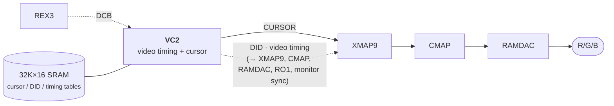

# VC2 — Video Timing & Cursor Controller (Henry/Newport block spec)

> VC2 generates the CRT timing (sync/blank), the display ID (DID), and the cursor (glyph or
> crosshair) for the Newport graphics board. It interprets tables held in its own external SRAM:
> a programmable video-timing state machine, a DID run-length stream, and a cursor pixel pattern.
> It is **not** programmed directly by the host — it sits on REX3's Display Control Bus (DCB), and
> the host pokes its registers/RAM through REX3. **Not needed for headless Henry** (graphics
> space bus-errors); this is future-work for a real display console.

Part: VC2, SGI 099-8918-001, Toshiba TC160G, 144 PQFP, ~27.5k gates (vc2.pdf p.2).

## Role & architecture

VC2 is one chip in the Newport pipeline. Newport datapath (p.3 block diagram):

The host (via REX3/DCB) writes three table types into the external SRAM; VC2 walks them in real
time to drive its outputs. It has six internal blocks (p.24):

- **DCB interface** — async handshake to REX3's DCB; the only host-facing port.
- **Master controller + master datapath** — a 16x16 register file of table pointers/counters and
  the memory controller that reads/writes the external SRAM on behalf of the other blocks.
- **Video Timing Generation (VTG)** — 16x28 FIFO (21 timing channels + 7-bit duration); drives the
  21 (+ duplicates) video timing channels: sync, blank, transfer-request, internal cursor/DID
  position strobes. Error flag on FIFO underflow.
- **DID Generation** — 64x20 FIFO; emits 5-bit window display IDs run-length-encoded across the
  scanline, 2 pixels wide, to XMAP9. Error flag on underflow.
- **Cursor Generation** — reads the cursor pattern table; emits a 2-wide cursor pixel stream to
  XMAP9. Supports 32x32x2 glyph, 64x64x1 glyph, and a full-screen crosshair.

DID and cursor are output 2 pixels wide at PCLK/2 (half the monitor pixel clock), so the timing
channels have 2-pixel resolution (p.2).

**Clocks (p.24):** VC2 takes PCLK/2 (≤70 MHz; max pixel rate 140 MHz). Backend (VTG/DID/cursor)
and the DCB always run at PCLK/2. The master controller/datapath run at PCLK/4 for hi-res
(pixel clock ≥70 MHz) and PCLK/2 for lo-res; a clock-enable gates the flops rather than muxing
clocks. The `Slow Clock` config bit selects the mode.

**External RAM:** 64 KB static RAM as 32Kx16, expandable to 64Kx16. RAM-address pointers are
15 bits (max 32767). Accessed by the host only through the DCB (RAM Address register + RAM Data
virtual register), big-endian, 2 bytes atomic.

## Register / RAM interface

Accessed over the DCB. The DCB exposes only 4 control-register-selects (CRS): CRS0 = Index reg,
CRS1/CRS2 = high/low byte of the indexed register, CRS3 = external RAM data. Because VC2's register
space is larger than the DCB address space, an **Index register** (5 bits) selects which internal
register CRS1/CRS2 touch. REX3's DCB auto-increment lets the host write Index then the 2 data
bytes in one burst; for RAM it writes the start address once then streams 2-byte words to CRS3
(RAM Address auto-increments) (p.16).

> **Hang warning (p.11):** before touching any register other than Index/Config, or the SRAM, the
> `Soft Reset` bit in the Configuration register must be set to 1 (normal operation). Otherwise VC2
> never acknowledges and both VC2 and the DCB hang.

**Register summary (p.10).** Shaded = host-programmed; rest are internal running pointers exposed
read-only for diagnostics. Addresses are the Index value.

| Idx  | Name                | Bits | Notes |
|------|---------------------|------|-------|
| —    | Index               | 5    | selects register for DCB access |
| 0x00 | Video Entry Pointer | 16   | start of video-timing frame table in SRAM |
| 0x01 | Cursor Entry Pointer| 16   | start of cursor glyph data; 128-word align (32x32x2) / 256-word (64x64x1) |
| 0x02 | Cursor X Location   | 16   | next cursor X (max 2047/4095); shadowed |
| 0x03 | Cursor Y Location   | 16   | next cursor Y (max 2047); write triggers X→CurrentX copy |
| 0x04 | Current Cursor X    | 16   | current X after update (R/O for programmer) |
| 0x05 | DID Entry Pointer   | 16   | start of Display-ID table in SRAM |
| 0x06 | Scanline Length     | 16   | visible pixels per scanline, bits[15:5] (max 2046); for DID gen |
| 0x07 | RAM Address         | 16   | address for host RAM access; auto-increments |
| 0x08–0x0F | (VT/DID/cursor running pointers + Vertical Line Counter) | 16 | diagnostic / R/O |
| 0x10 | Display Control     | 16   | enables + cursor/genlock mode (below) |
| 0x1F | Configuration       | 16   | soft reset, slow clock, error flags, revision |
| —    | RAM Data            | 16   | virtual register: external RAM data (CRS3) |

**Configuration register (Idx 0x1F, p.11):** bit0 `Soft Reset` (0=reset, 1=run; resets all but
DCB), bit1 `Slow Clock` (1 = monitor pixel rate <70 MHz), bit2 `Cursor Error`, bit3 `DID Error`
(DID FIFO underflow), bit4 `VTG Error` (VTG FIFO underflow) — error flags set by HW, cleared by
writing 0; bits[7:5] revision (000 = first rev); bits[15:8] read-only "Temp Hibyte" (high byte of
the last DCB transfer).

**Display Control register (Idx 0x10, p.12):**

| Bit | Name | Meaning |
|-----|------|---------|
| 0 | VINTR enable | enable vertical interrupt (when VINT timing channel active) |
| 1 | Blackout | 0 = blank display (forces CBLANK to RAMDAC), 1 = enable display |
| 2 | Video Timing Enable | 1 = run VTG from SRAM; 0 = channels driven to default |
| 3 | DID Function Enable | 1 = read DIDs from SRAM; 0 = drive DID 0 |
| 4 | Cursor Function Enable | 1 = read cursor pattern from SRAM |
| 5 | Gensync Enable | 1 = reset frame on GENSYNC input (genlock) |
| 6 | Interlace | monitor type: 0 = non-interlaced, 1 = interlaced |
| 7 | Cursor Enable | 1 = drive cursor pixels (effect immediate, not deferred to retrace) |
| 8 | Cursor Mode | 0 = glyph, 1 = crosshair |
| 9 | Cursor Size | 0 = 32x32x2, 1 = 64x64x1 (glyph mode only) |
| 10 | Genlock Select | 0 = GEN0, 1 = GEN1 |
| 15:11 | reserved | |

All Display-Control bits power up 0 (video disabled, blacked out).

### Table formats in SRAM

- **Video Timing Table (p.17–19):** a *frame table* of (line-sequence-pointer, line-count) runs,
  terminated by a 0x0000 run; each line-sequence is a circular linked list of *lines*; each line is
  a list of *state runs*. A state = 21 timing-channel bits split into State A/B/C (7 bits each:
  SA=VT[20:14], SB=VT[13:7], SC=VT[6:0]) plus a 7-bit duration (SRUN) in 2-pixel-clock units (max
  127). The A word always present; B/C word optional (bit7 of A flags presence). bit15 of the A
  word = end-of-line, followed by a pointer to the next line. ~150 words for a hi-res non-interlaced
  table, ~300 for NTSC/PAL.
- **Cursor Pattern Table (p.20–21):** raw glyph bitmap. 32x32x2 = 128 words (128-word aligned),
  two bit-planes; 64x64x1 = 256 words (256-word aligned). Crosshair needs no table.
- **Display ID Table (p.21–22):** a *frame table* of per-scanline pointers terminated by 0xFFFF,
  into a *scanline table* of transition records `{X-location[15:5], DID[4:0]}`; first X must be 0,
  end-of-line = X 0x7FF (2047). Run-length-encoded, so a sparse line is cheap. The same DID table
  serves multiple resolutions by changing only Scanline Length + DID Entry Pointer.

## Programming model (IRIX/X)

Power-on leaves VC2 with video disabled and blacked out; only Soft Reset is known. Bring-up
(p.15):

1. Program the RAMDAC for the target pixel clock.
2. Set `Slow Clock` if needed and release `Soft Reset` in Configuration (→ normal operation).
3. Load the video-timing tables into SRAM; write Video Entry Pointer.
4. Set `Video Timing Enable` (and Interlace) in Display Control; ~32 pixel clocks later video
   starts. VINTR / Blackout / Gensync may be enabled now or later.
5. Load DID tables; write DID Entry Pointer + Scanline Length.
6. Set `DID Function Enable`.
7. Set `Cursor Function Enable` (comes up glyph + disabled); write the cursor pattern into SRAM,
   set Cursor Enable + mode/size and the X/Y registers.

In steady state Video/DID/Cursor enables stay on. **Hardware cursor:** write Cursor X *then*
Cursor Y (the Y write copies X→Current X so the move is atomic); X/Y are relative to a point 31
px above/left of the visible screen so the glyph can slide partly off-screen (X=Y=31 = top-left
fully visible). VC2 double-buffers cursor pointer/position and swaps them during vertical
blanking, so the host need not disable the cursor to move it. Changing the *pattern* pointer or
mode coincident with an X/Y move should be done with the cursor disabled.

**Mode/clock change (p.15):** disable Cursor/DID/Video/VINTR/Gensync/Blackout, assert Soft Reset,
redo bring-up steps 1–4; DID and cursor tables/registers retain their values.

## Henry relevance

- **Headless (now):** N/A. Henry has no Newport board; the graphics address space bus-errors, so
  VC2 is never touched. Boot does not depend on it.
- **Future (graphics console):** required for a real display. VC2 is the piece that turns frame
  pointers + tables into CRT sync/blank, the hardware cursor, and per-pixel window DIDs. A Henry
  graphics block would need (a) a REX3-equivalent DCB master to reach VC2, (b) the external table
  SRAM, and (c) the XMAP9/CMAP/RAMDAC downstream. The hardware cursor and DID-based window IDs are
  the host-visible features X/IRIX would drive. Until that whole pipeline exists, VC2 is a
  reference spec only.

## Sources

- vc2.pdf p.2 — part/features, 2-wide PCLK/2 output, external RAM size.
- vc2.pdf p.3 — Newport system block diagram (REX3/DCB → VC2 → XMAP9/CMAP/RAMDAC).
- vc2.pdf p.5–6 — pin descriptions (DCB, MEM, XMAP, video timing channels).
- vc2.pdf p.10 — register summary table.
- vc2.pdf p.11 — Configuration register + soft-reset hang warning.
- vc2.pdf p.12 — Display Control register detail.
- vc2.pdf p.13–14 — cursor positioning, entry/X/Y registers, scanline length.
- vc2.pdf p.15 — reset / start-up / mode-change procedures.
- vc2.pdf p.16 — programming via the DCB (CRS, Index, atomic RAM access).
- vc2.pdf p.17–22 — table formats (video timing, cursor pattern, display ID).
- vc2.pdf p.24–25 — architecture: six blocks, clocks, VTG/DID/cursor generation.
