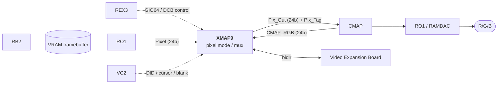

# XMAP9 — Colormap / Pixel Mapping (Henry/Newport block spec)

> Intro: XMAP9 takes framebuffer (RB2) pixel values and maps them through color-map / pixel-mode logic toward
> the RO1 DAC. Programmed via REX3's DCB. NOT needed for headless Henry. This is the backend of the Newport
> graphics subsystem: it picks which "plane" (pixel / overlay / underlay / cursor / pop-up / video) is visible at
> each pixel, formats it into a CMAP address or 24-bit RGB, and steers the result to the CMAP and the RO1 DAC.

XMAP9 is an LSI Logic 1.0 µm CMOS gate array (part 099-8913-001, L1A7726, 208 PQFP, ~19K gates), running at
half the pixel clock (70 MHz for a 1280×1024 @ 76 Hz screen). Newport uses **two** XMAP9s — one on the even
pixel path, one on the odd — so they jointly stream a pixel every dot clock; the config register bit 1 tells each
which path it owns (used for spatial dithering). It supports 24/12/8/4-bit RGB and 12/8/4-bit color-index (CI)
modes, plus double buffering for the 4- and 12-bit modes.

## Role & architecture

Pixel path position in the Newport backend:

- **Inputs:** `Pix_In[23:0]` (interleaved pixel data from RO1; in 8-bit systems bits 23:8 are ignored),
  `Aux_In[7:0]` (overlay/underlay), `Pup_In[1:0]` (global pop-up bits; become 2 extra aux bits when pop-up is
  off), and from VC2: `VC_DID[4:0]` (window display ID, ≤32 windows), `VC_Cur[1:0]` (2-bit cursor),
  `VC_C_Blank_N` (composite blanking — the master timing reference that gates mode-RAM writes and resets the
  dither matrix each line).
- **Outputs:** `Pix_Out[23:0]` to CMAP (24-bit RGB or 13-bit CI address), `Pix_Tag_Out[1:0]` (tells CMAP
  whether the value is CI or which of 3 RGB maps to use), `Gamma_Bypass_Out` (per-pixel DAC gamma disable).
- **Feedback / video:** the CMAP's mapped output returns on `CMAP_RGB[23:0]` and is re-packaged by XMAP9 for the
  optional Express Video board (`Vid0_*`, `Vid1_*`, two channels at pixel-clock/4, bidirectional in Express mode).

Internally (Fig 2 / §5) the chip is a pipeline: **Mode Register Table** (32 entries × 24-bit control words,
indexed by `VC_DID`+`VC_Cur`) → **Zero Detect** → **Pixel Format** (reformats each plane into a CI address or
duplicates bits up to 24-bit RGB) → **Pixel Select1** (the plane-priority decision tree, §3.3) → **Pixel
Select2** (the actual mux, drives `Pix_Tag`). A parallel **Video Select** block handles the graphics→video path.
Per-window behaviour lives entirely in the mode word selected by that window's DID; global state lives in the
config register and the Cursor/Pop-Up MSB registers.

## Register / colormap interface

XMAP9 is a slave on REX3's **Display Control Bus (DCB)** — an 8-bit async interface (no acknowledge), run at a
constant 33 MHz. Both XMAP9s share one `DCB_CS_Both_N` strobe. All registers are host-readable (diagnostics).
8 CRS-addressed registers (`DCB_CRS[2:0]`), Table 3a:

| CRS | Index   | R/W | Name                     | Bits | Notes |
|-----|---------|-----|--------------------------|------|-------|
| 0   | —       | R/W | Configuration Register   | 8    | power-on setup (see below); all-zero on reset |
| 1   | —       | R   | Revision Register        | 3    | chip spin, starts at 0 |
| 2   | —       | R   | FIFO Entries Available   | 3    | empty slots in mode-register FIFO; **grey-coded** (may be stale by ≤1) |
| 3   | —       | R/W | Cursor CMAP MSB          | 8    | top 8 bits of the cursor's CMAP address |
| 4   | —       | R/W | Pop-Up CMAP MSB          | 8    | top 8 bits of the pop-up's CMAP address |
| 5   | —       | W   | Mode Register Table (wr) | 32   | atomic write: 8-bit entry addr + 24-bit mode word, FIFO'd |
| 5   | 00–7F   | R   | Mode Register Table (rd) | 8    | diagnostic read, **one byte at a time** (via index reg) |
| 7   | —       | R/W | Mode Table Address Reg   | 8    | index register for indirect mode-RAM reads |

**Configuration Register (CRS 0)** — set once at power-on:

- bit 7 — Video Option board enable (0 = tristate the video bus; set 1 only if a board is fitted, else EMI)
- bit 6 — Video System Mode: 0 = Starter (12b in / 12b out), 1 = Express (24b bidir via `Vid_OE`)
- bits 5:4 — Video RGB Map select (00 = CI, 01/10/11 = RGB Map 0/1/2) used for the video path
- bit 3 — Fast/Slow DCB timing: 0 = Fast PClk (default), 1 = Slow PClk (tighter CS timing; see Table 3b)
- bit 2 — System width: 0 = 24-bit, 1 = 8-bit
- bit 1 — Even/Odd pixel path (this chip's role; for dithering)
- bit 0 — Pop-Up enable (0 = off → the 2 pup bits become aux bits; 1 = on)

**The CMAP** is an external 8K-entry (13-bit address) color map (separate Vitelic part, see CMAP spec). XMAP9
does not contain colormap RAM — it only *forms the address*. In CI mode the upper 11 bits come from the mode
register's `MSB_CMAP[4:0]` (and per-plane MSB registers), the lower bits from pixel data. In RGB mode `Pix_Tag`
selects one of three hardcoded 256×24 RGB maps inside the CMAP, addressed as `{11101|11110|11111, 8-bit color}`,
applied per color channel.

## Programming model

Two things get programmed: the **mode register table** (per-window pixel format) and the handful of global
registers above.

- **Mode words (the colormap/pixel-mode "program").** 32 entries, one 24-bit control word each, indexed by a
  window's `{VC_DID, VC_Cur}`. A write delivers 4 bytes over the DCB in one atomic op — `{5-bit entry addr,
  byte0, byte1, byte2}` (byte0 = bits 23:16, big-endian) — and lands in a FIFO that is **only drained into the
  mode RAM during blanking** (`VC_C_Blank_N` low), so the visible screen never tears. The host must not overrun
  the FIFO: poll the grey-coded *FIFO Entries Available* register (CRS 2), or pace writes to the
  blanking/pixel-clock rate. Mode-RAM reads are byte-at-a-time and only for diagnostics; allow ~10 cycles of
  write→RAM latency before reading back.

  Key mode-word fields (Table 3c, `Mode[23:0]`):

  | Field         | Bits   | Meaning |
  |---------------|--------|---------|
  | Aux_MSB_CMAP  | 23:19  | CMAP MSBs for aux (overlay/underlay) — always CI |
  | Aux_Pix_Mode  | 18:16  | overlay/underlay config (off / full underlay / full overlay / DB overlay / both) |
  | Alpha_En      | 15     | enable alpha for Express video (12b RGB + 8b α, or 8b DB RGB + 4b α) |
  | Video_Dither_Bypass | 14 | bypass video dithering |
  | Video_Mode    | 13:12  | 00 off / 01 overlay / 10 underlay / 11 replace-pixel |
  | Pix_Size      | 11:10  | 00 = 4 / 01 = 8 / 10 = 12 / 11 = 24 bpp (24 not allowed for CI) |
  | Pix_Mode      | 9:8    | 00 = CI, 01/10/11 = RGB Map 0/1/2 |
  | MSB_CMAP      | 7:3    | CMAP MSBs for CI mode (8-bit CI uses 5 of these, 12-bit CI uses 1) |
  | Gamma_Bypass  | 2      | bypass DAC gamma for this window |
  | OVL_Buf_Sel   | 1      | overlay double-buffer select |
  | Buf_Sel       | 0      | RGB/CI double-buffer select (buf0/buf1) |

- **Pixel formats (Table 3d/3f).** Frame-buffer bits are interleaved; XMAP9 de-interleaves and, for RGB,
  *duplicates* bits up to a full 8-bit-per-channel value (so e.g. 8-bit 3:3:2 RGB still reaches a true blue
  rather than a darkened one). Supported: 4/8/12/24-bit RGB, 4/8/12-bit CI, with double-buffer variants and
  RGBA (e.g. 3324+3324 DB, 4448 SB).
- **Plane priority (the visible-pixel decision tree, §3.3),** highest to lowest: **Cursor** (nonzero) → **Pop-Up**
  (nonzero) → **Overlay** (enabled & nonzero) → **Video overlay** (key) → **Video replace** (key) → **Pixel**
  (nonzero, unless video-replace) → **Video underlay** → **Underlay** → final video-replace/pixel fallback.
  Cursor and pop-up are global (no DID); their CMAP-address MSBs come from CRS 3 / CRS 4, not the mode word.
- **Global setup:** write the Configuration Register and the Cursor/Pop-Up MSB registers once at power-on; these
  are never modified by the chip. There is no way to change a register at an exact screen position — register
  changes are guaranteed synchronous but land at an arbitrary point in the frame, so you cannot, e.g., swap the
  video RGB map per-window.

## Henry relevance

- **Headless Henry: n/a.** Henry has no framebuffer and bus-errors all GIO64 graphics-slot accesses (see
  `peripherals/gio64.md`), so REX3/XMAP9/CMAP/RO1 never exist on the bus and IRIX skips the graphics console.
  None of this block is needed to boot.
- **Future graphics console.** A real display would require the whole Newport backend, not just XMAP9: REX3 (the
  rendering engine + DCB master), the RB2/VRAM framebuffer, RO1 (VRAM reorg → pixel stream), VC2 (timing, DID,
  cursor), the external CMAP, and the RAMDAC. XMAP9's job in that chain is purely the colormap-address / plane-mux
  formatting described here. For a minimal headless-with-text-console intermediate, none of the per-window mode
  machinery is required — but there is no partial XMAP9: it sits inline on every displayed pixel. Treat this doc
  as a reference for *when* a framebuffer is added, not a near-term implementation target.

## Sources

- Part / general description / features: xmap9.pdf p.2 (§1.1–1.3).
- Newport system & XMAP9 block diagrams (pixel path, two-XMAP9 even/odd): p.3–4 (Fig 1–2), p.23 (§4.1–4.3).
- Pin list (Pix/Aux/Pup, CMAP, VC2, video, DCB, clocks): p.7–10 (Tables 2a–2g).
- Register summary & config register: p.11–13 (§3.1, Tables 3a–3b).
- Mode register table & bit definitions: p.14–15 (§3.1.3, Table 3c).
- DCB programming sequence (4-byte atomic write, indexed reads): p.15 (§3.2).
- Plane-priority decision tree: p.16 (§3.3).
- Frame-buffer pixel formats / RGB & CI display modes / CMAP address formats: p.17–22 (§3.4, Tables 3d–3n).
- CMAP / VC2 interface detail (8K map, 3× RGB maps, tag encoding): p.23 (§4.2–4.3).
- Display-select / video-select / mode-register internal blocks: p.25–28 (§5.1–5.5, Fig "Display/Video Select").
- Composite-blank timing restrictions (mode-RAM write window, dithering): p.31 (§6.5.5).
