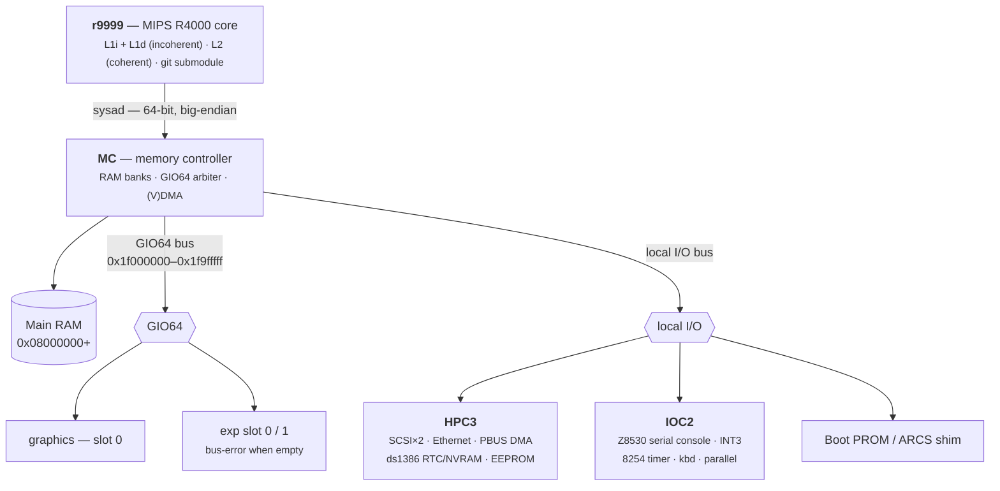

# Henry — the wannabe IP22 SoC

**Henry** is a from-scratch, FPGA/RTL **System-on-Chip** that impersonates the SGI **Indy** (board code
**IP22**) closely enough to boot **IRIX 6.5.22**. It is built around the **[r9999](https://github.com/dsheffie/r9999)**
MIPS R4000-class core (included here as a git submodule) plus a set of re-implemented IP22 peripheral blocks.

> **Why "Henry"?** The SGI **Indy** is named for **Indiana Jones** — whose real name is **Henry** (Walton Jones Jr.;
> "Indiana" was the dog). Henry is a machine that answers to a name that isn't quite its own: a *wannabe* IP22.

This site is the **platform specification and implementation reference**: the address map, each peripheral block's
register interface and "minimum to boot" subset, the ARCS firmware shim, the IRIX boot/console contract, and the
cache/coherence/TLB rules the CPU must honor. Every claim is **cross-validated against MAME** booting the real Indy
IRIX image — MAME is Henry's **golden reference model**, and the values captured from it are the block-level test
vectors. Tags: ✅ = confirmed in MAME, ⚠️ = a correction to an earlier reverse-engineering finding.

## The system at a glance

## Canonical physical address map (IP22 / Henry)

| Physical range | Size | Block | Henry notes |
|---|---|---|---|
| `0x00000000–0x0007ffff` | 512 KB | **RAM alias** | aliases `0x08000000`; holds the exception vectors (`0x0`, `0x80`) |
| `0x08000000–0x17ffffff` | 256 MB | **Main RAM** (MC banks) | base of physical DRAM; sized via MC MEMCFG |
| `0x18000000–0x1effffff` | 112 MB | reserved | bus-error |
| `0x1f000000–0x1f9fffff` | 10 MB | **GIO64 bus** | graphics @`0x1f000000`; exp slots @`0x1f400000`/`0x1f600000`; bus-error empty slots |
| `0x1fa00000–0x1faffff` | 1 MB | **MC registers** | ⚠️ big-endian `+4/+c` register alias |
| `0x1fb80000–0x1fbfffff` | 512 KB | **HPC3** | + IOC2 @`0x1fbd9800` (serial console), ds1386 RTC/NVRAM @`0x1fbe0000` |
| `0x1fc00000–0x1fffffff` | 4 MB | **Boot PROM** | Henry plants the ARCS shim |
| `0x20000000–0x2fffffff` | 256 MB | **High system memory** | kseg-mapped only → physical address space is **30-bit** |

(See [Memory & address map](peripherals/mc.md) for the MC/MEMCFG detail.)

## Where to start

| If you want to… | Read |
|---|---|
| understand the whole system | this page + [Architecture](architecture.md) |
| wire r9999 in & know what to implement | [CPU integration](cpu-integration.md) |
| get IRIX to print "IRIX is alive" | [Boot & console](boot-and-console.md) + [IOC2](peripherals/ioc2.md) |
| drive an interrupt-driven serial console | [SCC implementation & Tx interrupt](peripherals/scc.md) |
| build the firmware Henry presents | [Firmware / ARCS shim](firmware-arcs.md) |
| get cache/DMA/TLB right | [Cache, coherence & TLB](coherence-cache-tlb.md) |
| implement a chip | the [peripheral specs](peripherals/mc.md) |
| follow the IRIX boot, function by function | [IRIX boot flow](irix-boot-flow.md) |
| reproduce/extend the findings | [Methodology](methodology.md) |

## Status

Henry **boots IRIX 6.5.22 on real FPGA silicon** (Ultra96-v2, Zynq UltraScale+): PROM/ARCS → IRIX kernel
banners → SCSI DMA → miniroot → IRIX userspace (INIT / syslogd). The RTL (`rtl/`) and the Verilator
co-simulation harness (`sim/`, `henry_tb`) are implemented and working. Peripheral RTL implemented: MC, HPC3,
IOC2/SCC (Z8530 console), the ds1386 RTC, plus an ARM/PS-serviced SCSI disk bridge (the driver polls the `scsi_shim` doorbell and walks the HPC3 `{BP,BC,DP}` descriptor chain in shared DRAM, depositing disk data into guest buffers). The peripheral specs (MC, IOC2,
HPC3, GIO64, VDMA) and the cross-cutting docs are drafted from the SGI IP22 chip documents + MAME validation.
Newport graphics and audio (HAL2) are documented but **not** in the boot path — Henry runs headless on the serial
console. The detailed working notes live in the [`r9999/`](https://github.com/dsheffie/r9999) submodule
(`IRIX_CPU_REQUIREMENTS.md`, `IRIX_KERNEL_GAPS.md`, `IP22_CHIP_REGISTERS.md`, `MAME_QUESTIONS.md`).
