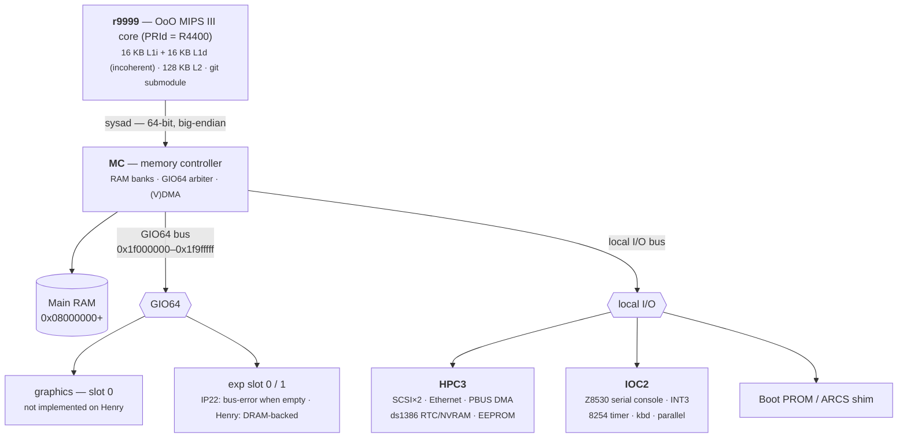

# Henry — the wannabe IP22 SoC

**Henry** is a from-scratch, FPGA/RTL **System-on-Chip** that impersonates the SGI **Indy** (board code
**IP22**) closely enough to boot **IRIX 6.5.22**. It is built around the **[r9999](https://github.com/dsheffie/r9999)**
out-of-order MIPS III core — it presents itself to software as an **R4400** (`PRId 0x0440`) — included here as a git
submodule, plus a set of re-implemented IP22 peripheral blocks.

> **Why "Henry"?** The SGI **Indy** is named for **Indiana Jones** — whose real name is **Henry** (Walton Jones Jr.;
> "Indiana" was the dog). Henry is a machine that answers to a name that isn't quite its own: a *wannabe* IP22.

This site is the **platform specification and implementation reference**: the address map, each peripheral block's
register interface and "minimum to boot" subset, the ARCS firmware shim, the IRIX boot/console contract, and the
cache/coherence/TLB rules the CPU must honor. Every claim is **cross-validated against MAME** booting the real Indy
IRIX image — MAME is Henry's **golden reference model**, and the values captured from it are the block-level test
vectors. Tags: ✅ = confirmed in MAME, ⚠️ = a correction to an earlier reverse-engineering finding.

## The system at a glance

```mermaid
flowchart TD
    CPU["<b>r9999</b> — OoO MIPS III core (PRId = R4400)<br/><small>16 KB L1i + 16 KB L1d (incoherent) · 128 KB L2 · git submodule</small>"]
    CPU -->|"sysad — 64-bit, big-endian"| MC["<b>MC</b> — memory controller<br/><small>RAM banks · GIO64 arbiter · (V)DMA</small>"]
    MC --> RAM[("Main RAM<br/>0x08000000+")]
    MC -->|"GIO64 bus<br/>0x1f000000–0x1f9fffff"| GIO{{GIO64}}
    GIO --> GFX["graphics — slot 0<br/><small>not implemented on Henry</small>"]
    GIO --> EXP["exp slot 0 / 1<br/><small>IP22: bus-error when empty · Henry: DRAM-backed</small>"]
    MC -->|local I/O bus| LIO{{local I/O}}
    LIO --> HPC3["<b>HPC3</b><br/><small>SCSI×2 · Ethernet · PBUS DMA<br/>ds1386 RTC/NVRAM · EEPROM</small>"]
    LIO --> IOC2["<b>IOC2</b><br/><small>Z8530 serial console · INT3<br/>8254 timer · kbd · parallel</small>"]
    LIO --> PROM["Boot PROM / ARCS shim"]
```

## Canonical physical address map (IP22 / Henry)

| Physical range | Size | Block | Henry notes |
|---|---|---|---|
| `0x00000000–0x0007ffff` | 512 KB | **RAM alias** | aliases `0x08000000`; holds the exception vectors (`0x0`, `0x80`) — remapped in `henry_soc.sv` before DRAM arbitration (CPU accesses only) |
| `0x08000000–0x17ffffff` | 256 MB | **Main RAM** (MC banks) | base of physical DRAM; sized via MC MEMCFG (Henry's `mc.sv` reset value describes **128 MB**; the `henry_arcs` FSBL reprograms MEMCFG0 to 256 MB, which is what IRIX sees) |
| `0x18000000–0x1effffff` | 112 MB | reserved | IP22: bus-error. Henry: not decoded — passed to the AXI port; outside the DRAM window reads return a `0xA5A5…` poison pattern and writes are dropped, with **no** bus error |
| `0x1f000000–0x1f9fffff` | 10 MB | **GIO64 bus** | graphics @`0x1f000000`; exp slots @`0x1f400000`/`0x1f600000`. IP22 bus-errors empty slots; **Henry has no GIO64 decode and no graphics** — the whole `0x1f000000–0x1fffffff` window that isn't MC/HPC3/IOC2 is remapped onto a 16 MB shared-DRAM window (`ip_hdl/axi_is_the_worst_v1_0_M00_AXI.v`) |
| `0x1fa00000–0x1faffff` | 1 MB | **MC registers** | ⚠️ big-endian `+4/+c` register alias |
| `0x1fb80000–0x1fbfffff` | 512 KB | **HPC3** | + IOC2 @`0x1fbd9800` (serial console), ds1386 RTC/NVRAM @`0x1fbe0000` |
| `0x1fc00000–0x1fffffff` | 4 MB | **Boot PROM** | DRAM-backed on Henry; the host loads the ARCS first-stage image (`henry_arcs.bin`) here and starts the core at `0xbfc00000` |
| `0x20000000–0x2fffffff` | 256 MB | **High system memory** | kseg-mapped only → the IP22 platform's physical address space is **30-bit** (r9999 itself carries 36-bit PAs, `PA_WIDTH=36`) |

(See [Memory & address map](peripherals/mc.md) for the MC/MEMCFG detail.) On Henry, nothing in this map raises a
**bus error**: `henry_soc.sv` decodes only MC, HPC3 and IOC2, the IOC2/INT3 bus-error input is tied to 0, and the
core ignores the AXI master's `mem_rsp_bad`. See [Architecture](architecture.md#how-henry-realizes-it-rtl-fpga).

## Where to start

| If you want to… | Read |
|---|---|
| understand the whole system | this page + [Architecture](architecture.md) |
| wire r9999 in & know what to implement | [CPU integration](cpu-integration.md) |
| get IRIX to print "IRIX is alive" | [Boot & console](boot-and-console.md) + [IOC2](peripherals/ioc2.md) |
| drive an interrupt-driven serial console | [SCC implementation & Tx interrupt](peripherals/scc.md) |
| build the firmware Henry presents | [Firmware / ARCS shim](firmware-arcs.md) |
| get cache/DMA/TLB right | [Cache, coherence & TLB](coherence-cache-tlb.md) |
| implement a chip | the [peripheral specs](peripherals/mc.md) |
| follow the IRIX boot, function by function | [IRIX boot flow](irix-boot-flow.md) |
| reproduce/extend the findings | [Methodology](methodology.md) |

## Status

*As of 2026-10-04 (henry `main` @ `209e6f6`, r9999 submodule @ `5c89b70`; deployed bitstream md5 `f66c6d49dfb1`).*

Henry **boots IRIX 6.5.22 on real FPGA silicon** (Ultra96-v2, Zynq UltraScale+ ZU3EG, 100 MHz): PROM/ARCS →
IRIX kernel → SCSI disk → multi-user IRIX userspace. On silicon IRIX runs SPEC CINT95 (`-Ofast` builds), talks to
the network (`telnet` into the guest), and runs X11 clients (4Dwm) against an X/VNC server on the Zynq ARM side;
IP22 Linux boots as well. Henry has no Newport graphics hardware — X11 goes over the
network, and the system console is the Z8530 serial port.

Implemented SoC RTL (`rtl/`): **MC**, **HPC3**, **IOC2** with the **Z8530 SCC** console (Tx and Rx) and the
i8254, the **INT3** interrupt mux (`int3.sv`), the **ds1386 RTC/NVRAM** (in `hpc3.sv`), an **ARM/PS-serviced SCSI disk**
(`scsi_shim.sv`: the driver polls the doorbell and walks the HPC3 `{BP,BC,DP}` descriptor chain in shared DRAM,
depositing disk data straight into guest buffers), and **Seeq 8003 + HPC3 ENET** (`enet_shim.sv`, likewise
serviced by the ARM through a host tap). Because the ARM does the DMA, cache coherence for DMA is maintained by
ARM-requested whole-cache and per-page flushes injected into the core (see [Architecture](architecture.md)).
The Verilator co-simulation harness (`sim/`, `henry_tb`, with an ISS lock-step checker) is the pre-silicon
vehicle. FPGA resource/timing history is on the [FPGA stats](fpga_stats.md) page.

The peripheral specs (MC, IOC2, HPC3, GIO64, VDMA) and the cross-cutting docs are drafted from the SGI IP22
chip documents + MAME validation. Newport graphics and audio (HAL2) are documented but **not** implemented.
The detailed working notes live in the [`r9999/`](https://github.com/dsheffie/r9999) submodule
(`IRIX_CPU_REQUIREMENTS.md`, `IRIX_KERNEL_GAPS.md`, `IP22_CHIP_REGISTERS.md`, `MAME_QUESTIONS.md`).
