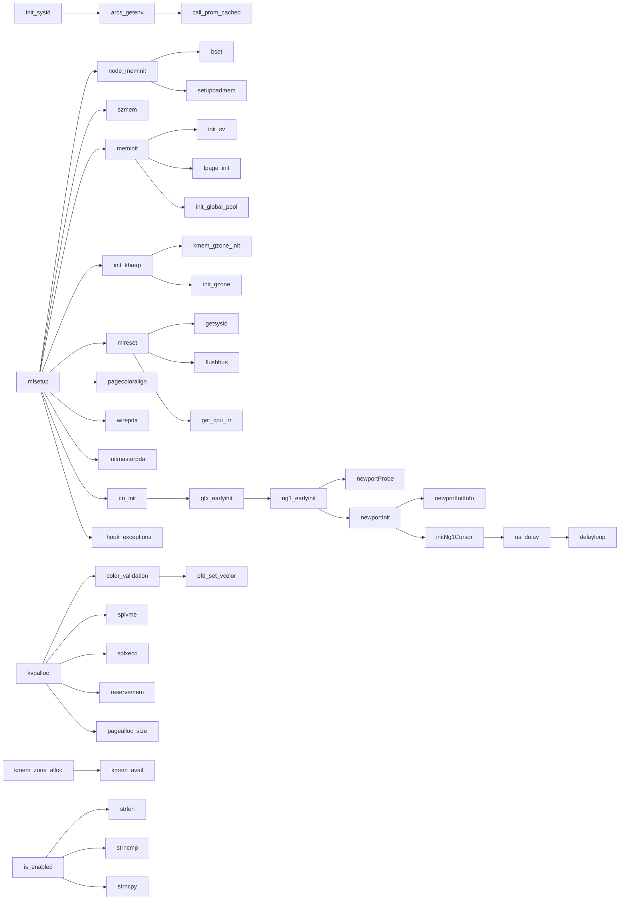

# Anatomy of an IRIX kernel boot

*A function-by-function walk through the first 14 million instructions of a real IRIX 6.5 `/unix` booting on an SGI Indy — reconstructed from a retired-PC trace of MAME's `indy_4610` (R4600) and the symbolized kernel.*

This page is in the spirit of [maizure.org's "Evolution of the x86 context switch in Linux"](https://www.maizure.org/projects/evolution_x86_context_switch_linux/): follow the real control flow, name every function, and explain what each one is *for*. It doubles as the golden reference the [MAME-oracle methodology](methodology.md) checks Henry against — several functions below are exactly where we found (and fixed) SoC/core bugs.

!!! info "How this was made"
    - **Oracle:** MAME `indy_4610` booting genuine IRIX 6.5.22 (`mips3` interpreter, `-nodrc`), instrumented to dump one retired virtual PC per line from kernel entry (`start`, `0x88005960`).
    - **Trace:** 14,000,000 instructions — `start` through the first device probes, ending inside a hardware-settle delay loop.
    - **Symbols:** `mips-linux-gnu-nm` on the extracted `/unix` (N32, not stripped, 7,511 text symbols). Each PC is mapped to its enclosing function by address.
    - **What ran:** **190 distinct functions**, **9,685 call events**, **274 caller→callee edges**.
    - Counts below are *instructions retired in that function* across the whole trace (`instret`), and *first @insn* is the instruction index where the function first appears (the boot timeline).

---

## The 30,000-foot view

IRIX hands off from the ARCS PROM / `sash` loader to **one** function that orchestrates almost everything you see here: **`mlsetup`** (machine-language setup). `mlsetup` is the spine — it calls the cache, TLB, platform, memory and device init routines roughly in the order below, then control eventually reaches the scheduler. Our 14M-instruction window covers `start` through the **Newport graphics probe**, where a long hardware-settle delay runs out the capture.

```mermaid
flowchart TD
    A["start (0x88005960)<br/>ARCS handoff: a0=argc, a1=argv, a2=envp"] --> B["mlsetup<br/><i>the boot spine</i>"]
    B --> P1["① cache config & boot args<br/>config_cache · getargs · is_enabled"]
    P1 --> P2["② page coloring + PDA wiring<br/>pagecoloralign · wirepda · flush_cache"]
    P2 --> P3["③ mlreset: platform reset & system ID<br/>mlreset · getsysid · init_sysid · call_prom_cached"]
    P3 --> P4["④ NVRAM · ECC · VDMA<br/>load_nvram_tab · allocate_ecc_info · VdmaInit"]
    P4 --> P5["⑤ CPU freq & timing calibration<br/>findcpufreq_raw · _cpuclkper100ticks"]
    P5 --> P6["⑥ PDAs · locks · exception vectors<br/>initmasterpda · _hook_exceptions"]
    P6 --> P7["⑦ LEDs · sleep/sema · sanity · szmem<br/>szmem · devavail · *_sanity"]
    P7 --> P8["⑧ physical memory init (pfdat)<br/>node_meminit · bset"]
    P8 --> P9["⑨ VM pools & kernel heap<br/>meminit · init_kheap · kvpalloc"]
    P9 --> P10["⑩ zones · creds · kernel threads<br/>kmem_zone_init · cred_init · kthread_init"]
    P10 --> P11["⑪ caches · timers · console · graphics<br/>cn_init · gfx_earlyinit · newportProbe · newportInit"]
    P11 --> P12["⑫ hardware-settle delay<br/>initNg1Cursor → us_delay → delayloop"]
    P12 -.10.9M instrs.-> P12
```

The five fattest functions tell the story of where time goes during bring-up:

| instret | function | what it's doing |
|---:|---|---|
| 10,946,024 | `delayloop` | Newport cursor hardware-settle busy-wait (eats the tail of the capture) |
| 2,530,697 | `bzero` | clearing the PDA arena, page-frame DB and kernel BSS |
| 149,751 | `node_meminit` | building one page-frame descriptor per physical page |
| 99,601 | `newportInitInfo` | walking the Newport graphics registers |
| 56,448 | `bset` | the bit-fill primitive inside `node_meminit` |

---

## Phase 0 — Kernel entry & the ARCS handoff

`sash` (the standalone shell / OSLoader) loads `/unix`, then enters the kernel at **`start` (`0x88005960`)** following the ARC "Loaded Program Conventions": `Invoke(ExecAddr, StackAddr, Argc, Argv, Envp)`.

```
a0 = argc = 8
a1 = argv = 0x88fff300     ; "/unix" + boot args
a2 = envp = 0x88fff908     ; ARCS environment (console=, eaddr=, …)
```

`start` stashes these into the globals `_argc` / `_argv` / `_envirn`, establishes `gp` and the boot stack, runs `_check_dbg` (is a kernel debugger attached?), and jumps to `mlsetup`. Everything after this is C.

!!! warning "Henry/RTL gotcha"
    Getting `a0/a1/a2` *exactly* right is load-bearing — an earlier Henry firmware doc had `a1=a2=0`, which wedged `getargs`. See [`firmware-arcs.md`](firmware-arcs.md) and MAME_QUESTIONS Q5.

## Phase 1 — `mlsetup`: cache config & boot args

`mlsetup` is where the machine becomes a usable C environment. First it reads CP0 `Config` via **`config_cache`** (R4600 reports `0x0002e4b3` → 16 KB I + 16 KB D, line/assoc encoded) and records the geometry. Then the enormous **`bzero`** passes begin (2.5M instructions total) clearing kernel scratch. **`getargs` / `is_enabled` / `is_true`** parse the boot line and `_envirn` — the string routines (`strlen`, `strncmp`, `strncpy`, `strcmp`, `atoi`) all light up here for the first time servicing the option parser.

## Phase 2 — Page coloring, PDA wiring, cache flush

The R4600 primary caches are **virtually indexed**, so IRIX must avoid color aliasing. **`pagecoloralign`** derives `cachecolormask` from the cache geometry. **`wirepda`** then installs a *wired* TLB entry mapping the per-CPU **PDA** (Processor Data Area, VA `0xffffa000`) — wired entries are never replaced, so per-CPU data is always addressable even mid-TLB-miss. **`tlbwired`** / **`pte_cachebits`** build the entry; **`flush_cache` → `__cache_wb_inval` → `_r4600sc_index_inval`** writeback-invalidate the caches so the new mappings are coherent (the Indy's L1 is incoherent — see [`coherence-cache-tlb.md`](coherence-cache-tlb.md)).

## Phase 3 — `mlreset`: platform reset & system identity

**`mlreset`** is the platform's hands-on init: it reads the MC `mconfig` registers, programs interrupt routing (`lclvec_init`, `setgiosharedvector`, `setlclvector`, the `spl*` IPL helpers), and pins down *what machine this is*.

**`getsysid`** reads the IOC2 System-ID register and runs the canonical Indy test:

```mips
880076fc  lw   a2,0(0xbfbd9858)   ; IOC2 SYSID  (phys 0x1fbd9858)
8800770c  andi at,a2,0xe0
88007720  beq  at,0x20            ; (sysid & 0xe0)==0x20  -> Indy/guinness
```

**`init_sysid`** then asks the PROM for the Ethernet address (`arcs_getenv("eaddr")`) and folds it into the hostid. The PROM call goes through **`call_prom_cached`**, a small trampoline that rewrites `ra`/`sp` to *cached* kseg0 addresses before `jr`-ing into firmware:

```mips
88006574  lui  t1,0x8000          ; t1 = 0x80000000 (kseg0 bit)
8800657c  addiu ra,ra,...          ; ra = 0x880065a4 (return point)
88006580  dsll32 ra,ra,0x3         ; 64-bit: clear the upper bits …
88006584  dsrl32 ra,ra,0x3
88006588  or   ra,ra,t1            ; … then force kseg0  -> cached return
8800659c  jr   a4                  ; call the PROM romvec entry
```

(The `sprintf`/`vsprintf`/`aptoargs` cluster here formats the id strings. The `panic` symbol that appears in this phase is an nm artifact — see *Caveats*; no panic actually occurs.)

!!! warning "Henry/RTL gotchas (two real bugs lived here)"
    - **`getsysid`** — Henry's IOC2 must return SYSID `0x26` in the **low byte** of the 32-bit word (byte-lane bug, MAME_QUESTIONS Q6).
    - **the kseg0 idiom above** (`dsll32/dsrl32/or 0x8000…`) is exactly the 64-bit pointer construction that the r9999 core later truncated in `kmem_avail`, faulting the boot (MAME_QUESTIONS Q6 round-2).

## Phase 4 — NVRAM, ECC, VDMA

**`load_nvram_tab`** pulls the platform NVRAM variables; **`allocate_ecc_info` / `perr_mem_init`** stand up memory parity/ECC error handling; **`VdmaInit`** initializes the GIO64 virtual-DMA translation tables ([`vdma.md`](peripherals/vdma.md)).

## Phase 5 — CPU frequency & timing calibration

IRIX measures the CPU clock rather than trusting a constant. **`findcpufreq_raw`** times a fixed loop, and **`_cpuclkper100ticks`** calibrates CPU cycles against the IOC **8254 PIT** (counter 2 @ `0x1fbd98b0`), busy-polling the timer down to zero while sampling CP0 `Count`. **`is_ioc1`** / **`is_fullhouse`** here read the MC/IOC registers to confirm the board class.

!!! note "Headless-platform note"
    Neither the r9999 RTL sim nor `interp_mips` model the PIT, so this loop runs once and yields a garbage clock — *harmless*; the boot proceeds. MAME (which has a PIT) loops it 641×.

## Phase 6 — PDAs, locks & exception vectors

**`initmasterpda` / `alloc_cpupda`** finish the boot CPU's PDA; the lock primitives (`init_mutex`, `mrlock_init`, `spinlock_init`, `init_sema`) come online; and **`_hook_exceptions`** installs the real exception/interrupt vectors — general (`0x180`), TLB-refill (`0x000`), XTLB (`0x080`), cache-error. From here the CPU can take and service faults properly. `delay_calibrate` / `_ticksper1024inst` finalize the busy-wait constant from the measured frequency.

## Phase 7 — LEDs, sleep/sema, config sanity & `szmem`

Boot-progress **LEDs** (`set_leds`), the **sleep/wakeup** machinery (`slpinit`, `init_sv`), and a wall of tunable **`*_sanity`** checks run via `sinit`. The pivotal one is **`szmem`** — it **sizes physical memory** by walking banks 0–2 through `is_ioc1`/MC `mconfig0`/`mconfig1`, accumulating the physical memory map (16 MB, bank 0 only on this Indy). **`devavail`** builds the available-device table by calling each driver's presence check.

!!! warning "Henry/RTL gotcha"
    `szmem`'s per-bank result is the *entire* VM system's foundation. `interp_mips` had a nonzero `mconfig1` and hallucinated a phantom bank 2; the RTL (correctly, matching MAME) reads it empty — MAME_QUESTIONS Q6 round-2.

## Phase 8 — Physical memory init (the page-frame database)

**`node_meminit`** builds the **pfdat** — one page-frame descriptor for every physical page on the node — using the `bset` bit-fill primitive (this is the 149K-instruction heavy hitter). `low_mem_alloc` / `pmem_getfirstclick` bootstrap allocations below it; `setupbadmem` quarantines POST-flagged bad pages.

## Phase 9 — VM pools & kernel heap

On top of the pfdat, **`meminit`** stands up the VM system: free-page pools, large-page pools (`lpage_init`), and reserves. **`init_kheap`** brings up the kernel heap; **`kvpalloc`** — the workhorse virtual-page allocator (page coloring via `color_validation`/`pfd_set_vcolor`, reserve, dequeue) — and **`kmem_avail`** start servicing allocations. `tlbinfo_init` sets up TLB management (wired count, random bound, ASIDs).

!!! danger "Henry/RTL gotcha — the boot blocker"
    The allocator helper under **`kmem_avail`** computes a kseg0/xkphys pointer with the 64-bit idiom from Phase 3. The r9999 RTL **truncated the upper 32 bits**, handing `bzero` a kuseg address (`0x0838e000`) instead of `0x8838e000` → TLB fault → panic. This is the current IRIX-on-RTL blocker (MAME_QUESTIONS Q6 round-2).

## Phase 10 — Zones, credentials & kernel threads

The slab/zone allocator (**`kmem_zone_init`**, `kmem_zone_alloc`, `kmem_zalloc`) comes up, contiguous-memory allocation (`contmemall`, `lpage_alloc_contig_physmem`) is enabled, the credential subsystem (`cred_init`) initializes, and the **kernel-thread framework** (`sthread_init`, `sthread0_init`, **`kthread_init`**) — the basis for every kernel execution context — is established.

## Phase 11 — Caches, timers, console & the graphics probe

Cache maintenance (`cache_operation`, `clean_dcache`/`clean_icache` and their refill helpers) and the kernel **timer** subsystem (`ktimer_init`) initialize. Then the **console** is chosen: **`cn_init` → `gfx_earlyinit` → `tp_dogui`** decides graphical vs serial, and the framebuffer family is probed — `gr2_earlyinit` (absent), then **`ng1_earlyinit` → `newportProbe`**. `badaddr` is the safe "does hardware respond?" probe (read with the bus-error handler armed). On success **`newportInit` → `newportInitInfo` → `initNg1Cursor`** bring the Newport up ([`graphics/index.md`](graphics/index.md)).

!!! warning "Henry/RTL gotcha"
    Henry's **`newportProbe` returns 0** (no board) where MAME's returns nonzero — IRIX doesn't detect the Newport. First *permanent* RTL-vs-MAME divergence; real but separate from the Phase-9 blocker (MAME_QUESTIONS Q6 round-2).

## Phase 12 — Hardware-settle delay

**`initNg1Cursor`** issues a **`us_delay`** for the Newport cursor hardware to settle, which spins in **`delayloop`** — and that single busy-wait consumes the remaining **10.9 million instructions** of this capture. Beyond here (not in this trace) lies the rest of `main()`: process 0, the scheduler, `init`, and root-filesystem mount.

---

## The call graph

Every caller→callee edge observed in the boot (heaviest first; full set is 274 edges). The shape is a wide fan-out from `mlsetup`, with `node_meminit→bset` and the `kvpalloc`/`kmem_*` cluster dominating by volume.



| count | edge |
|---:|---|
| 6,272 | `node_meminit → bset` |
| 1,060 | `is_enabled → strlen` |
| 1,060 | `is_enabled → strncmp` |
| 512 | `slpinit → init_sv` |
| 65 | `meminit → init_sv` |
| 36 | `mlsetup → init_bitlock` |
| 28 | `pagecoloralign → low_mem_alloc` |
| 24 | `contmemall → bfclr` |
| 22 | `sprintf → vsprintf` |
| 21 | `zoneuser_name_lookup → sprintf` |
| 17 | `kvpalloc → {splvme, splxecc, color_validation}` |
| 13 | `low_mem_alloc → bzero` |

---

## Methodology & caveats

- **Symbol attribution.** PCs are mapped to the nearest preceding `nm` text symbol, so a few instructions attributed to a function are really unnamed static helpers placed after it in the binary. The clearest example: a printf/`cmn_err`-family helper sits just after `panic()` and gets counted as **`panic`** (9,380 instrs) — but the literal `panic` entry (`0x8815bf2c`) executes **0 times**. No panic occurs in this boot.
- **Trace extent.** 14M instructions reaches the Newport probe, then a 10.9M-instruction `us_delay`/`delayloop` runs out the capture. The scheduler, `init`, and rootfs mount are past the window.
- **It's an oracle, not a model.** This is MAME's R4600 path. Where Henry or the r9999 RTL diverge from it, that divergence *is* the bug — the warnings above flag the ones we've already chased through [MAME_QUESTIONS.md](https://github.com/dsheffie/r9999).
- **Delay loops & timers.** MAME models the IOC 8254 PIT; the headless r9999 sim does not, so timing-calibration loops (`_cpuclkper100ticks`, `findcpufreq_raw`, `delayloop` counts) differ harmlessly between them.

---

## Appendix A — Every executed function, by phase

All **190** functions in first-appearance order within each phase. *first @insn* = boot-timeline position; *instret* = instructions retired in that function across the trace.

### Phase 0 · Entry & ARCS handoff

| first @insn | instret | function | role |
|---:|---:|---|---|
| 1 | 59 | `start` | Kernel entry (`0x88005960`). Receives `a0=argc, a1=argv, a2=envp` from the ARCS/sash loader; saves them to `_argc/_argv/_envirn`, sets up the initial `gp`/`sp`, and jumps to `mlsetup`. |
| 21 | 2 | `_check_dbg` | Checks for a kernel-debugger / `symmon` handoff flag before normal setup. |

### Phase 1 · mlsetup: cache cfg & boot args

| first @insn | instret | function | role |
|---:|---:|---|---|
| 62 | 31,649 | `mlsetup` | **The boot spine.** Machine-language setup: drives the entire early bring-up sequence below — cache config, arg parsing, page coloring, PDA wiring, `mlreset`, memory sizing, heap init, and the first device probes. |
| 72 | 2,530,697 | `bzero` | Zero a region of memory (`sdl/sdr` block clear). The boot's single biggest consumer (~2.5M instrs) — clears the PDA arena, page-frame DB and kernel BSS. |
| 73,036 | 43 | `config_cache` | Reads CP0 `Config` (R4600: `0x0002e4b3`) to learn I/D cache size/associativity/line and records the geometry for later cache ops. |
| 73,072 | 13,360 | `get_current_flid` | Returns the current fault/thread-locality id (node/CPU index); used pervasively to index per-CPU data. |
| 84,622 | 25 | `getargs` | Parses the kernel boot command line / `_envirn` ARCS environment into the kernel's arg table. |
| 84,631 | 13,249 | `is_enabled` | Tests whether a named boot/option flag is enabled (string-compares against the parsed args). |
| 84,654 | 43,268 | `strlen` | C string length. |
| 84,687 | 16,559 | `strncmp` | Bounded string compare (used heavily by the option/env parsers). |
| 87,620 | 6,048 | `strncpy` | Bounded string copy. |
| 163,530 | 9 | `is_true` | Parses a boolean env value (`1/true/yes`). |
| 163,535 | 227 | `strcmp` | String compare. |
| 163,566 | 26 | `atoi` | ASCII-to-integer for numeric env values. |

### Phase 2 · Page coloring, PDA wiring, cache flush

| first @insn | instret | function | role |
|---:|---:|---|---|
| 163,605 | 2 | `initsplocks` | Initialize the static spinlocks used before the lock subsystem is fully up. |
| 163,611 | 4,943 | `pagecoloralign` | Computes the page-coloring alignment mask from the cache geometry (`cachecolormask`) so virtually-indexed cache aliasing is avoided. |
| 164,448 | 128 | `wirepda` | Installs the wired TLB entry that maps the per-CPU PDA (VA `0xffffa000` → the PDA physical page); slot 0, Wired bumped. |
| 164,454 | 4 | `pte_cachebits` | Returns the hardware cache-coherency attribute bits for a PTE (cached/uncached/`C=3`). |
| 164,509 | 80 | `tlbwired` | Writes a wired TLB entry (low-numbered, never replaced) — used for the PDA and other always-mapped pages. |
| 164,562 | 95 | `flush_cache` | Top-level cache flush (writeback+invalidate) wrapper for the bring-up path. |
| 164,577 | 19,410 | `__cache_wb_inval` | Writeback-invalidate a cache range; on R4600 dispatches to the secondary/primary index-invalidate primitives. |
| 168,459 | 35 | `_r4600sc_index_inval` | R4600-specific secondary-cache index invalidate primitive. |

### Phase 3 · mlreset: platform reset & system ID

| first @insn | instret | function | role |
|---:|---:|---|---|
| 168,470 | 200 | `mlreset` | Machine-level reset/early platform init: reads the MC `mconfig` registers, programs interrupt routing, and establishes the system/platform identity. |
| 168,474 | 63 | `get_cpu_irr` | Reads the CPU interrupt request register (board revision is encoded in the high bits — used by the board-type probe). |
| 168,497 | 88 | `flushbus` | Flushes the write buffer / GIO bus so prior MMIO stores are visible before proceeding. |
| 168,585 | 35 | `getsysid` | Reads the IOC2 **System ID** register (`0x1fbd9858`); `(sysid & 0xe0)==0x20` selects the Indy/guinness path. (See MAME_QUESTIONS Q6 — the byte-lane bug.) |
| 168,681 | 240 | `lclvec_init` | Initializes the local interrupt vector table. |
| 168,700 | 275 | `setgiosharedvector` | Wires the shared GIO interrupt vector. |
| 169,201 | 190 | `setlclvector` | Installs a handler into the local interrupt vector. |
| 169,245 | 336 | `splvme` | Raise IPL to block VME/GIO interrupts (spl = set priority level); returns the old IPL. |
| 169,278 | 392 | `splxecc` | Raise IPL for the ECC/memory-error interrupt class. |
| 169,478 | 56 | `init_sysid` | Builds the kernel system-id/hostid: fetches the `eaddr` (MAC) env var via ARCS, converts it (`etoh`), and derives the board identity. |
| 169,483 | 17 | `arcs_getenv` | Calls the PROM `GetEnvironmentVariable` firmware vector (FW[30], romvec offset `0x78`) via `call_prom_cached`. |
| 169,497 | 120 | `call_prom_cached` | Generic PROM romvec trampoline — rewrites `ra`/`sp` to cached (kseg0) addresses, then `jr` to the firmware entry so the call returns into cached space. |
| 170,263 | 304 | `etoh` | ASCII-hex (e.g. a MAC string) to binary conversion. |
| 170,571 | 817 | `ovbcopy` | Overlapping-safe byte copy (memmove). |
| 170,663 | 308 | `sprintf` | Formatted print into a buffer. |
| 170,674 | 264 | `vsprintf` | varargs core of the printf family used for boot/console message formatting. |
| 170,683 | 9,380 | `panic` | *(nm artifact — the literal `panic` entry is never executed in a clean boot.)* The instrs attributed here are a printf/`cmn_err`-family helper located just after `panic()` in the binary. |
| 170,742 | 2,039 | `aptoargs` | Converts the ARCS argument-pointer block into the kernel's internal argv form. |

### Phase 4 · NVRAM, ECC, VDMA

| first @insn | instret | function | role |
|---:|---:|---|---|
| 172,288 | 9 | `load_nvram_tab` | Loads the platform NVRAM variable table (console/netaddr/boot vars) from the Dallas/IOC NVRAM. |
| 172,294 | 16 | `arcs_nvram_tab` | Per-entry accessor used while walking the ARCS NVRAM table. |
| 173,559 | 19 | `VdmaInit` | Initializes the GIO64 virtual-DMA (VDMA) translation machinery. |
| 173,603 | 53 | `allocate_ecc_info` | Allocates the per-bank ECC/memory-error bookkeeping structures. |
| 173,670 | 28 | `perr_mem_init` | Initializes memory parity/ECC error handling. |

### Phase 5 · CPU frequency & timing calibration

| first @insn | instret | function | role |
|---:|---:|---|---|
| 175,097 | 3 | `get_r4k_config` | Reads R4x00 CP0 `Config`/`PRId` to classify the CPU (R4600 here). |
| 175,111 | 22 | `timestamp_init` | Initializes the CP0 `Count`-based timestamp source. |
| 175,115 | 897 | `findcpufreq_raw` | Measures CPU clock by timing a fixed instruction loop against a hardware timer (raw, pre-rounding result). |
| 175,128 | 22 | `is_fullhouse` | Board-type predicate — true on Indigo2 (`full_house` IOC2 id `0x11`), false on Indy (guinness `0x26`). |
| 175,134 | 120 | `is_ioc1` | Reads MC `mconfig0/mconfig1` (`0x1fa000c4/cc`) per memory bank — the bank-size probe `szmem` builds the physical map from. (See MAME_QUESTIONS Q6 round-2.) |
| 175,148 | 9,678 | `_cpuclkper100ticks` | Calibrates CPU cycles per 100 PIT ticks by busy-polling the IOC 8254 timer (counter 2 @ `0x1fbd98b0`) against CP0 `Count`. |

### Phase 6 · PDAs, locks & exception vectors

| first @insn | instret | function | role |
|---:|---:|---|---|
| 185,127 | 162 | `initmasterpda` | Initializes the master (boot CPU) PDA — the per-CPU data area the wired TLB entry maps. |
| 185,173 | 11 | `sw_cachesynch_patch` | Patches in the software cache-synchronization sequences appropriate to the detected cache config. |
| 185,197 | 107 | `alloc_cpupda` | Allocates a per-CPU PDA structure. |
| 185,235 | 2 | `frs_alloc` | Low-level fixed/region storage allocator used before the heap is up. |
| 185,252 | 15 | `init_mutex` | Initializes a kernel mutex. |
| 185,307 | 87 | `mrlock_init` | Initializes a multi-reader (rw) lock. |
| 185,510 | 3 | `get_except_norm` | Returns the address of the normal (general) exception vector template. |
| 185,588 | 600 | `_hook_exceptions` | Installs the exception/interrupt vector handlers (general `0x180`, TLB refill `0x000`, XTLB `0x080`, cache-error) into the vector locations. |
| 190,110 | 38 | `str_init_master` | Initializes the master streams/IPL dispatch tables. |
| 190,115 | 464 | `str_init_masterlfvec` | Initializes the master low-level fast interrupt vector table. |
| 190,121 | 42 | `spinlock_init` | Initializes a spinlock object. |
| 190,665 | 20 | `init_sema` | Initializes a counting semaphore. |
| 190,678 | 27 | `delay_calibrate` | Calibrates the busy-wait `DELAY()` constant from the measured CPU frequency. |
| 190,695 | 4,366 | `_ticksper1024inst` | Measures timer ticks elapsed per 1024 instructions (a complementary calibration point). |
| 192,894 | 16 | `cache_preempt_limit` | Sets the cache-operation length above which preemption is allowed. |

### Phase 7 · LEDs, sleep/sema, config sanity, szmem

| first @insn | instret | function | role |
|---:|---:|---|---|
| 195,099 | 15 | `findcpufreq` | Rounds/normalizes `findcpufreq_raw`'s measurement to a reported CPU MHz. |
| 195,758 | 11 | `idbg_setup` | Initializes the in-kernel debugger (`idbg`) command tables. |
| 195,764 | 4 | `ev1_reset` | Resets the EV1/VINO or Express graphics/video subsystem state (board-specific early reset). |
| 195,773 | 7 | `reset_leds` | Resets the front-panel diagnostic LEDs. |
| 195,777 | 18 | `set_leds` | Writes a value to the diagnostic LEDs (boot progress code). |
| 195,800 | 59 | `sinit` | Streams/subsystem init dispatcher — calls a table of `*_sanity`/init routines. |
| 195,845 | 1,767 | `init_sv` | Initializes a synchronization variable (sleep/wakeup condition). |
| 195,888 | 5,137 | `slpinit` | Initializes the sleep/wakeup hash queues used by the scheduler. |
| 202,566 | 12 | `stopclocks` | Stops the periodic clock interrupts during early init. |
| 202,572 | 32 | `enable_ithreads` | Enables interrupt-thread mode. |
| 202,609 | 14 | `stopclocks_r4000` | R4000-family backend for `stopclocks` (masks the CP0 timer compare interrupt). |
| 202,617 | 10 | `ackrtclock` | Acknowledge the real-time (profiling) clock interrupt. |
| 202,624 | 17 | `ackrtclock_r4000` | R4000-family backend for `ackrtclock`. |
| 202,648 | 10 | `ackkgclock` | Acknowledge the kernel/gettimeofday clock interrupt. |
| 202,655 | 17 | `ackkgclock_r4000` | R4000-family backend for `ackkgclock`. |
| 202,692 | 204 | `flush_tlb` | Invalidates all non-wired TLB entries. |
| 202,899 | 16 | `is_specified` | Predicate: was a given tunable/option explicitly set on the boot line? |
| 202,922 | 77 | `szmem` | **Sizes physical memory** by walking banks 0-2 via `is_ioc1` (MC `mconfig`); accumulates the physical memory map the VM system is built on (16 MB, bank 0 only on this Indy). |
| 203,102 | 638 | `devavail` | Builds the available-devices table — calls each driver's early presence check. |
| 203,301 | 6 | `_disp_sanity` | Sanity-check the dispatcher/scheduler tunables. |
| 203,456 | 68 | `_io_sanity` | Sanity-check the I/O subsystem tunables. |
| 203,533 | 12 | `_shm_sanity` | Sanity-check the System V shared-memory tunables. |
| 203,561 | 8 | `_lpage_watermarks_sanity` | Sanity-check the large-page watermark tunables. |
| 203,606 | 42 | `_bufcache_sanity` | Sanity-check the buffer-cache tunables. |
| 203,657 | 15 | `_paging_sanity` | Sanity-check the paging/swap tunables. |
| 203,681 | 51 | `_memsize_sanity` | Sanity-check derived memory-size tunables against actual RAM. |
| 203,706 | 103 | `_numproc_sanity` | Sanity-check the max-process tunable. |
| 203,818 | 23 | `_timer_sanity` | Sanity-check the timer/clock tunables. |
| 203,913 | 25 | `_resource_sanity` | Sanity-check the resource-limit tunables. |
| 203,947 | 11 | `_limits_sanity` | Sanity-check assorted kernel limits. |
| 203,967 | 15 | `_debug_sanity` | Sanity-check debug-related tunables. |
| 203,973 | 15 | `_utrace_sanity` | Sanity-check the user-trace tunables. |
| 204,061 | 24 | `node_getmaxclick` | Returns the highest physical page (`click`) on a memory node — the top of usable RAM. |

### Phase 8 · Physical memory init (pfdat)

| first @insn | instret | function | role |
|---:|---:|---|---|
| 2,682,660 | 185 | `init_bitlock` | Initializes a bit-granular lock used by the page-frame database. |
| 2,682,774 | 845 | `low_mem_alloc` | Bootstrap allocator that hands out low physical memory before the page allocator exists. |
| 2,690,692 | 15 | `readadapters` | Probes/enumerates GIO/bus adapters present on the node. |
| 2,690,794 | 2 | `pmem_getfirstclick` | Returns the first usable physical page (`click`) after the kernel image. |
| 2,691,597 | 149,751 | `node_meminit` | **Builds the page-frame database (`pfdat`)** for the node — one descriptor per physical page; the heavy `bset` loop initializes them across all of RAM. |
| 2,692,171 | 6 | `setupbadmem` | Marks pages flagged bad (by ECC/POST) as unusable in the pfdat. |
| 2,692,425 | 56,448 | `bset` | Set a run of bits / fill (the inner primitive `node_meminit` uses to initialize the pfdat bitmaps). |

### Phase 9 · VM pools & kernel heap

| first @insn | instret | function | role |
|---:|---:|---|---|
| 2,897,835 | 718 | `meminit` | Brings up the VM memory system on top of the pfdat: free-page pools, large-page pools and reserves. |
| 2,897,840 | 87 | `tune_sanity` | Final cross-check of memory tunables vs the now-known RAM size. |
| 2,897,929 | 15 | `global_freemem_init` | Initializes the global free-memory accounting counters. |
| 2,897,956 | 35 | `init_global_pool` | Initializes the global physical free-page pool. |
| 2,897,993 | 30 | `unreservemem` | Releases bootstrap memory reservations back to the free pool. |
| 2,898,023 | 11 | `vm_pool_wakeup` | Wakes any waiters on a VM page pool. |
| 2,898,076 | 9 | `init_spinlock` | Initializes a spinlock (VM-subsystem variant). |
| 2,898,937 | 161 | `lpage_init` | Initializes the large-page (superpage) subsystem. |
| 2,898,967 | 11 | `lpage_init_watermarks` | Sets large-page pool low/high watermarks. |
| 2,899,133 | 15 | `lpage_free_contig_physmem` | Returns contiguous physical memory to the large-page pool. |
| 2,899,180 | 22 | `init_kheap` | Initializes the kernel heap (`kmem_alloc` backing store). |
| 2,899,186 | 22 | `init_gzone` | Initializes a kernel heap general zone. |
| 2,899,193 | 38 | `kmem_gzone_init` | Initializes the kmem general-purpose zone allocator. |
| 2,899,244 | 7,070 | `zoneuser_name_lookup` | Resolves a heap-zone's owner/name string (debug/accounting); uses `sprintf`. |
| 2,904,833 | 986 | `kmem_heapzone_index_get` | Maps an allocation size to its heap-zone index. |
| 2,905,821 | 351 | `zoneuser_name_stash` | Records the zone owner name string (via `ovbcopy`). |
| 2,917,434 | 9 | `idbg_addfunc` | Registers an `idbg` debugger command function. |
| 2,917,549 | 2,338 | `tlbinfo_init` | Initializes the TLB-management bookkeeping (wired count, random bound, ASID state). |
| 2,917,560 | 19 | `kmem_alloc` | Kernel general-purpose memory allocate. |
| 2,917,569 | 425 | `kmem_avail` | Returns/allocates available kernel memory; the alloc helper whose result the kernel then `bzero`s. (RTL bug site — see MAME_QUESTIONS Q6 round-2.) |
| 2,917,596 | 77 | `heap_mem_alloc` | Backing-store allocation for the heap (calls `kvpalloc`). |
| 2,917,604 | 1,172 | `kvpalloc` | Allocate kernel virtual pages backed by physical pages — the workhorse VM allocator (page coloring, reserve, dequeue). |
| 2,917,635 | 322 | `reservemem` | Reserves physical pages from the free pool for a pending allocation. |
| 2,917,728 | 250 | `pagealloc_size` | Allocates a run of pages of a given size. |
| 2,917,756 | 950 | `_pagealloc_size_node` | Node-local backend of `pagealloc_size` (per-node free lists, bit clear). |
| 2,917,880 | 1,054 | `pagedequeue` | Removes a page descriptor from a free/LRU queue. |
| 2,917,950 | 850 | `bfclr` | Bit-field clear primitive (free-page bitmap maintenance). |
| 2,918,149 | 663 | `color_validation` | Validates/assigns the page color of an allocation to match the cache-coloring constraints. |
| 2,918,179 | 204 | `pfd_set_vcolor` | Sets the virtual color attribute on a page-frame descriptor. |

### Phase 10 · Zones, creds & kernel threads

| first @insn | instret | function | role |
|---:|---:|---|---|
| 2,920,603 | 42 | `kmem_zone_init` | Initializes the slab/zone allocator infrastructure. |
| 2,920,611 | 149 | `kmem_zoneset_zoneinit` | Initializes a zone within a zone-set (fixed-size object cache). |
| 2,920,817 | 76 | `kmem_zalloc` | Allocate and zero kernel memory. |
| 2,920,962 | 349 | `lpage_alloc_contig_physmem` | Allocates physically-contiguous memory for a large page. |
| 2,920,977 | 32 | `lpage_size_to_index` | Maps a large-page size to its pool index. |
| 2,921,127 | 42 | `coalesce_daemon_wakeup` | Wakes the page-coalescing daemon when fragmentation warrants. |
| 2,921,181 | 1,704 | `contmemall` | Allocates contiguous physical memory (page-dequeue + bitmap clear across a run). |
| 2,921,214 | 34 | `pfdat_probe` | Probes a page-frame descriptor's state. |
| 2,923,549 | 324 | `phead_unjoin` | Detaches a page from a page-head (free/contig list) chain. |
| 2,923,595 | 56 | `phead_join` | Attaches a page to a page-head chain. |
| 2,935,950 | 1,015 | `kmem_zone_alloc` | Allocates one object from a slab zone (calls into `kmem_avail` when the zone needs more backing). |
| 2,935,974 | 258 | `kmem_zone_zalloc` | Zone-allocate and zero. |
| 2,938,154 | 18 | `initpdas` | Initializes the array of per-CPU PDA pointers. |
| 2,938,174 | 21 | `str_init_memsize` | Sizes the streams data structures from available memory. |
| 2,938,201 | 27 | `cred_init` | Initializes the credential (uid/gid) subsystem and the cred zone. |
| 2,938,205 | 10 | `crgetsize` | Returns the size of a credential structure. |
| 2,938,316 | 44 | `kmem_zoneset_create` | Creates a new zone-set (object cache family). |
| 2,938,336 | 14 | `kmem_zalloc_node` | Node-local zero-allocate. |
| 2,941,392 | 57 | `sthread_init` | Initializes the system-thread (sthread) subsystem. |
| 2,941,712 | 40 | `sthread0_init` | Initializes sthread 0 (the bootstrap system thread). |
| 2,942,212 | 132 | `kthread_init` | Initializes the kernel-thread (kthread) framework — the basis for all kernel execution contexts. |
| 2,942,360 | 66 | `kt_getcfg` | Reads kthread configuration/limits. |
| 2,942,373 | 45 | `xthread_table_thread_get_property` | Looks up a property in the cross-thread table. |

### Phase 11 · Caches, timers, console & graphics probe

| first @insn | instret | function | role |
|---:|---:|---|---|
| 2,949,617 | 78 | `cache_operation` | Dispatches a cache maintenance operation (clean/invalidate) on a range. |
| 2,949,682 | 58 | `_bclean_caches` | Clean both I and D caches for a buffer. |
| 2,949,712 | 39 | `clean_dcache` | Writeback-clean the data cache for a range. |
| 2,949,742 | 25 | `__dcache_wb_inval` | D-cache writeback-invalidate primitive. |
| 2,949,767 | 1,029 | `cacheops_refill_2` | Cache-op refill helper (line size 2 path). |
| 2,950,826 | 33 | `clean_icache` | Invalidate the instruction cache for a range. |
| 2,950,851 | 25 | `__icache_inval` | I-cache invalidate primitive. |
| 2,950,876 | 2,071 | `cacheops_refill_3` | Cache-op refill helper (line size 3 path). |
| 2,953,056 | 65 | `init_mria` | Initializes the MRIA (memory-region interval) bookkeeping. |
| 2,953,166 | 14 | `ktimer_init` | Initializes the kernel timer (callout) subsystem. |
| 2,953,174 | 2 | `_get_timestamp` | Reads the current timestamp (CP0 `Count`). |
| 2,953,176 | 15 | `get_r4k_counter` | Reads the raw R4k CP0 `Count` register. |
| 2,953,204 | 47 | `sysreg_earlyinit` | Early init of the platform system registers (the `0x1fbd…`/`0x1fbe…` control regs). |
| 2,953,235 | 14 | `pg_setcachable` | Marks a physical page range cacheable in the page attributes. |
| 2,953,268 | 9 | `cn_init` | Console init — selects and brings up the boot console device. |
| 2,953,277 | 12 | `gfx_earlyinit` | Graphics early-init dispatcher; probes the framebuffer family (Newport/GR2/Express) for a console. |
| 2,953,281 | 13 | `tp_dogui` | Decides whether to bring up the graphical (vs serial) console. |
| 2,953,306 | 2 | `gr2_earlyinit` | GR2/Express graphics early-init probe (returns absent on this Indy). |
| 2,953,310 | 58 | `ng1_earlyinit` | Newport (NG1) graphics early-init: loops candidate slots calling `newportProbe`/`newportInit`. |
| 2,953,361 | 70 | `newportProbe` | Probes for a Newport board by reading its REX3/board registers; returns nonzero if present. (RTL returns 0 — see MAME_QUESTIONS Q6 round-2.) |
| 2,953,396 | 24 | `setgioconfig` | Programs a GIO slot's configuration register. |
| 2,953,422 | 9 | `is_sysad_parity_enabled` | Checks whether SysAD-bus parity checking is enabled (gates `badaddr` probing). |
| 2,953,436 | 77 | `badaddr` | Probes an address for bus-error presence (read with the bus-error handler armed) — the safe way to test if hardware responds. |
| 2,953,556 | 36 | `newportInit` | Initializes a detected Newport board (REX3 state, XMAP9 colormap, VC2 timing). |
| 2,953,586 | 255 | `initNg1Cursor` | Initializes the Newport hardware cursor; issues the long hardware-settle `us_delay` that dominates the tail of the trace. |
| 2,953,643 | 99,601 | `newportInitInfo` | Fills the Newport per-board info/capability structure (resolution, depth, planes) — ~100K instrs walking the gfx registers. |
| 2,953,683 | 49 | `ng1_i2cProbe` | Probes the Newport I2C bus (monitor EDID / VC2). |
| 2,953,689 | 11 | `ng1_setvideotiming` | Programs the VC2 video timing for the detected monitor mode. |
| 2,953,810 | 133 | `kopt_find` | Looks up a kernel boot option by name in the parsed option table. |

### Phase 12 · Hardware settle delay

| first @insn | instret | function | role |
|---:|---:|---|---|
| 3,053,730 | 2 | `ev1_softprobe` | Soft-probe of the EV1/video input presence. |
| 3,053,950 | 27 | `us_delay` | Microsecond busy-wait; spins in `delayloop`. |
| 3,053,977 | 10,946,024 | `delayloop` | The tight `bgtz`-decrement busy-wait. 10.9M instrs here = the Newport cursor hardware-settle delay that runs to the end of this 14M-instruction capture. |