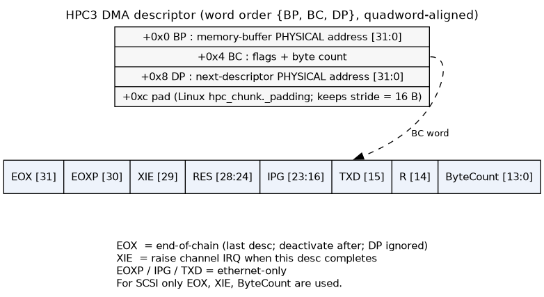
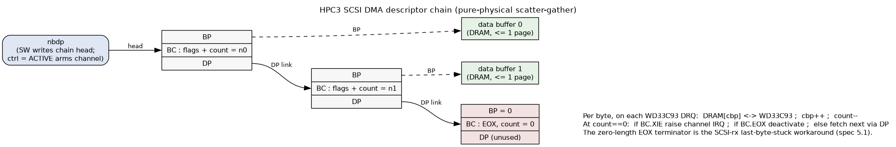

# HPC3 — Peripheral / DMA Controller (Henry block spec)

> Intro: HPC3 @ phys 0x1fb80000–0x1fbfffff bridges GIO64 to SCSI(×2)/Ethernet/PBUS and holds the ds1386
> RTC/NVRAM + serial EEPROM. Two headline facts up front: (1) DMA is pure-physical scatter-gather with NO
> address map; (2) HPC3 has NO cache coherence — software must flush/invalidate (this is WHY Henry's r9999
> cache ops are mandatory). Legend ✅ = MAME-confirmed / matches our golden reference; ⚠️ = correction,
> known-bug, or gotcha to model carefully.

HPC3 is SGI's third-generation "High Performance Peripheral Controller." Six functional blocks: the 64-bit
GIO64 bus interface, two SCSI ports (WD33C93 or Fujitsu 86603), one Ethernet port (Seeq 8003/8020), the PBUS
controller (boot PROM, battery-backed SRAM, 8 general-purpose DMA channels, 10 chip selects), and the serial
EEPROM interface. HPC3 runs GIO64 at 33 MHz; it is a bus slave for all PIO and a bus master for all DMA.

## Role in Henry

In the Indy/IP22 datapath HPC3 is the **real system-DMA engine** — the path that actually moves disk and
network bytes in and out of DRAM. The MC's VDMA engine is the *graphics* GIO64 master (`v3f()` etc.); HPC3 is
the *peripheral* master and is the one Henry must implement to boot, because it owns the SCSI channel that
reads the root disk and the ds1386 NVRAM that holds the boot environment. It also sits on the IOC2/INT2–INT3
interrupt path back to the r9999 core.

Henry must model HPC3 as: a GIO64 slave for PIO register/PROM/fifo access, and a GIO64 master that walks
descriptor chains and reads/writes **physical DRAM directly with no coherence hardware**.

## DMA model — descriptor format + pure-physical addressing

DMA is **descriptor-based linked-list scatter-gather, and all addresses are PURE PHYSICAL** — there is no
address map, no page table, no translation (this is the key difference from VDMA, which goes through the MC's
DMA map). Software builds a chain of descriptors in DRAM, configures the channel registers + device registers,
then sets the channel's **start-DMA** bit; HPC3 becomes the GIO64 master, fetches the first descriptor, and
walks the chain via the `DP` link until it hits a descriptor with `EOX` set, at which point the channel goes
inactive.

Each descriptor is **3 consecutive 32-bit words, quadword (16-byte) aligned, and must not cross a page
boundary**. "Page" = the smaller of the CPU page and DRAM page (4 KB or 8 KB). Word order is `{BP, BC, DP}`
from low address up:

| Off | Word | Field layout |
|-----|------|--------------|
| 0x0 | `BP` | Memory Buffer **PHYSICAL** address [31:0] — the data buffer in DRAM |
| 0x4 | `BC` | `EOX`[31] `EOXP`[30] `XIE`[29] `RES`[28:24] `IPG`[23:16] `TXD`[15] `RES`[14] `ByteCount`[13:0] |
| 0x8 | `DP` | Next-descriptor **PHYSICAL** address [31:0] (the chain `link`; unused when `EOX` set) |

`BC` field meanings (hpc3.pdf p6–7):

| Field | Bit(s) | Meaning |
|-------|--------|---------|
| `EOX` | 31 | End-of-chain. Last descriptor; channel deactivates after processing it. `DP` ignored. |
| `EOXP` | 30 | End-of-packet (Ethernet only). Exactly one per enet-rx packet. |
| `XIE` | 29 | Interrupt-enable: raise the channel interrupt after this descriptor completes. (Enet: ignored unless `EOXP`.) |
| `IPG` | 23:16 | Inter-packet-gap byte (Ethernet transmit only). |
| `TXD` | 15 | Transmit-done marker (Ethernet transmit only). |
| `ByteCount` | 13:0 | Bytes to transfer for this buffer (max one page). On enet-rx, written back with the actual count. |

Visually — one descriptor and its `BC` word:

```text
      one DMA descriptor (16 bytes: 12 used + 4 pad; quadword-aligned, never crosses a page)
      +0x0  +-----------------------------------------------------------+
            |  BP  = data-buffer PHYSICAL address [31:0]                 | --> buffer in DRAM (<= 1 page)
      +0x4  +-----------------------------------------------------------+
            |  BC  = flags || byte count        (bit map below)         |
      +0x8  +-----------------------------------------------------------+
            |  DP  = next-descriptor PHYSICAL address [31:0]  (link)    | --> next desc (ignored if EOX=1)
      +0xc  +-----------------------------------------------------------+
            |  pad  (Linux `hpc_chunk._padding`, keeps the stride = 16) |
            +-----------------------------------------------------------+

      BC word:
       31    30    29   28      24 23        16  15   14  13                   0
      +-----+-----+-----+----------+------------+-----+---+----------------------+
      | EOX |EOXP | XIE |   RES    |    IPG     | TXD | R |   ByteCount [13:0]    |
      +-----+-----+-----+----------+------------+-----+---+----------------------+
         |     |     |        \-------- enet-only: EOXP / IPG / TXD --------/
         |     |     \--- XIE : raise the channel IRQ after this descriptor completes
         |     \--------- EOXP: end-of-packet (ethernet rx)
         \--------------- EOX : end-of-chain - last descriptor; deactivate after; DP ignored
      For SCSI only EOX, XIE and ByteCount are used.
```

And the chain is a linked list — HPC3 follows `DP` until it hits a descriptor with `EOX` set:

```text
  nbdp -.   (SW writes the chain head to nbdp, then ctrl=ACTIVE arms the channel)
        v
  +-----------+      +-----------+            +-----------+   zero-length EOX
  | BP -------+--+   | BP -------+--+         | BP = 0    |   terminator - the
  | BC = n0   |  |   | BC = n1   |  |   ...   | BC = EOX,0|   SCSI-rx last-byte
  | DP -------+--|-->| DP -------+--|--> ...->| DP  (n/a) |   workaround (spec 5.1)
  +-----------+  |   +-----------+  |         +-----------+
                 v                  v
               buf0               buf1
  Per byte, on each WD33C93 DRQ:  DRAM[cbp] <--> WD33C93 ;  cbp++ ;  count-- .
  At count==0:  if BC.XIE raise channel IRQ ;  if BC.EOX deactivate ;  else fetch next via DP.
```

Rendered (graphviz — sources `hpc3_dma_descriptor.dot` / `hpc3_dma_chain.dot` in this dir):





Buffer rules: the `BP` buffer is **≤ one page and cannot cross a page boundary**; enet-rx buffers must be
doubleword-aligned. For DMA **write** (memory→device) there are no alignment constraints — HPC3 packs bytes
seamlessly into the fifo. For DMA **read** (device→memory) each buffer's start byte must align with the byte
*after* the end of the previous buffer (buffers need not be contiguous but must *appear* contiguous), because
HPC3 packs device data into the fifo without knowing the buffer seams.

Endianness: each channel has a big/little endian config bit for the data transfer; one **global** config bit
sets the endianness of *all descriptor fetches*. Big-endian IRIX → both 0 (`gio.misc[1] des_endian` = 0).
HPC3 never runs DMA with the GIO64 "count direction = down" bit asserted.

The transfer is two-stage: device↔fifo and fifo↔DRAM (a GIO64 burst). Each channel also has a **flush** bit
(drain remaining fifo bytes to memory and deactivate) and a direction bit (receive/transmit; not present on
the two Ethernet channels, where direction is implicit). Clearing the start bit aborts the current op.

## SCSI DMA channel — verified register layout & operation ✅

Validated against HPC3 spec §3.0/§3.3, the MAME golden model (`hpc3.cpp`), the Linux IP22 driver
(`drivers/scsi/sgiwd93.c` + `asm/sgi/hpc3.h`), and a live IRIX 6.5 MAME boot trace (2026-06-19).

**Channel registers** (offsets from base `0x1fb80000`; SCSI0 shown, SCSI1 = +0x2000):

| Offset | Reg | R/W | Meaning |
|--------|-----|-----|---------|
| 0x10000 | `cbp`  | R   | current buffer pointer (= descriptor `BP`); HW loads it from the descriptor |
| 0x10004 | `nbdp` | R/W | next-descriptor pointer (= `DP`); SW writes the chain head here to arm |
| 0x11000 | `bc`   | R   | byte count (`count[13:0]` live + the `BC` flag bits) |
| 0x11004 | `ctrl` | R/W | DMA control (bit table below) |
| 0x11008 | `gio`  | R   | GIO-side fifo pointer |
| 0x1100c | `dev`  | R   | device-side fifo pointer |
| 0x11010 | `dmacfg` | R/W | DMA timing / width config |
| 0x11014 | `piocfg` | R/W | PIO timing / width config |

**Control register (`ctrl` @ 0x11004)** — bit values confirmed in MAME `hpc3.h` (`HPC3_DMACTRL_*`), Linux
`hpc3.h` (`HPC3_SCTRL_*`), and the live IRIX trace:

| Bit | Mask | Name | Meaning |
|-----|------|------|---------|
| 0 | 0x01 | IRQ | DMA-done / parity IRQ asserted; **read-only, cleared on read of ctrl** |
| 1 | 0x02 | ENDIAN | 0 = big-endian, 1 = little |
| 2 | 0x04 | DIR | **1 = memory→device (write), 0 = device→memory (read)** |
| 3 | 0x08 | FLUSH | flush SCSI fifo to memory (program only when receiving) |
| 4 | 0x10 | ACTIVE | ch_active / start DMA; HW clears it when the transfer completes |
| 5 | 0x20 | AMASK | write-protect for ACTIVE (lets FLUSH be written without disturbing ACTIVE) |
| 6 | 0x40 | CRESET | reset the DMA channel **and** the external WD33C93 |
| 7 | 0x80 | PERR | parity error on the SCSI iface; read-only, cleared on read |

⚠️ The Linux header comment (`asm/sgi/hpc3.h`) labels DIR backwards (`"1=dev2mem"`); the driver *code*, HPC3
spec §3.3, and MAME all agree **DIR=1 is memory→device**. Trust the code.

**Operation** (Linux `sgiwd93.c`, confirmed by the IRIX trace):
1. SW builds the descriptor chain in DRAM (each buffer ≤ 8192 B) and **appends a zero-length `EOX`
   descriptor** (the SCSI-rx last-byte-stuck workaround, spec §5.1).
2. SW writes `nbdp` = chain head, then `ctrl = ACTIVE` (read) or `ACTIVE|DIR` (write) to arm.
3. HW fetches the first descriptor (`cbp/bc/nbdp ← {BP,BC,DP}`), then on each WD33C93 **DRQ** moves one byte
   between `DRAM[cbp]` and the controller, `cbp++`, `count--`. At `count==0`: if `BC.XIE` (bit 29) raise the
   channel IRQ (`intstat` bit 8/9); if `BC.EOX` (bit 31) deactivate (clear ACTIVE); else fetch the next
   descriptor via `DP`.
4. Teardown: `ctrl |= FLUSH`, spin while `ACTIVE`, then `ctrl = 0`. Reset: `ctrl = CRESET; udelay(50); ctrl=0`.

MAME's golden model moves SCSI DMA **byte-at-a-time directly between DRAM and the controller, bypassing the
fifo entirely** — so the zero-length terminator is harmless and Henry may model it the same way.

**WD33C93 controller**: 8-bit device in the HD0 window at `0x40000` (HD1 `0x48000`), accessed as
**SASR = base+3 (0x40003)** (register-select pointer) and **SCMD = base+7 (0x40007)** (data; auto-increments
the pointer). The SCSI CDB lives in the controller's register file (regs 0x03–0x0e); the workhorse command is
**Select-w/Atn-and-Transfer (0x18 ← COMMAND, 0x08)**; reading SCSI Status (reg 0x17) clears INTRQ; success
code = `0x16` (`SELECT_TRANSFER_SUCCESS`). Init: `dma_mode = CTRL_BURST (0x20)`, `FS = 20 MHz`, host ID 7.

**SCSI command set IRIX actually issues** (live full-boot-to-userland trace): READ(10) `0x28` (the workhorse,
~3000 issued) and WRITE(10) `0x2a` for data; INQUIRY `0x12`, TEST UNIT READY `0x00`, READ CAPACITY(10) `0x25`,
MODE SENSE(6) `0x1a`, MODE SELECT(6) `0x15`, REQUEST SENSE `0x03`, START-STOP-UNIT `0x1b` for probe/config.
**No READ(6)** — IRIX uses READ(10): `28 00 [LBA:4 BE] 00 [len:2 BE] 00`, transferring `len`×512 B (transfers
up to 320 blocks = 160 KB seen, i.e. multi-descriptor chains). The target uses **SCSI disconnect/reconnect**
during seek latency (thousands of disconnect/reselect events in the trace) — a real-bus optimization the
WD33C93 auto-sequencer handles transparently; a fused controller+disk model may complete in one shot and post
the same `0x16` status without modeling it.

**Target STATUS byte lands in reg 0x0f (Target LUN) — critical for LUN/target enumeration.** After a
Select-and-Transfer completes, the WD33C93 overwrites reg **0x0f** with the **STATUS byte the target returned**
in the SCSI STATUS phase: `0x00` = GOOD, `0x02` = CHECK CONDITION. IRIX's autoconfig reads 0x0f (not just the
0x16 controller-completion code in 0x17) to decide GOOD vs CHECK on every probe command. This drives bus walk:
IRIX issues INQUIRY to every target 0–7 × LUN 0–7; a real single-LUN disk answers LUN 0 GOOD and returns
**CHECK CONDITION (0x02)** for LUN ≥ 1 (sense key 0x05 ILLEGAL REQUEST / ASC 0x25 LOGICAL UNIT NOT SUPPORTED),
which IRIX confirms with a following REQUEST SENSE (`0x03`) then moves on. **Modeling gotcha (verified the hard
way):** if a model leaves 0x0f holding the LUN value the host just wrote, IRIX reads back e.g. LUN 2 = `0x02`,
mistakes it for CHECK CONDITION, and falls into an INQUIRY→REQUEST-SENSE loop. A fused controller+disk model
must (a) write the real STATUS byte into 0x0f on completion and (b) report CHECK CONDITION + LUN-not-supported
sense for non-existent LUNs/targets. (Selection of an absent target should instead post a **selection-timeout**
completion rather than 0x16.)

**End-to-end read sequence (verified interrupt-driven against live IRIX, 2026-06-20).** For a data-in command:
(1) the driver builds the descriptor chain and writes `nbdp`; (2) **arms the channel** by writing the control
register with `ch_active` (`0x10`) set — *32-bit* register, big-endian; (3) programs the WD33C93 CDB/dest/LUN
and writes COMMAND = Select-w/Atn-and-Transfer (`0x08`); (4) the WD33C93 runs the bus phases and asserts **DRQ**
per byte, the HPC3 channel drains DRAM↔controller until the descriptor count hits 0; (5) on completion the
WD33C93 raises **INTRQ** → IOC2 `istat0[1]` (SCSI0) → **IP2** (see `ioc2.md`); (6) the ISR reads SCSI Status
(reg 0x17, clears INTRQ) + the target STATUS (reg 0x0f) and the data already in DRAM. The driver typically arms
the DMA *before* issuing the command and then blocks on the interrupt — so a model that completes the transfer
synchronously inside the COMMAND write still must post INTRQ and hold it until reg 0x17 is read, or IRIX never
wakes from its idle loop.

## Cache coherence — NONE in hardware (the mandatory software contract)

⚠️ **HPC3 has zero coherence hardware — no snoop, no invalidate-on-DMA.** The entire spec contains no
coherence language; HPC3 simply masters GIO64 to/from physical DRAM. On Henry's uniprocessor R4000-class
r9999 this means **software is solely responsible** for keeping the L1 D-cache consistent with DMA buffers.
This is the actual hardware path that the r9999 cache-op findings came from, and it is **why Henry's L1d
`cache` ops are mandatory, not optional** (see the coherence doc):

- **DMA-in (device→memory, "read/receive"):** after the DMA completes, software must `cache Hit-Invalidate-D`
  the buffer lines (no writeback) so the stale clean copies in the D-cache are dropped and the next CPU read
  fetches the freshly-DMA'd data from DRAM.
- **DMA-out (memory→device, "write/transmit"):** before starting the DMA, software must
  `cache Hit-Writeback-Invalidate-D` the buffer so dirty CPU writes are pushed to DRAM where HPC3 will read
  them.

Henry's correct model: HPC3 DMA reads/writes DRAM directly (no cache probe), and the r9999 core honors those
L1d cache ops. Zero coherence HW on the HPC3 side is spec-correct — do **not** add snooping.

✅ **Empirically confirmed (live IRIX 6.5 MAME trace, 2026-06-19).** During disk I/O the IRIX *kernel* issues a
flood of D-cache ops — **102,509** in one ~13M-insn window, of which **99.5 % are `Hit_Writeback_Invalidate_D`**
(cache op 5; plus a few `Hit_Invalidate_D` / `Hit_Writeback_D`) — and their addresses fall squarely on the DMA
buffer regions: the KSEG0 cached alias `0x88xxxxxx` of the phys-`0x08xxxxxx` low-DRAM descriptors/buffers, and
mapped buffer-cache pages at `0xc0xxxxxx`. The **PROM/firmware, by contrast, issues ZERO** cache ops around its
SCSI DMA — it sidesteps coherence by treating its buffers as uncached. So IRIX uses exactly the software-
coherence model above: **cached DMA buffers + `Hit_Writeback_Invalidate_D`** (writeback before a device-read
DMA so the device sees current data; invalidate before the CPU reads a device-write buffer so it doesn't get
stale cache lines). This is direct hardware-trace evidence that r9999's L1d cache ops are load-bearing for DMA
correctness, and that the HPC3 master path must hit DRAM with **no** cache probe.

## I/O sub-map

Offsets from base `0x1fb80000`. (✅ = matches MAME golden ref; ⚠️ = MAME correction.)

| Offset range | Region | Notes |
|--------------|--------|-------|
| 0x00000–0x0ffff | PBUS DMA channel registers | 8 general-purpose PBUS DMA channels |
| 0x10000–0x1ffff | SCSI(HD0/HD1) + ENET DMA channel registers | per-channel descriptor ptr / control / status |
| 0x20000–0x2ffff | **DMA FIFO ports** (doubleword access) | PBUS 0x20000, HD0 0x28000, HD1 0x2a000, ENET-rx 0x2c000, ENET-tx 0x2e000 ✅ |
| 0x30000–0x3ffff | General/PIO registers | `intstat`@0x30000 [4:0], `gio.misc`@0x30004, `eeprom.data`@0x30008, `intstat`@0x3000c [9:5] ⚠️split, `bus_error`@0x30010 |
| 0x40000–0x47fff | SCSI HD0 device window (WD33C93) | SASR=0x40003, SCMD=0x40007 (byte = big-endian low byte of the word reg) |
| 0x48000–0x4ffff | SCSI HD1 device window (WD33C93) | SASR=0x48003, SCMD=0x48007 |
| 0x54000 | ENET device (Seeq 8003) | |
| 0x58000 | PBUS device PIO | + dma/pio config 0x5c000 / 0x5d000 |
| 0x60000–0x7ffff | **bbRAM / RTC (ds1386)** | byte-per-word ×4; spec §3.0 `pbus.bbram` = 0x1fbe0000–0x1fbfffff = 128 KB ✅ |

✅ **SCSI window (corrected 2026-06-20):** the WD33C93 register windows are at **0x40000 (HD0) / 0x48000
(HD1)** — SASR=0x40003, SCMD=0x40007. This matches MAME's authoritative `hpc3.cpp` address map
(`map(0x00040000,0x00047fff).rw(hd_r<0>,hd_w<0>)`) and live IRIX (which accesses 0x40003/0x40007). A prior
note here claimed **+0x4000 = 0x44000/0x4c000** — that was WRONG: it trusted MAME's *unhandled-access log
string* (`0x1fbc4000 + offset<<2`, a formatter bug) instead of `map()`. The bad address propagated into
interp_mips and stalled IRIX at "Root device target/1 not available" until corrected.

⚠️ **bbRAM window (corrected 2026-06-19 from the spec):** the battery-backed RAM / RTC decodes **0x60000–0x7ffff
only** (spec §3.0: `pbus.bbram` = 0x1fbe0000–0x1fbfffff = 128 KB). An earlier draft of this doc claimed it ran
to 0xfffff — that was **wrong**; MAME's 0x60000–0x7ffff and the spec agree. The whole first-chip I/O window is
exactly 512 KB (0x80000), which is also why interp_mips's `pa & 0x7ffff` decode mask is correct.

PIO access rules: all HPC3 register accesses are **word (32-bit)** accesses with word-aligned addresses (the
two LSBs of the register address are ignored); FIFO-RAM accesses are **doubleword**; PROM accesses may be
halfword/word/doubleword. Each register access transfers exactly one word regardless of GIO64 byte count;
unused bits read back 0 (except PBUS external regs, where the 8/16-bit value is replicated to fill the word).
Word-oriented register code is *not* endian-sensitive; byte/halfword external-register code *is*.

## ds1386 RTC / battery-backed NVRAM @0x60000

bbRAM/RTC is a **Dallas ds1386** RTC-with-NVRAM at offset 0x60000, accessed **one byte per 32-bit word (×4
address spacing)** — i.e. ds1386 internal byte `i` is read/written at HPC3 offset `0x60000 + i*4`, in the low
byte of the word. This is the SGI NVRAM that holds the boot-monitor environment: **`eaddr` (MAC address),
`console`, `OSLoad*`, `netaddr`** and the rest of the `setenv` variables the PROM reads at power-on.

**Required for boot:** the IP22 PROM reads its boot parameters here; without a populated, correctly-spaced
ds1386 Henry will not get through the boot monitor. The ds1386 *internal* register/NVRAM layout (clock
registers, NVRAM bytes) follows the Dallas datasheet, not the HPC3 spec — Henry should reuse the standard
ds1386 model (MAME has one) behind the ×4 byte-per-word address wrapper.

## Serial EEPROM (NMC93CS56) @0x30008

A separate serial EEPROM (National **NMC93CS56**) holds the chassis serial number and boot-monitor env;
**distinct from the ds1386 NVRAM**. It is bit-banged through the single PIO register `eeprom.data` @0x30008:

| Bit | Signal | Dir |
|-----|--------|-----|
| 0 | `pre` (program-enable / preamble) | out |
| 1 | `cs` (chip select) | out |
| 2 | `clk` (serial clock) | out |
| 3 | `dato` (data → EEPROM, MOSI) | out |
| 4 | `dati` (data ← EEPROM, MISO) | in |

Henry models this as a 5-bit bit-bang shift interface driving a standard 93CS56 serial EEPROM state machine.
Stub-friendly for first boot (PROM tolerates a blank/default serial), but the bit-bang register must exist.

## SCSI (WD33C93) & Ethernet (seeq) glue

HPC3 is *glue*, not the device. The actual SCSI controller is a **WD33C93** (or Fujitsu 86603) reached
through the device window (HD0 @0x40000, HD1 @0x48000); HPC3 supplies its DMA channel (descriptor walk +
fifo) and PIO path. The actual Ethernet controller is a **Seeq 8003** (with 8020 transceiver) at 0x54000;
HPC3 supplies the enet-tx/enet-rx DMA channels (the `EOXP`/`IPG`/`TXD` `BC` fields are for it). Henry reuses
MAME's WD33C93 and Seeq device models and only implements the HPC3 channel/fifo/PIO wrapper around them. The
WD33C93 generates its own interrupts, so the HPC3 `XIE` per-descriptor interrupt is often redundant for SCSI.

## Interrupts

HPC3 raises a small set of interrupt sources:

- **`dma_complete_int`** — shared by *all* DMA channels **except** Ethernet; asserted when a channel finishes
  a descriptor that has `XIE` set. Exact timing: DMA-read+`XIE` → after the last byte is written to the main-
  memory buffer; DMA-write+`XIE`+`EOX` → after the last byte reaches the device; DMA-write+`XIE` without
  `EOX` → when the last byte has been read into the HPC3 fifo (fifo-to-buffer correspondence is unknown
  because the fifo is packed seamlessly).
- **`enet` interrupt** — the Ethernet channels have their own dedicated interrupt pin (not shared with
  `dma_complete_int`).
- **`bus_error_int`** — GIO64 parity / bus error during a master cycle.

All of these route through **IOC2 → INT2/INT3 → MC → r9999 CP0 Cause IP** (exact bit mapping lives in the IOC
doc). Per-channel DMA interrupt status is readable from two HPC3 registers (the split `intstat` @0x30000 /
@0x3000c — see known bugs).

## Minimum for a Henry IRIX boot

To get IRIX off the root disk, Henry needs:

1. **Address decode** of 0x1fb80000–0x1fbfffff and the sub-map above.
2. **PIO register R/W** for the general regs (`intstat`, `gio.misc`, `bus_error`) and channel/config regs.
3. **ds1386 RTC/NVRAM @0x60000** (byte-per-word ×4) — boot env, **mandatory**.
4. **Serial EEPROM @0x30008** (bit-bang; default/blank contents OK).
5. **One SCSI channel + WD33C93 @0x40000** — descriptor-walk DMA into DRAM to read the root disk / load the
   kernel.

Stub until real I/O is needed: **Ethernet (Seeq) DMA, audio (HAL2), parallel, floppy, the other SCSI channel,
and the general PBUS DMA channels.** They can be decode-only / read-as-0 stubs initially.

## Golden vectors / known chip bugs to model

- ⚠️ **PIO read-back of DMA descriptors (single-stage write-queue bug, hpc3.pdf p10):** HPC3 has a one-stage
  PIO write queue. **Before reading any DMA-descriptor port, software must flush it by doing a PIO read of any
  register immediately before the descriptor read, back-to-back.** Skipping the dummy read returns wrong data.
  Henry must reproduce this so PROM/IRIX driver sequences (which issue the dummy read) match real timing.
- ⚠️ **`intstat` split (chip quirk):** DMA interrupt status is split across two registers — bits [4:0] at
  0x30000 and bits [9:5] at 0x3000c (SCSI ch0/ch1 = bits 8/9). Drivers read both. ⚠️ The spec is
  self-inconsistent on the exact split — §3.1 says [4:0]/[9:5], §5.2 (Misfeatures) says [5:0]/[9:6]. MAME
  sidesteps it by returning the **full word at both** 0x30000 and 0x3000c, and that boots IRIX — Henry can do
  the same unless a driver proves it needs the precise split.
- ⚠️ **SCSI-rx drops the last byte:** the SCSI receive path leaves the final byte stuck in the fifo. The IRIX
  driver works around it by appending a **0-count descriptor** to flush. Henry must model the last-byte-stuck
  behavior so the workaround descriptor is actually needed (and harmless).

## Open / not-yet-needed

- Exact per-channel register layouts within 0x00000–0x1ffff (PBUS DMA, SCSI/ENET channel ctrl/status) — only
  the SCSI channel needs full fidelity for boot; the rest can come as devices are added.
- DMA/PIO config-register fields at 0x5c000/0x5d000 (PBUS access timing) — PROM writes them; treat as R/W
  storage until a real PBUS device cares.
- Ethernet `IPG`/`TXD`/`EOXP` semantics and the enet-rx byte-count write-back — only when wiring real
  networking.
- HAL2 audio, parallel port, floppy (PC8477) — out of scope for first boot.

## Sources

- SGI IP22 **HPC3 Chip Specification** (`~/code/sgi/docs/indy_docs/ip22/hpc3.pdf`) — authoritative: features
  (p1), DMA descriptor format + buffer rules (p6–7), PIO/word-access + single-stage-write-queue bug (p5,10),
  DMA interrupt timing + flush/coherence absence (p8).
- `~/code/r9999/IP22_CHIP_REGISTERS.md` (HPC3 section + corrections #8/#9) — sub-map, SCSI-window correction
  (0x40000/0x48000), bbRAM window 0x60000–0x7ffff, ds1386 byte-per-word ×4, EEPROM bit-bang, coherence finding.
- MAME IP22/Indy driver — golden reference for FIFO-port offsets, ds1386, WD33C93 and Seeq device models.
