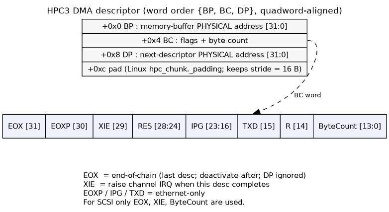
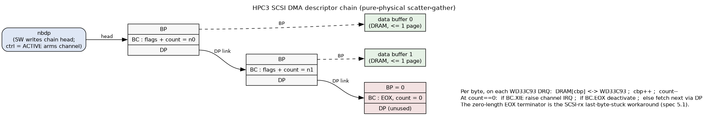

# HPC3 — Peripheral / DMA Controller (Henry block spec)

> Intro: HPC3 @ phys 0x1fb80000–0x1fbfffff bridges GIO64 to SCSI(×2)/Ethernet/PBUS and holds the ds1386
> RTC/NVRAM + serial EEPROM. Two headline facts up front: (1) DMA is pure-physical scatter-gather with NO
> address map; (2) HPC3 has NO cache coherence — software must flush/invalidate. Legend ✅ = MAME-confirmed /
> matches our golden reference; ⚠️ = correction, known-bug, or gotcha to model carefully.
>
> **Read this first:** most of this page is the *SGI/MAME reference* behaviour of the real chip. What henry
> actually builds is a much smaller set of register shims plus host (ARM/testbench) services — see
> [What henry implements](#what-henry-implements-current-rtl) directly below. Where the reference text says
> "Henry must…", check that section for what the RTL really does.

HPC3 is SGI's third-generation "High Performance Peripheral Controller." Six functional blocks: the 64-bit
GIO64 bus interface, two SCSI ports (WD33C93 or Fujitsu 86603), one Ethernet port (Seeq 8003/8020), the PBUS
controller (boot PROM, battery-backed SRAM, 8 general-purpose DMA channels, 10 chip selects), and the serial
EEPROM interface. HPC3 runs GIO64 at 33 MHz; it is a bus slave for all PIO and a bus master for all DMA.

## What henry implements (current RTL)

henry has no GIO64 bus and no real HPC3. `henry_soc.sv` decodes the HPC3 window as
`pa[31:19] == 0x1fb8>>3` minus the IOC2 carve-out `0x1fbd9800–0x1fbd98ff` (`rtl/henry_soc.sv:255-257`), and
hands every access in it to three register slaves at once. Their read data is ORed together
(`henry_soc.sv:1028`), so they must claim disjoint offsets:

| Module | Offsets it owns | What it is |
|--------|-----------------|------------|
| `rtl/hpc3.sv` | `0x30000` intstat, `0x30004` gio.misc, `0x30008` EEPROM, `0x11010/0x11014` SCSI0 dma/pio cfg, `0x5c000` PBUS DMA cfg (8 × stride 0x200), `0x5d000` PBUS PIO cfg (16 × stride 0x100), ds1386 clock + MAC bytes @`0x60000` | storage + constants |
| `rtl/scsi_shim.sv` (`ENABLE_SCSI_SHIM`, on) | HD0 channel `0x10000` cbp/nbdp, `0x11000` bc/ctrl; WD33C93 across `0x40000–0x47fff` | WD33C93A + HPC3 SCSI0 channel register model; disk served by the host |
| `rtl/enet_shim.sv` (`ENABLE_ENET_SHIM`, on) | ENET RX `0x14000/0x15000`, TX `0x16000/0x17000`, reset/CLRIRQ `0x15014`/`0x17014`, CRBDP `0x18000`/`0x1a000`; Seeq 8003 `0x54000–0x5401f` | Seeq + HPC3 ENET channel register model; frames served by the host |

Everything else in the window **reads 0 and swallows writes**. That covers the PBUS DMA channels, the HD1
(SCSI1) channel, the FIFO ports, `bus_error`, the PROM, the rest of the bbRAM/NVRAM, and the `0x3000c` half of
the intstat split. Device accesses never bus-error: the response is always good (`henry_soc.sv:1059`).

Where henry departs from the reference text below:

- **SCSI DMA.** The guest-facing registers are reproduced faithfully enough for unmodified IRIX and Linux
  `wd93` drivers. The data movement is split between the `scsi_dma` engine (arbiter master 1) and a host
  service. Full detail: [SCSI disk theory of operation](scsi_disk_theory_of_operation.md) §10. The engine
  moves **16-byte beats**, not single bytes on DRQ. It needs **16-byte-aligned** descriptors and buffers.
  It stops on `EOX`, on a null `DP`, or after 255 descriptors (`rtl/scsi_dma.sv:160-168`). A zero-count
  descriptor is simply skipped (`scsi_dma.sv:120`). The SCSI-rx last-byte-stuck bug is **not** modelled.
- **ENET.** This is a host-served tap. `enet_shim.sv` owns the Seeq/HPC3 registers. The ARM (`driver/enet_arm.h`)
  or `henry_tb` walks the descriptor rings and moves the frames. The RTL `enet_dma` engine exists but is
  **opt-in** (`ifndef ENABLE_ENET_DMA` ties it off, `henry_soc.sv:733`). By default it is out of the build.
- **Interrupts.** Only two HPC3-side sources are wired. WD33C93 INTRQ goes to IOC2 local0 bit1, and the ENET
  channel IRQ goes to local0 bit3 (`henry_soc.sv:1020`). Both reach CPU IP2. `dma_complete_int` (local1
  HPC-DMA), `bus_error_int`, and SCSI1 are not driven.
- **Coherence.** The r9999 core has an L2 that IRIX cannot see. The guest's L1 cache ops are therefore *not*
  sufficient on their own. See the coherence section below.
- **Chip bugs.** None of the "known chip bugs" listed at the end of this page are reproduced.

## Role in Henry

In the Indy/IP22 datapath HPC3 is the **real system-DMA engine** — the path that actually moves disk and
network bytes in and out of DRAM. The MC's VDMA engine is the *graphics* GIO64 master (`v3f()` etc.); HPC3 is
the *peripheral* master and is the one Henry must implement to boot, because it owns the SCSI channel that
reads the root disk and the ds1386 NVRAM that holds the boot environment. It also sits on the IOC2/INT2–INT3
interrupt path back to the r9999 core.

On a real Indy, HPC3 is a GIO64 slave for PIO register/PROM/FIFO access and a GIO64 master that walks
descriptor chains and reads/writes **physical DRAM directly with no coherence hardware**. In henry the "GIO64
master" is either the `scsi_dma` engine (arbiter master 1) or the host writing shared DRAM directly. The boot
environment comes from the henry ARCS firmware, not from a populated ds1386 NVRAM. Only the clock and the
station-MAC bytes are modelled; see the ds1386 section.

## DMA model — descriptor format + pure-physical addressing

DMA is **descriptor-based linked-list scatter-gather, and all addresses are PURE PHYSICAL** — there is no
address map, no page table, no translation (this is the key difference from VDMA, which goes through the MC's
DMA map). Software builds a chain of descriptors in DRAM, configures the channel registers + device registers,
then sets the channel's **start-DMA** bit; HPC3 becomes the GIO64 master, fetches the first descriptor, and
walks the chain via the `DP` link until it hits a descriptor with `EOX` set, at which point the channel goes
inactive.

Each descriptor is **3 consecutive 32-bit words, quadword (16-byte) aligned, and must not cross a page
boundary**. "Page" = the smaller of the CPU page and DRAM page (4 KB or 8 KB). Word order is `{BP, BC, DP}`
from low address up:

| Off | Word | Field layout |
|-----|------|--------------|
| 0x0 | `BP` | Memory Buffer **PHYSICAL** address [31:0] — the data buffer in DRAM |
| 0x4 | `BC` | `EOX`[31] `EOXP`[30] `XIE`[29] `RES`[28:24] `IPG`[23:16] `TXD`[15] `RES`[14] `ByteCount`[13:0] |
| 0x8 | `DP` | Next-descriptor **PHYSICAL** address [31:0] (the chain `link`; unused when `EOX` set) |

`BC` field meanings (hpc3.pdf p6–7):

| Field | Bit(s) | Meaning |
|-------|--------|---------|
| `EOX` | 31 | End-of-chain. Last descriptor; channel deactivates after processing it. `DP` ignored. |
| `EOXP` | 30 | End-of-packet (Ethernet only). Exactly one per enet-rx packet. |
| `XIE` | 29 | Interrupt-enable: raise the channel interrupt after this descriptor completes. (Enet: ignored unless `EOXP`.) |
| `IPG` | 23:16 | Inter-packet-gap byte (Ethernet transmit only). |
| `TXD` | 15 | Transmit-done marker (Ethernet transmit only). |
| `ByteCount` | 13:0 | Bytes to transfer for this buffer (max one page). On enet-rx, written back with the actual count. |

Visually — one descriptor and its `BC` word:

```text
      one DMA descriptor (16 bytes: 12 used + 4 pad; quadword-aligned, never crosses a page)
      +0x0  +-----------------------------------------------------------+
            |  BP  = data-buffer PHYSICAL address [31:0]                 | --> buffer in DRAM (<= 1 page)
      +0x4  +-----------------------------------------------------------+
            |  BC  = flags || byte count        (bit map below)         |
      +0x8  +-----------------------------------------------------------+
            |  DP  = next-descriptor PHYSICAL address [31:0]  (link)    | --> next desc (ignored if EOX=1)
      +0xc  +-----------------------------------------------------------+
            |  pad  (Linux `hpc_chunk._padding`, keeps the stride = 16) |
            +-----------------------------------------------------------+

      BC word:
       31    30    29   28      24 23        16  15   14  13                   0
      +-----+-----+-----+----------+------------+-----+---+----------------------+
      | EOX |EOXP | XIE |   RES    |    IPG     | TXD | R |   ByteCount [13:0]    |
      +-----+-----+-----+----------+------------+-----+---+----------------------+
         |     |     |        \-------- enet-only: EOXP / IPG / TXD --------/
         |     |     \--- XIE : raise the channel IRQ after this descriptor completes
         |     \--------- EOXP: end-of-packet (ethernet rx)
         \--------------- EOX : end-of-chain - last descriptor; deactivate after; DP ignored
      For SCSI only EOX, XIE and ByteCount are used.
```

And the chain is a linked list — HPC3 follows `DP` until it hits a descriptor with `EOX` set:

```text
  nbdp -.   (SW writes the chain head to nbdp, then ctrl=ACTIVE arms the channel)
        v
  +-----------+      +-----------+            +-----------+   zero-length EOX
  | BP -------+--+   | BP -------+--+         | BP = 0    |   terminator - the
  | BC = n0   |  |   | BC = n1   |  |   ...   | BC = EOX,0|   SCSI-rx last-byte
  | DP -------+--|-->| DP -------+--|--> ...->| DP  (n/a) |   workaround (spec 5.1)
  +-----------+  |   +-----------+  |         +-----------+
                 v                  v
               buf0               buf1
  Per byte, on each WD33C93 DRQ:  DRAM[cbp] <--> WD33C93 ;  cbp++ ;  count-- .
  At count==0:  if BC.XIE raise channel IRQ ;  if BC.EOX deactivate ;  else fetch next via DP.
```

Rendered (graphviz — sources `hpc3_dma_descriptor.dot` / `hpc3_dma_chain.dot` in this dir):





Buffer rules: the `BP` buffer is **≤ one page and cannot cross a page boundary**; enet-rx buffers must be
doubleword-aligned. For DMA **write** (memory→device) there are no alignment constraints — HPC3 packs bytes
seamlessly into the fifo. For DMA **read** (device→memory) each buffer's start byte must align with the byte
*after* the end of the previous buffer (buffers need not be contiguous but must *appear* contiguous), because
HPC3 packs device data into the fifo without knowing the buffer seams.

Endianness: each channel has a big/little endian config bit for the data transfer; one **global** config bit
sets the endianness of *all descriptor fetches*. Big-endian IRIX → both 0 (`gio.misc[1] des_endian` = 0).
HPC3 never runs DMA with the GIO64 "count direction = down" bit asserted.

The transfer is two-stage: device↔fifo and fifo↔DRAM (a GIO64 burst). Each channel also has a **flush** bit
(drain remaining fifo bytes to memory and deactivate) and a direction bit (receive/transmit; not present on
the two Ethernet channels, where direction is implicit). Clearing the start bit aborts the current op.

## SCSI DMA channel — verified register layout & operation ✅

Validated against HPC3 spec §3.0/§3.3, the MAME golden model (`hpc3.cpp`), the Linux IP22 driver
(`drivers/scsi/sgiwd93.c` + `asm/sgi/hpc3.h`), and a live IRIX 6.5 MAME boot trace (2026-06-19).

**Channel registers** (offsets from base `0x1fb80000`; SCSI0 shown, SCSI1 = +0x2000):

| Offset | Reg | R/W | Meaning |
|--------|-----|-----|---------|
| 0x10000 | `cbp`  | R   | current buffer pointer (= descriptor `BP`); HW loads it from the descriptor |
| 0x10004 | `nbdp` | R/W | next-descriptor pointer (= `DP`); SW writes the chain head here to arm |
| 0x11000 | `bc`   | R   | byte count (`count[13:0]` live + the `BC` flag bits) |
| 0x11004 | `ctrl` | R/W | DMA control (bit table below) |
| 0x11008 | `gio`  | R   | GIO-side fifo pointer |
| 0x1100c | `dev`  | R   | device-side fifo pointer |
| 0x11010 | `dmacfg` | R/W | DMA timing / width config |
| 0x11014 | `piocfg` | R/W | PIO timing / width config |

**Control register (`ctrl` @ 0x11004)** — bit values confirmed in MAME `hpc3.h` (`HPC3_DMACTRL_*`), Linux
`hpc3.h` (`HPC3_SCTRL_*`), and the live IRIX trace:

| Bit | Mask | Name | Meaning |
|-----|------|------|---------|
| 0 | 0x01 | IRQ | DMA-done / parity IRQ asserted; **read-only, cleared on read of ctrl** |
| 1 | 0x02 | ENDIAN | 0 = big-endian, 1 = little |
| 2 | 0x04 | DIR | **1 = memory→device (write), 0 = device→memory (read)** |
| 3 | 0x08 | FLUSH | flush SCSI fifo to memory (program only when receiving) |
| 4 | 0x10 | ACTIVE | ch_active / start DMA; HW clears it when the transfer completes |
| 5 | 0x20 | AMASK | write-protect for ACTIVE (lets FLUSH be written without disturbing ACTIVE) |
| 6 | 0x40 | CRESET | reset the DMA channel **and** the external WD33C93 |
| 7 | 0x80 | PERR | parity error on the SCSI iface; read-only, cleared on read |

⚠️ The Linux header comment (`asm/sgi/hpc3.h`) labels DIR backwards (`"1=dev2mem"`); the driver *code*, HPC3
spec §3.3, and MAME all agree **DIR=1 is memory→device**. Trust the code.

**Operation** (Linux `sgiwd93.c`, confirmed by the IRIX trace):
1. SW builds the descriptor chain in DRAM (each buffer ≤ 8192 B) and **appends a zero-length `EOX`
   descriptor** (the SCSI-rx last-byte-stuck workaround, spec §5.1).
2. SW writes `nbdp` = chain head, then `ctrl = ACTIVE` (read) or `ACTIVE|DIR` (write) to arm.
3. HW fetches the first descriptor (`cbp/bc/nbdp ← {BP,BC,DP}`), then on each WD33C93 **DRQ** moves one byte
   between `DRAM[cbp]` and the controller, `cbp++`, `count--`. At `count==0`: if `BC.XIE` (bit 29) raise the
   channel IRQ (`intstat` bit 8/9); if `BC.EOX` (bit 31) deactivate (clear ACTIVE); else fetch the next
   descriptor via `DP`.
4. Teardown: `ctrl |= FLUSH`, spin while `ACTIVE`, then `ctrl = 0`. Reset: `ctrl = CRESET; udelay(50); ctrl=0`.

MAME's golden model moves SCSI DMA **byte-at-a-time directly between DRAM and the controller, bypassing the
fifo entirely**, so the zero-length terminator is harmless.

**What henry's SCSI0 channel actually does (`rtl/scsi_shim.sv`)**

- **Decode.** `cbp`/`nbdp` are the two words of line `0x10000`, and `bc`/`ctrl` are the two words of line
  `0x11000` (`scsi_shim.sv:131-132`). All four are byte-swapped (`bswap32`) on the bus. HD1 (`+0x2000`) is not
  decoded and reads 0.
- **`ctrl` storage.** `ctrl` keeps the low 8 bits the guest wrote. `ACTIVE` is cleared by hardware when the
  command completes (`scsi_shim.sv:242`). `FLUSH`, `CRESET`, `AMASK` and `ENDIAN` are stored but have **no
  effect**. Teardown still terminates, because `ACTIVE` drops at completion.
- **`ctrl` bit 0 (IRQ).** Bit 0 reads the shim's channel-IRQ latch. The latch is set at completion only if
  the *guest-written* `bc` register had XIE (bit 29) set (`scsi_shim.sv:260`). Reading `ctrl` clears it.
- **`bc` read.** Returns the last value the guest wrote. It is not a live count.
- **Stray bits from `hpc3.sv`.** `hpc3.sv` also decodes `0x11000/0x11004` (`hpc3.sv:101-102`), and its read
  data is ORed in *without* the byte swap. While the engine is busy, extra bits can appear in `ctrl`. After
  the CPU's load swap they land in bits [29:24]. The guest drivers do not look at those bits.
- **`dmacfg`/`piocfg`.** `0x11010`/`0x11014` are plain storage in `hpc3.sv`. IRIX's pbus/SCSI init reads them
  back to validate.

**WD33C93 controller**: 8-bit device decoded across the whole **HD0 device region `0x40000..0x47fff`** (HD1
`0x48000..0x4ffff`); `port = ((offs-0x40000)>>2)&1`, so the chip is **aliased across the 32 KB region**. Accessed
as **SASR = +3** (register-select pointer) and **SCMD = +7** (data; auto-increments the pointer). IRIX accesses
it at `0x40003/0x40007`; **Linux at `0x44003/0x44007`** (its `scsi0_ext` = the SGI-spec `hd0.cs` sub-window
`0x1fbc4000`) — both decode identically (see the SCSI-window note below). The SCSI CDB lives in the controller's register file (regs 0x03–0x0e); the workhorse command is
**Select-w/Atn-and-Transfer (0x18 ← COMMAND, 0x08)**; reading SCSI Status (reg 0x17) clears INTRQ; success
code = `0x16` (`SELECT_TRANSFER_SUCCESS`). Init: `dma_mode = CTRL_BURST (0x20)`, `FS = 20 MHz`, host ID 7.

**SCSI command set IRIX actually issues** (live full-boot-to-userland trace): READ(10) `0x28` (the workhorse,
~3000 issued) and WRITE(10) `0x2a` for data; INQUIRY `0x12`, TEST UNIT READY `0x00`, READ CAPACITY(10) `0x25`,
MODE SENSE(6) `0x1a`, MODE SELECT(6) `0x15`, REQUEST SENSE `0x03`, START-STOP-UNIT `0x1b` for probe/config.
**No READ(6)** — IRIX uses READ(10): `28 00 [LBA:4 BE] 00 [len:2 BE] 00`, transferring `len`×512 B (transfers
up to 320 blocks = 160 KB seen, i.e. multi-descriptor chains). The target uses **SCSI disconnect/reconnect**
during seek latency (thousands of disconnect/reselect events in the trace) — a real-bus optimization the
WD33C93 auto-sequencer handles transparently; a fused controller+disk model may complete in one shot and post
the same `0x16` status without modeling it.

**Target STATUS byte lands in reg 0x0f (Target LUN) — critical for LUN/target enumeration.** After a
Select-and-Transfer completes, the WD33C93 overwrites reg **0x0f** with the **STATUS byte the target returned**
in the SCSI STATUS phase: `0x00` = GOOD, `0x02` = CHECK CONDITION. IRIX's autoconfig reads 0x0f (not just the
0x16 controller-completion code in 0x17) to decide GOOD vs CHECK on every probe command. This drives bus walk:
IRIX issues INQUIRY to every target 0–7 × LUN 0–7; a real single-LUN disk answers LUN 0 GOOD and returns
**CHECK CONDITION (0x02)** for LUN ≥ 1 (sense key 0x05 ILLEGAL REQUEST / ASC 0x25 LOGICAL UNIT NOT SUPPORTED),
which IRIX confirms with a following REQUEST SENSE (`0x03`) then moves on. **Modeling gotcha (verified the hard
way):** if a model leaves 0x0f holding the LUN value the host just wrote, IRIX reads back e.g. LUN 2 = `0x02`,
mistakes it for CHECK CONDITION, and falls into an INQUIRY→REQUEST-SENSE loop. A fused controller+disk model
must (a) write the real STATUS byte into 0x0f on completion and (b) report CHECK CONDITION + LUN-not-supported
sense for non-existent LUNs/targets. (Selection of an absent target should instead post a **selection-timeout**
completion rather than 0x16.)

**End-to-end read sequence (verified interrupt-driven against live IRIX, 2026-06-20).** For a data-in command:
(1) the driver builds the descriptor chain and writes `nbdp`; (2) **arms the channel** by writing the control
register with `ch_active` (`0x10`) set — *32-bit* register, big-endian; (3) programs the WD33C93 CDB/dest/LUN
and writes COMMAND = Select-w/Atn-and-Transfer (`0x08`); (4) the WD33C93 runs the bus phases and asserts **DRQ**
per byte, the HPC3 channel drains DRAM↔controller until the descriptor count hits 0; (5) on completion the
WD33C93 raises **INTRQ** → IOC2 `istat0[1]` (SCSI0) → **IP2** (see `ioc2.md`); (6) the ISR reads SCSI Status
(reg 0x17, clears INTRQ) + the target STATUS (reg 0x0f) and the data already in DRAM. The driver typically arms
the DMA *before* issuing the command and then blocks on the interrupt — so a model that completes the transfer
synchronously inside the COMMAND write still must post INTRQ and hold it until reg 0x17 is read, or IRIX never
wakes from its idle loop.

## Cache coherence — NONE in hardware (the mandatory software contract)

⚠️ **HPC3 has zero coherence hardware — no snoop, no invalidate-on-DMA.** The entire spec contains no
coherence language; HPC3 simply masters GIO64 to/from physical DRAM. On Henry's uniprocessor R4000-class
r9999 this means **software is solely responsible** for keeping the L1 D-cache consistent with DMA buffers.
This is the actual hardware path that the r9999 cache-op findings came from, and it is **why Henry's L1d
`cache` ops are mandatory, not optional** (see the coherence doc):

- **DMA-in (device→memory, "read/receive"):** after the DMA completes, software must `cache Hit-Invalidate-D`
  the buffer lines (no writeback) so the stale clean copies in the D-cache are dropped and the next CPU read
  fetches the freshly-DMA'd data from DRAM.
- **DMA-out (memory→device, "write/transmit"):** before starting the DMA, software must
  `cache Hit-Writeback-Invalidate-D` the buffer so dirty CPU writes are pushed to DRAM where HPC3 will read
  them.

On a real Indy that contract is complete. **In henry it is not complete on its own.** r9999 has an L2 behind
the primary caches, and IRIX cannot see it: `Config.SC` reports no secondary cache. IRIX therefore issues no
secondary-cache ops, and it skips primary invalidates it believes are unnecessary. DMA data written behind the
caches can then be shadowed by a stale L2 line. henry provides two hardware hooks for this:

- **ARM-requested flushes (the mechanism in use).**
  - **Whole-cache flush.** AXI control bit 2 (`ext_flush_ctl`) starts a write-back + invalidate of the L1D
    and L2.
  - **Page list.** The ARM pushes up to 16 physical page numbers (AXI write `0x3C`), then writes "go"
    (`0x3D`, bit0 = drop-without-writeback). henry runs one core page operation per page. If the list
    overflows, henry does the whole-cache flush instead.
  - **Status and logic.** Status/cycle counts read back at AXI `0x25`/`0x24`. The logic is
    `rtl/henry_soc.sv:303-455`, and `ip_hdl/axi_is_the_worst_v1_0_S00_AXI.v:474-494` holds the AXI side.
  - **Who calls it.** The host's DMA service must issue these around each deposit.
- **DMA→L2 snoop FIFO.** This is **opt-in** (`ENABLE_DMA_SNOOP`, off by default, `henry_soc.sv:844`). The
  core ties its L2 snoop request off, so the FIFO is inert even when it is compiled in.

The DMA paths themselves (the `scsi_dma` engine, and the host writing shared DRAM) never probe the caches.

✅ **Empirically confirmed (live IRIX 6.5 MAME trace, 2026-06-19).** During disk I/O the IRIX *kernel* issues a
flood of D-cache ops — **102,509** in one ~13M-insn window, of which **99.5 % are `Hit_Writeback_Invalidate_D`**
(cache op 5; plus a few `Hit_Invalidate_D` / `Hit_Writeback_D`) — and their addresses fall squarely on the DMA
buffer regions: the KSEG0 cached alias `0x88xxxxxx` of the phys-`0x08xxxxxx` low-DRAM descriptors/buffers, and
mapped buffer-cache pages at `0xc0xxxxxx`. The **PROM/firmware, by contrast, issues ZERO** cache ops around its
SCSI DMA — it sidesteps coherence by treating its buffers as uncached. So IRIX uses exactly the software-
coherence model above: **cached DMA buffers + `Hit_Writeback_Invalidate_D`** (writeback before a device-read
DMA so the device sees current data; invalidate before the CPU reads a device-write buffer so it doesn't get
stale cache lines). This is direct hardware-trace evidence that r9999's L1d cache ops are load-bearing for DMA
correctness, and that the HPC3 master path must hit DRAM with **no** cache probe.

## I/O sub-map

Offsets from base `0x1fb80000`. (✅ = matches MAME golden ref; ⚠️ = MAME correction.)

| Offset range | Region | Notes |
|--------------|--------|-------|
| 0x00000–0x0ffff | PBUS DMA channel registers | 8 general-purpose PBUS DMA channels |
| 0x10000–0x1ffff | SCSI(HD0/HD1) + ENET DMA channel registers | per-channel descriptor ptr / control / status |
| 0x20000–0x2ffff | **DMA FIFO ports** (doubleword access) | PBUS 0x20000, HD0 0x28000, HD1 0x2a000, ENET-rx 0x2c000, ENET-tx 0x2e000 ✅ |
| 0x30000–0x3ffff | General/PIO registers | `intstat`@0x30000 [4:0], `gio.misc`@0x30004, `eeprom.data`@0x30008, `intstat`@0x3000c [9:5] ⚠️split, `bus_error`@0x30010 |
| 0x40000–0x47fff | SCSI HD0 device window (WD33C93) | chip aliased across the region (port=bit2). IRIX SASR=0x40003/SCMD=0x40007; Linux SASR=0x44003/SCMD=0x44007 (hd0.cs @0x44000). byte = BE low byte of the word reg |
| 0x48000–0x4ffff | SCSI HD1 device window (WD33C93) | hd1.cs @0x4c000; SASR +3 / SCMD +7 in the region |
| 0x54000 | ENET device (Seeq 8003) | |
| 0x58000 | PBUS device PIO | + dma/pio config 0x5c000 / 0x5d000 |
| 0x60000–0x7ffff | **bbRAM / RTC (ds1386)** | byte-per-word ×4; spec §3.0 `pbus.bbram` = 0x1fbe0000–0x1fbfffff = 128 KB ✅ |

**henry coverage of this map.** Anything not listed below reads 0 and swallows writes.

| Offset | henry module | Behaviour |
|--------|--------------|-----------|
| `0x10000/0x11000` (HD0) | `scsi_shim.sv` | cbp/nbdp/bc/ctrl (see the SCSI section) |
| `0x11010/0x11014` (HD0) | `hpc3.sv` | dmacfg/piocfg as storage |
| `0x14000–0x1a007` (ENET) | `enet_shim.sv` | see [ENET in henry](#ethernet-in-henry-enet_shimsv) |
| `0x1000c` | `hpc3.sv` | mem-to-mem test-engine status. Reads 0: `ENABLE_HPC3_DMA` is commented out (`hpc3.sv:19`) |
| `0x30000` intstat | `hpc3.sv` | reads 0 (the register is never written) |
| `0x30004` gio.misc | `hpc3.sv` | storage, low 2 bits |
| `0x30008` EEPROM | `hpc3.sv` | bit-bang model |
| `0x3000c` intstat high half | — | not decoded, reads 0 |
| `0x40000–0x47fff` (HD0 WD33C93) | `scsi_shim.sv` | live |
| `0x48000–0x4ffff` (HD1) | — | not decoded |
| `0x54000–0x5401f` (Seeq) | `enet_shim.sv` | live |
| `0x5c000/0x5d000` (PBUS cfg) | `hpc3.sv` | storage, read back |
| `0x60000` page (ds1386) | `hpc3.sv` | fixed clock + MAC bytes only |

✅ **SCSI window (region 0x40000..0x47fff; reconciled 2026-06-29 against the SGI spec).** The WD33C93 is
decoded across the **whole HD0 device region 0x40000–0x47fff (HD1 0x48000–0x4ffff)** with `port=((offs-0x40000)>>2)&1`,
so the chip is **aliased across the 32 KB region** — this matches MAME's `map(0x00040000,0x00047fff).rw(hd_r<0>,hd_w<0>)`.
The SGI HPC3 spec (hpc3.pdf) is consistent: the HD0 *region* is `0x1fbc0000–0x1fbc7fff`, and the chip `hd0.cs` is
the sub-window `0x1fbc4000–0x1fbc43ff` (offset **0x44000**). Both guests work because the region aliases:
**IRIX accesses 0x40003/0x40007, Linux accesses 0x44003/0x44007** (the spec `hd0.cs`; `offsetof(hpc3_regs,scsi0_ext)=0x44000`).
History to keep straight: (1) making the decode `0x44000`-*based* (region 0x44000.., port from offs−0x44000)
shifted IRIX's 0x40003 out of range and stalled it at "Root device target/1 not available" — that's the real bug
the "0x44000 is wrong / MAME log artifact" note was reacting to. (2) But matching only the *exact line 0x40000*
(the first henry RTL shim) works for IRIX yet **misses Linux's 0x44003** → the Linux SCSI-reset hang on silicon
(2026-06-29). **Correct decode = the whole region 0x40000..0x47fff** (henry `scsi_shim.sv` `w_wd_line`), which
covers both. `0x44003` is NOT wrong — it's the spec address Linux uses.

⚠️ **bbRAM window (corrected 2026-06-19 from the spec):** the battery-backed RAM / RTC decodes **0x60000–0x7ffff
only** (spec §3.0: `pbus.bbram` = 0x1fbe0000–0x1fbfffff = 128 KB). An earlier draft of this doc claimed it ran
to 0xfffff — that was **wrong**; MAME's 0x60000–0x7ffff and the spec agree. The whole first-chip I/O window is
exactly 512 KB (0x80000), which is also why interp_mips's `pa & 0x7ffff` decode mask is correct.

PIO access rules: all HPC3 register accesses are **word (32-bit)** accesses with word-aligned addresses (the
two LSBs of the register address are ignored); FIFO-RAM accesses are **doubleword**; PROM accesses may be
halfword/word/doubleword. Each register access transfers exactly one word regardless of GIO64 byte count;
unused bits read back 0 (except PBUS external regs, where the 8/16-bit value is replicated to fill the word).
Word-oriented register code is *not* endian-sensitive; byte/halfword external-register code *is*.

## ds1386 RTC / battery-backed NVRAM @0x60000

bbRAM/RTC is a **Dallas ds1386** RTC-with-NVRAM at offset 0x60000, accessed **one byte per 32-bit word (×4
address spacing)** — i.e. ds1386 internal byte `i` is read/written at HPC3 offset `0x60000 + i*4`, in the low
byte of the word. This is the SGI NVRAM that holds the boot-monitor environment: **`eaddr` (MAC address),
`console`, `OSLoad*`, `netaddr`** and the rest of the `setenv` variables the PROM reads at power-on.

On a real Indy the IP22 PROM reads its boot parameters here. The ds1386 *internal* register/NVRAM layout
(clock registers, NVRAM bytes) follows the Dallas datasheet, not the HPC3 spec.

**henry does not model the NVRAM.** henry boots through its own ARCS firmware rather than the SGI PROM, so no
NVRAM environment is needed. In `rtl/hpc3.sv` (`hpc_rd`, lines 115-151), only these ds1386 addresses return
data; every other bbRAM read returns 0 and every write is ignored:

- **Clock** (below).
- **Station MAC.** The bytes live at `0x604e8, 0x604ec, …, 0x604fc` (bbRAM base `0x60100` + reg 250×4). They
  are hard-coded constants for **`08:00:69:12:34:56`**, with each byte in `[31:24]`. They were made constant
  because the kernel clears that bbRAM region during boot, and IRIX reads the MAC much later.
- **FSBL MAC write.** The FSBL also writes the MAC there. That write lands in `r_enet_eaddr`, which nothing
  reads back.

**⚠️ The clock registers are NOT optional — the IRIX kernel hangs on garbage time (verified 2026-06-20).**
After SCSI/disk init the kernel reads the ds1386 wall clock and runs `rtodc()` (RTC→date conversion). With the
clock registers unimplemented (reading 0), `rtodc`'s loop bound is garbage and it spins effectively forever —
boot never reaches userspace. Returning a **fixed, valid BCD time** is enough: the kernel prints `WARNING: lost
battery backup clock` and proceeds. The byte offsets IRIX actually reads (ds1386 reg `i` at `0x60000 + i*4`,
value in the low byte / `[31:24]` after the BE swap, same lane convention as the IOC2 SYSID): seconds `0x60004`,
minutes `0x60008`, hours `0x60010`, day-of-week `0x60018`, date `0x60020`, month `0x60024`, year `0x60028`,
command/status `0x6002c` (polled). All values BCD; month/date must be 1-based and valid or the conversion
underflows.

**henry's clock is constant.** It reads 00:00:00, day-of-week 1, date 1, month 1, year BCD **`0x90`**
(`hpc3.sv:115-131`). IRIX's `rtodc()` decodes the year as 1940 + BCD, so this reads as **2030-01-01**. The
year was moved forward from BCD 00 (1970). With the old value the clock was older than the `/var/sysgen`
mtimes, so IRIX re-ran "Automatically reconfiguring the operating system" on every boot. With a 2030 clock it
reconfigures once. The clock does not advance, and writes to it are ignored.

## Serial EEPROM (NMC93CS56) @0x30008

A separate serial EEPROM (National **NMC93CS56**) holds the chassis serial number and boot-monitor env;
**distinct from the ds1386 NVRAM**. It is bit-banged through the single PIO register `eeprom.data` @0x30008:

| Bit | Signal | Dir |
|-----|--------|-----|
| 0 | `pre` (program-enable / preamble) | out |
| 1 | `cs` (chip select) | out |
| 2 | `clk` (serial clock) | out |
| 3 | `dato` (data → EEPROM, MOSI) | out |
| 4 | `dati` (data ← EEPROM, MISO) | in |

**henry implementation (`hpc3.sv`).**

- **Lane.** The five bits live in byte 3 of the word, i.e. after the CPU's byte swap they land in `[4:0]` as
  in the table.
- **Protocol.** Only the Microwire **READ** is modelled. Leading zeros are skipped. After the start bit, 11
  command bits (start + opcode + 8-bit address) are clocked in on ECLK rising edges. The 16-bit word is then
  shifted out MSB-first on DATI. Dropping CSEL resets the sequencer.
- **Contents.** Words 125/126/127 hold the station MAC `08:00:69:12:34:56` (`0x0800`, `0x6912`, `0x3456`).
  All other words read 0.
- **Who uses it.** IRIX `if_ec` (`get_nvreg`) reads the MAC from here.
- **Not modelled.** Program/erase commands.

## SCSI (WD33C93) & Ethernet (seeq) glue

HPC3 is *glue*, not the device. The actual SCSI controller is a **WD33C93** (or Fujitsu 86603) reached
through the device window (HD0 @0x40000, HD1 @0x48000); HPC3 supplies its DMA channel (descriptor walk +
fifo) and PIO path. The actual Ethernet controller is a **Seeq 8003** (with 8020 transceiver) at 0x54000;
HPC3 supplies the enet-tx/enet-rx DMA channels (the `EOXP`/`IPG`/`TXD` `BC` fields are for it). The
WD33C93 generates its own interrupts, so the HPC3 `XIE` per-descriptor interrupt is often redundant for SCSI.

henry does **not** reuse MAME's device models. Both devices are RTL register shims (`scsi_shim.sv`,
`enet_shim.sv`) that raise a doorbell to a host service:

- **On the FPGA** the service is the ARM PS, using `driver/scsi_arm.h` and `driver/enet_arm.h`.
- **In simulation** it is `henry_tb`, using `sim/scsi_service.h` and `sim/enet_service.h`.

The host holds the disk image and the tap device.

### Ethernet in henry (`enet_shim.sv`)

**Registers** (all offsets from `0x1fb80000`):

- **Channels.** RX = channel 0 at `0x14000` (cbp, nbdp) and `0x15000` (bc, ctrl). TX = channel 1 at the same
  offsets `+0x2000`. All are byte-swapped on the bus.
- **`ctrl` ACTIVE** is `0x200` (`enet_shim.sv:70`). Reading `ctrl` returns ACTIVE ORed with the Seeq RX or TX
  status byte.
- **Reset/CLRIRQ** is at `0x15014` (RX) / `0x17014` (TX). A write clears the ENET IRQ. A read returns `0x2`
  while an IRQ is pending.
- **CRBDP** is at `0x18000` (RX) / `0x1a000` (TX). It returns the descriptor pointer that the host service
  maintains. TX publishes it in both words of the line, because IRIX's `ec` TX reap reads both.
- **Seeq 8003.** The registers sit at `0x54000 + 4·N`, with the byte in the MSB of the word.
  - Writes: regs 0–5 set the station address when the TX-command bank is 0; reg 6 is the RX command; reg 7
    is the TX command.
  - Reads: reg 5 returns `0x01` (carrier, no SQE); reg 6 returns RX status; reg 7 returns TX status.

**Flow:**

- **TX.** A `ctrl` write with ACTIVE on the TX channel bumps the TX doorbell and snapshots `nbdp`. The host
  walks the chain, sends the frame to the tap, and echoes the doorbell.
- **TX completion.** On the echo, the shim clears ACTIVE and raises the IRQ. It also **advances TX `nbdp` to
  the host's TX end pointer** (`enet_shim.sv:190`). This is the `r_tx_nbdp` fix for the IRIX `if_ecintr`
  NULL-deref panic.
- **RX.** A `ctrl` ACTIVE write on the RX channel bumps the RX-arm sequence number and publishes the ring
  head. Each inbound frame is deposited by the host, which then bumps the RX sequence number; the shim then
  raises the IRQ.
- **IRQ routing.** The IRQ goes to IOC2 local0 bit3, i.e. CPU IP2.

**AXI side** (`axi_is_the_worst_v1_0_S00_AXI.v`):

- Reads: `0x39` TX doorbell, `0x3C` TX chain head, `0x3D` RX arm, `0x3E` RX ring head.
- Writes: `0x12` TX echo, `0x13` RX sequence, `0x14`/`0x15` RX/TX CRBDP.

The RTL `enet_dma` engine (with its own RX/TX beat FIFOs) is compiled out unless `ENABLE_ENET_DMA` is defined
(`henry_soc.sv:733`). In the default build the host writes and reads guest DRAM directly.

## Interrupts

HPC3 raises a small set of interrupt sources:

- **`dma_complete_int`** — shared by *all* DMA channels **except** Ethernet; asserted when a channel finishes
  a descriptor that has `XIE` set. Exact timing: DMA-read+`XIE` → after the last byte is written to the main-
  memory buffer; DMA-write+`XIE`+`EOX` → after the last byte reaches the device; DMA-write+`XIE` without
  `EOX` → when the last byte has been read into the HPC3 fifo (fifo-to-buffer correspondence is unknown
  because the fifo is packed seamlessly).
- **`enet` interrupt** — the Ethernet channels have their own dedicated interrupt pin (not shared with
  `dma_complete_int`).
- **`bus_error_int`** — GIO64 parity / bus error during a master cycle.

All of these route through **IOC2 → INT2/INT3 → MC → r9999 CP0 Cause IP** (exact bit mapping lives in the IOC
doc). Per-channel DMA interrupt status is readable from two HPC3 registers (the split `intstat` @0x30000 /
@0x3000c — see known bugs).

**henry wiring** (`henry_soc.sv:1020`):

- **ENET.** The ENET IRQ goes to `local0[3]`.
- **SCSI0.** WD33C93 INTRQ goes to `local0[1]`, which is the SCSI completion signal the drivers wait on. A
  second term is ORed onto the same bit: `hpc3.sv`'s `scsi0_hpc_intr`, a latch of the engine's end-of-chain
  XIE pulse.
  - ⚠️ **Suspect RTL.** In `hpc3.sv:186-189` both the set and the clear of this latch sit inside the
    `sel & is_store` branch. The latch is therefore set only if the 1-cycle engine pulse coincides with an
    HPC3 store. The "clear on `ctrl` read" condition (`~is_store`) can never be true there, so once set the
    latch stays set until reset.
- **Not driven.** `dma_complete_int` (local1 HPC-DMA), `bus_error_int`, and SCSI1.
- **`intstat`.** Reads 0.

## Minimum for a Henry IRIX boot

What henry actually provides, and boots IRIX with:

1. **Address decode.** The window is 0x1fb80000–0x1fbfffff, minus the IOC2 carve-out.
2. **Readback registers.** IRIX's pbus probe reads back the PBUS DMA/PIO config registers (`0x5c000`/`0x5d000`)
   and the SCSI0 `dmacfg`/`piocfg`. It fails with "pbus configuration failed for channel N" if they don't
   return what was written. `gio.misc` is also storage.
3. **ds1386 clock.** It must be a valid BCD time, or `rtodc()` spins. The NVRAM itself is not needed.
4. **Station MAC.** It comes from the bbRAM bytes and the serial EEPROM, which `if_ec` reads.
5. **One SCSI channel + WD33C93** across `0x40000–0x47fff`, with host-served disk I/O.
6. **ENET** through the Seeq/HPC3 shim, with a host-served tap. This is needed for networking, not for boot.

Audio (HAL2), parallel, floppy, SCSI1 and the PBUS DMA channels are read-as-0 / write-absorb.

## Golden vectors / known chip bugs (reference; henry reproduces none of them)

henry does not implement the one-stage PIO write-queue bug. `intstat` reads 0 at both halves. There is no
SCSI-rx FIFO, so no byte gets stuck; the trailing zero-count `EOX` descriptor is skipped. The unmodified
drivers boot regardless.

- ⚠️ **PIO read-back of DMA descriptors (single-stage write-queue bug, hpc3.pdf p10):** HPC3 has a one-stage
  PIO write queue. **Before reading any DMA-descriptor port, software must flush it by doing a PIO read of any
  register immediately before the descriptor read, back-to-back.** Skipping the dummy read returns wrong data.
  Henry must reproduce this so PROM/IRIX driver sequences (which issue the dummy read) match real timing.
- ⚠️ **`intstat` split (chip quirk):** DMA interrupt status is split across two registers — bits [4:0] at
  0x30000 and bits [9:5] at 0x3000c (SCSI ch0/ch1 = bits 8/9). Drivers read both. ⚠️ The spec is
  self-inconsistent on the exact split — §3.1 says [4:0]/[9:5], §5.2 (Misfeatures) says [5:0]/[9:6]. MAME
  sidesteps it by returning the **full word at both** 0x30000 and 0x3000c, and that boots IRIX — Henry can do
  the same unless a driver proves it needs the precise split.
- ⚠️ **SCSI-rx drops the last byte:** the SCSI receive path leaves the final byte stuck in the fifo. The IRIX
  driver works around it by appending a **0-count descriptor** to flush. Henry must model the last-byte-stuck
  behavior so the workaround descriptor is actually needed (and harmless).

## Open / not-yet-needed

- Exact per-channel register layouts within 0x00000–0x1ffff (PBUS DMA, SCSI/ENET channel ctrl/status) — only
  the SCSI channel needs full fidelity for boot; the rest can come as devices are added.
- DMA/PIO config-register fields at 0x5c000/0x5d000 (PBUS access timing) — PROM writes them; treat as R/W
  storage until a real PBUS device cares.
- Ethernet `IPG`/`TXD`/`EOXP` semantics and the enet-rx byte-count write-back. In henry these are handled
  by the host tap service. The opt-in `enet_dma` engine instead implements ROWN (bit 14) and ETXD (bit 15) in
  `BC`.
- HAL2 audio, parallel port, floppy (PC8477) — out of scope for first boot.

## Sources

- SGI IP22 **HPC3 Chip Specification** (`~/code/sgi/docs/indy_docs/ip22/hpc3.pdf`) — authoritative: features
  (p1), DMA descriptor format + buffer rules (p6–7), PIO/word-access + single-stage-write-queue bug (p5,10),
  DMA interrupt timing + flush/coherence absence (p8).
- `~/code/r9999/IP22_CHIP_REGISTERS.md` (HPC3 section + corrections #8/#9) — sub-map, SCSI-window correction
  (0x40000/0x48000), bbRAM window 0x60000–0x7ffff, ds1386 byte-per-word ×4, EEPROM bit-bang, coherence finding.
- MAME IP22/Indy driver — golden reference for FIFO-port offsets, ds1386, WD33C93 and Seeq device models.
- henry RTL (ground truth for what is built): `rtl/hpc3.sv`, `rtl/scsi_shim.sv`, `rtl/scsi_dma.sv`,
  `rtl/enet_shim.sv`, `rtl/enet_dma.sv` (opt-in), `rtl/henry_soc.sv`; AXI side
  `ip_hdl/axi_is_the_worst_v1_0_S00_AXI.v`; host services `driver/scsi_arm.h`, `driver/enet_arm.h`.
- [SCSI disk theory of operation](scsi_disk_theory_of_operation.md): the end-to-end SCSI path and the henry
  shim, engine and host split.
