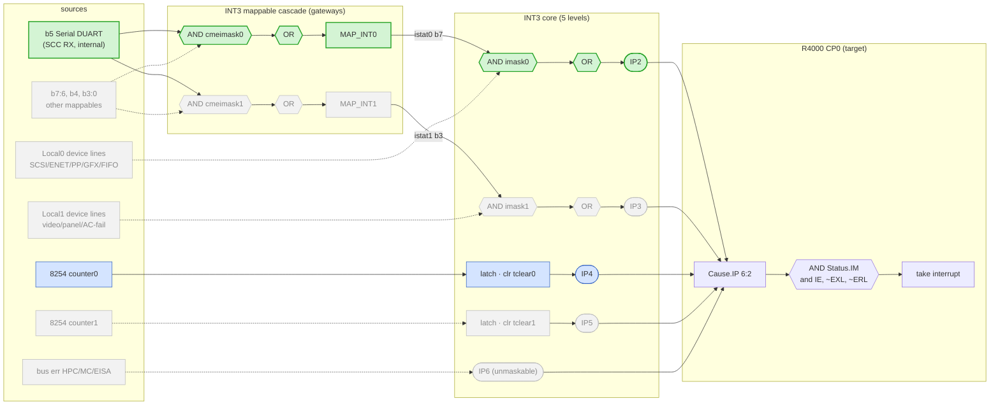

# IOC2 — I/O Controller (Henry block spec)

> Intro: IOC2 @ phys base 0x1FBD9800 — serial (Z8530 SCC), INT3 interrupt controller, 8254 timer, kbd/mouse,
> parallel, boot-ID/power regs. THE serial console lives here and is the #1 Henry bring-up target. Legend ✅ = MAME-validated / must-have; ⚠️ = stub or not-yet-needed.
>
> The IOC2 is a single VTI ASIC ("Guinness" variant for Indy) holding six macrocells: VTI 85CX30 serial DUART,
> SGI PI1 parallel, Intel 8042 kbd/mouse, Intel 8254 timer, SGI INT3 interrupt mux, and miscellaneous glue
> (power/ID/reset). It hangs off the HPC3 P-bus (PBUS_CS_N<6>); registers are 64 word-spaced (×4) slots at base
> 0x1FBD9800. All addresses below are absolute physical (k1seg uncached: OR 0xA0000000).

## Role in Henry  (and why it's the first peripheral to implement)
Henry is a headless, PROM-less r9999 SoC whose entire observable output during IRIX bring-up is the **serial
console**. MEASURED (2026-06-13, IRIX 6.5 boot, `console=d`): the IRIX kernel does **NOT** route the console
through ARCS — `arcs_write`=0, `romvec[Write]`=0 over a full boot. Both the PROM diagnostic phase
("Running power-on diagnostics…") and the kernel phase ("IRIX Release 6.5 IP22…") write the **Z8530 SCC
directly** via the `du_*` serial driver (`du_putchar`/`ducons_write`). The "free output via the ARCS Write
hook" path therefore does **not** work — Henry must emulate a minimal Z8530 at the IOC2 SCC address or it boots
blind. That makes IOC2 the first peripheral: get ~10 lines of polled TX working and Henry can print, after
which every other bring-up step is observable. Ground truth for the stream was captured with a C++ hook on the
SCC TX register (`scc_dc_w` in MAME `src/mame/sgi/ioc2.cpp`).

## Serial console (Z8530 SCC) — THE priority
The 85CX30 is a Zilog Z85230-class **dual-channel** ESCC. **Indy console = Port 1, channel A.** The macrocell
uses Zilog **indirect addressing**: the IOC2 decodes two address lines into 4 byte addresses, where
**addr bit1 = channel** (0 = Port1/chan A, 1 = Port2/chan B) and **addr bit0 = data/command** (0 = command/
register, 1 = data). ✅ Confirmed against MAME `map(0x0c,0x0f) -> z80scc ab_dc_r/w`.

| Addr (phys) | IOC word | Z8530 access | r9999 behavior |
|-------------|----------|--------------|----------------|
| `0x1FBD9830` | 0x0c | Port1 (chan A) **command/RR0** | **read → return `0x04`** (RR0 bit2 Tx Buffer Empty). write → swallow (WR pointer/select). ✅ |
| `0x1FBD9834` | 0x0d | Port1 (chan A) **data** | **write[7:0] → emit byte to console sink (stdout).** read → 0 (no Rx). ✅ THIS is `du_putchar`'s store. |
| `0x1FBD9838` | 0x0e | Port2 (chan B) command/RR0 | return `0x04`, swallow writes (2nd serial port — not console). ⚠️ |
| `0x1FBD983C` | 0x0f | Port2 (chan B) data | swallow / 0. ⚠️ |

Minimal TX recipe (the whole console for Henry):
1. **Write `0x1FBD9834`** → take `data[7:0]`, append to the console output sink. That's the printed character.
2. **Read `0x1FBD9830`** → always return **`0x04`** so the driver's "wait for Tx empty" poll (`while(!(RR0&4));`)
   never stalls. (Real RR0: bit2 = Tx Buffer Empty, bit0 = Rx Char Available, bit3 = DCD, …; Henry only needs
   bit2 = 1, rest 0.)
3. **Write `0x1FBD9830`** → **swallow.** These are WR-pointer selects and WR-register loads (baud, mode, IE).
   Henry models no internal SCC register file; a stateless drain ignores them. Baud (DMA_SEL `0x9868[5:4]`,
   default 00 = 10 MHz internal) is irrelevant to a stdout drain.

Note: IRIX talks to this register **directly**, not through ARCS — so emulating these 4 addresses is mandatory,
not optional. ~10 lines of logic (decode 2 addrs, mux a constant, forward a byte) buys the entire boot log.

## INT3 interrupt controller
Base `0x1FBD9880` (registers `0x1FBD9880`–`0x1FBD98AC`, ioc.pdf §2.5 + §4.5). INT3 multiplexes system interrupts
onto **5 CPU interrupt outputs** CPU_INT_N<4:0>, wired to CP0 Cause IP2..IP6. INT3 does **no internal latching**
except the two 8254 timer interrupts; it expects already-latched, level-triggered, **active-high** status (a `1`
= active interrupt regardless of mask/polarity). Each register is a **byte at a 4-byte-aligned address** (kernel
does `readb`/`writeb`); masks reset to 0 (all masked).

### Interrupt funnel (signal flow)
The whole block is a funnel: device/source lines → (optional mappable cascade) → per-level AND-mask + OR-reduce →
one of five CPU IP pins → CP0. **Green** = the SCC-RX → IP2 path we're wiring next; **blue** = implemented + tested
(Timer0 → IP4); **grey** = tied 0 / not modeled in Henry.

Structured like the RISC-V PLIC spec's Figure 3 (sources → gateways → core → target):

The PLIC analogy is exact: the **mappable cascade = the PLIC gateways** (a source passes through a routing mask),
the **per-level `AND imaskN` + OR = the PLIC core's per-source enable+gather**, and **`Status.IM` at the CPU = the
PLIC priority threshold** (the final gate before the target sees it).

Reading the green path: SCC RX asserts `map_src[5]` → (`AND cmeimask0`, OR) → **MAP_INT0** → lands in `istat0[7]` →
(`AND imask0`, OR) → **IP2** → `Cause.IP[2]` → taken once `Status.IM[2]` is set. Note the **two** INT3 masks in
series (`cmeimask0` then `imask0`) plus the CPU's `Status.IM[2]`. To wire it: drive `map_src[5]` from an `rx_avail`
output added to `ioc.sv` — `int3.sv` itself is unchanged.

### 5 output levels → CPU IP pins
Across the 5 levels there are **27 distinct physical interrupt sources**.

| INT3 Level | CPU pin | Sources | Maskable | Latched |
|-----------|---------|---------|----------|---------|
| Level 0 — Local0 | **IP2** | 8 (incl. MAP_INT0) | yes (`imask0`) | no (level) |
| Level 1 — Local1 | **IP3** | 8 (incl. MAP_INT1) | yes (`imask1`) | no (level) |
| Level 2 — Timer0 | **IP4** | 1 (8254 cnt0)      | no | **yes** (clr `tclear[0]`) |
| Level 3 — Timer1 | **IP5** | 1 (8254 cnt1)      | no | **yes** (clr `tclear[1]`) |
| Level 4 — Bus Error | **IP6** | 3                | no INT3 mask¹ | no |

¹ Bus errors have no mask *inside* INT3, but IP6 is still gated at the CPU like any line (`Status.IM[6]`/`IE`/`EXL`) — it is **not** a true NMI.

### Register / source enumeration (§4.5)
| Reg | Addr | Bits (b7…b0) |
|-----|------|--------------|
| Local0 Status (`istat0`) | `0x9880` (R) | b7 **MAP_INT0**, b6 Graphics, b5 Parallel, b4 MC-DMA-done, b3 ENET, b2 SCSI1, b1 SCSI0, b0 FIFO-full |
| Local0 Mask (`imask0`) | `0x9884` (RW) | same bit order; `1`=enable, default 0 (masked) after reset |
| Local1 Status (`istat1`) | `0x9888` (R) | b7 Vretrace, b6 Vsync, b5 AC-Fail, b4 HPC-DMA-done, b3 **MAP_INT1**, b2 GP_LOCAL1<2> (active-low, new in INT3), b1 Panel (pwr/vol buttons), b0 GP_LOCAL1<0> (active-low, new in INT3) |
| Local1 Mask (`imask1`) | `0x988C` (RW) | same order, default 0 |
| Map Status (`vmeistat`) | `0x9890` (R) | 8 mappable ints; b5 = **Serial DUART**, b4 = Kbd/Mouse, b<7:6>/b<3:0> general. Status unaffected by mask/pol |
| Map Mask0 (`cmeimask0`) | `0x9894` (RW) | routes mappables → **MAP_INT0** (Local0 b7); b5 reserved=serial, b4 reserved=kbd |
| Map Mask1 (`cmeimask1`) | `0x9898` (RW) | routes mappables → **MAP_INT1** (Local1 b3) |
| Map Pol (`cmepol`) | `0x989C` (RW) | polarity; `1`=active-high, `0`=active-low (default). **Serial(b5)/Kbd(b4) are active-low → leave 0** |
| Timer Clear (`tclear`) | `0x98A0` (W) | b1 clears Timer1 int, b0 clears Timer0 int |
| Error Status (`errstat`) | `0x98A4` (R) | b2 HPC-bus-err, b1 MC-bus-err, b0 EISA-err — 3 bus errors → IP6, **no INT3 mask** (the controller can't gate them; still maskable at the CPU via `Status.IM[6]`) |

### The mappable cascade
There are **8 mappable, polarity-selectable inputs** (Map Status `0x9890`). Each is gated by **two** independent
masks: `Map Mask0` (`0x9894`) ORs the selected mappables into **MAP_INT0** → Local0 b7 → IP2, and `Map Mask1`
(`0x9898`) ORs them into **MAP_INT1** → Local1 b3 → IP3. Polarity per bit is set by `Map Pol` (default active-low),
but a hard `1` is always active regardless of polarity. The **SCC serial interrupt is mappable bit 5** → routed
via Map Mask0 to MAP_INT0 → istat0 b7 (the kernel's "LIO2") → **IP2**; this is the path for keyboard/console RX.

### Where the mappable inputs come from (and what is NOT in the IOC2 spec)
This is the part that confuses people: **which physical signal drives each mappable input is fixed wiring, and for
the 6 "general" mappables it is NOT specified by the IOC2 spec at all.** The IOC2 I/O list defines them only as
package pins:

> `MAP_INT_N<7:6,3:0>` — Input — *"Mappable interrupts for general use. Polarity selectable, default is active low."*
> `CPU_INT_N<4:0>` — Output — the 5 CPU interrupt outputs (= IP2..IP6).

So the 8 mappable inputs split into two kinds:

| Mappable bit | Source | In the IOC2 spec? |
|---|---|---|
| **b5** Serial DUART | **internal** IOC2 macrocell (the on-chip Z8530 SCC) | yes — reserved by §4.5 |
| **b4** Keyboard/Mouse | **internal** IOC2 macrocell (the on-chip 8042) | yes — reserved by §4.5 |
| **b7, b6, b3, b2, b1, b0** | **external** pins `MAP_INT_N<7:6,3:0>` — "general use" | **NO source assigned** |

The general-use bits are just polarity-selectable input *pins*. What (if anything) a real Indy soldered to them —
a GIO-slot interrupt, an expansion device — is a **board/system-level decision documented in the IP22 system spec
/ schematics and the GIO bus spec, not in this IOC2 document.** There is no prose anywhere in `ioc.pdf` that says
e.g. "GIO slot X → MAP_INT_N<0>"; the chip only promises "here are 6 general interrupt input pins."

**Consequences for Henry** (the `int3.sv` `map_src[7:0]` port):
- `map_src[5]` (serial) — *internal* on real silicon ⇒ in Henry it is driven **inside `ioc.sv`** (the SCC RX),
  which faithfully mirrors the chip. This is the one live source to wire.
- `map_src[4]` (kbd/mouse) — internal 8042 ⇒ not modeled, tied 0.
- `map_src[7:6, 3:0]` — external GIO/expansion pins ⇒ Henry has **no GIO**, and the spec assigns them no source,
  so they are correctly tied 0. There is nothing to "look up" for these — they are unassigned by design.

In short: `int3.sv` only ever *consumes* `map_src`; the source wiring lives in `henry_soc.sv`, and for the general
mappables there is no canonical source to wire because the IOC2 spec leaves them to the system designer.

### Henry relevance — what actually fires
Of the 27 sources, only a handful have a real device model or plausible assertion in Henry:
- **Serial DUART** (Map Status b5) → MAP_INT0 → **IP2** — console/keyboard RX. **The one live source to wire next**
  (we have the SCC in `ioc.sv`).
- **Timer0** (IP4) — **implemented + tested**: `ioc.sv` 8254 counter0 is a periodic down-counter whose terminal
  count drives `timer0_irq` → INT3 latch → IP4 (see below). Note IP22 Linux/IRIX don't actually use it (they drive
  the system tick from CP0 Count/Compare on **IP7**, the 8254 IRQ being buggy on IP22), but it's the cleanest
  testable real INT3 source. **Timer1** (IP5) is a trivial mirror, not yet wired (counter1).
- **SCSI0/1** (IP2) — relevant only once there's a root disk; no SCSI model yet.
- **Bus errors** (IP6) — could be asserted from a bad-address fault if ever desired; not modeled.
- Everything else (graphics, parallel, ENET, panel, vsync/retrace, AC-fail, GP, ISDN) — no device, stays 0.

### Implementation — `rtl/int3.sv` (skeleton, 2026-06-18)
INT3 is a standalone module **`rtl/int3.sv`**, instantiated in `henry_soc.sv` sharing the IOC2 access window (its
registers sit at lines `0x80`/`0x90`/`0xa0`; `ioc.sv` reads 0 there, so `w_rd_ioc = w_rd_iocdev | w_rd_int3`).
Its 5 outputs drive `core_l1d_l1i`'s `ip2..ip6` pins (this replaced the old 1-bit `extern_irq`). Aggregation:
`ip2 = |(istat0 & imask0)`, `ip3 = |(istat1 & imask1)`, `ip6 = |buserr` (unmaskable), `ip4/ip5` = the two latched
timer IRQs; `map_int0 = |(vmeistat & cmeimask0)` feeds `istat0[7]`. The §4.5 RW registers (`imask0`, `imask1`,
`cmeimask0`, `cmeimask1`, `cmepol`) and the timer latches (tclear-cleared) are modeled. **`timer0_irq` is now driven
by the `ioc.sv` 8254 counter0** (the first real source); the remaining device **sources are input ports tied to 0**
for now → only IP4 can fire.

Source-port mapping:
- `local0_src[6:0]` = istat0 b6..b0 (Graphics/Parallel/MC-DMA/ENET/SCSI1/SCSI0/FIFO); b7 (MAP_INT0) computed.
- `local1_src[7:0]` = istat1 (b3 = MAP_INT1 computed, that input bit ignored).
- `map_src[7:0]` = the 8 mappable inputs (**`[5]` = serial RX** is the one to wire next).
- `buserr[2:0]` = {HPC, MC, EISA}; `timer0_irq` ← `ioc.sv` counter0 (live); `timer1_irq` tied 0 (counter1 TODO).

**Test:** `tests/pit/` (a bare-metal MIPS program run on `henry_tb`) programs counter0 periodic, enables `IM[4]`,
takes 5 IP4 interrupts ~2000 core cycles apart (= 20 PIT ticks × PIT_DIV 100, the programmed 20 µs @ 1 MHz),
acking each via `tclear` → checksum `0x10` (IP4). Validates the full 8254 → INT3 latch/clear → IP4 → CPU path.

**Next:** wire the SCC serial RX — host stdin → SCC Rx FIFO in `ioc.sv` (RR0 bit0 Rx-Char-Available) → drive
`map_src[5]` → MAP_INT0 → IP2, enabling interrupt-driven console input at the IRIX/Linux prompt. (Not needed for
the polled-TX boot console; IRIX's du driver polls RR0 for TX.)

## 8254 timer (Intel 82C54 PIT)
Standard Intel **82C54** CHMOS Programmable Interval Timer — three independent 16-bit down-counters. On IP22 it's
clocked at **exactly 1 MHz** (1 µs/tick — `SGINT_TIMER_CLOCK`, *not* the PC's 1.193 MHz). Counter0 terminal count
→ INT3 Timer0 → **IP4**, Counter1 → Timer1 → **IP5**, Counter2 = calibration only (`dosample` measures CP0 Count
against a known Counter2 down-count). *(Source: Intel 82C54 datasheet, Intel order #23124406.)*

### Registers & byte addressing
The four ports are 4-byte-aligned slots in the IOC2 window, but the 82C54 is an 8-bit part wired to the **low byte
lane**, so each is accessed as a **byte at slot+3** (this is why `ioc.sv` matches on `mask[3/7/11/15]`):

| Port | Slot | Byte addr (kseg1) | henry mask bit |
|------|------|-------------------|----------------|
| Counter 0 | `0x98B0` | `0xBFBD98B3` | `mask[3]` |
| Counter 1 | `0x98B4` | `0xBFBD98B7` | `mask[7]` |
| Counter 2 | `0x98B8` | `0xBFBD98BB` | `mask[11]` |
| Control Word | `0x98BC` | `0xBFBD98BF` | `mask[15]` |

(The IOC2's *internal* registers — SYSID, INT3 — sit on byte lane 0; the 8254, an external 8-bit chip, is on lane 3.)

### Control Word format (write to the Control Word port)
| Bits | Field | Values |
|------|-------|--------|
| D7:D6 | **SC** — Select Counter | `00`=C0, `01`=C1, `10`=C2, `11`=Read-Back command |
| D5:D4 | **RW** — Read/Write | `00`=Counter-Latch command, `01`=LSB only, `10`=MSB only, **`11`=LSB then MSB** |
| D3:D1 | **M** — Mode | `000`=0, `001`=1, `x10`=**2**, `x11`=**3**, `100`=4, `101`=5 |
| D0 | **BCD** | `0`=binary 16-bit, `1`=BCD (4 decades) |

So "program Counter0, periodic, 16-bit, lo+hi" is `0x34` (Mode 2) or `0x36` (Mode 3).

### Modes (Intel datasheet)
| Mode | Name | Behavior |
|------|------|----------|
| 0 | Interrupt on Terminal Count | one-shot: OUT low until count expires, then high |
| 1 | Hardware Retriggerable One-Shot | GATE-triggered one-shot |
| **2** | **Rate Generator** | divide-by-N, **periodic**; *"typically used to generate a Real Time Clock interrupt"* — OUT pulses low for 1 CLK when the count reaches 1, reloads, repeats every N CLKs |
| **3** | **Square Wave** | like Mode 2 but 50% duty (OUT high first half, low second); period N; "typically used for Baud rate generation" |
| 4 | Software Triggered Strobe | one-shot strobe on terminal count |
| 5 | Hardware Triggered Strobe | GATE-triggered strobe |

**Programming protocol:** write the Control Word, then the initial count to the counter port (for `RW=11`, **LSB
first, then MSB** — the counter loads and starts on the MSB write). To *read* a live count, first issue a **Counter
Latch Command** (Control Word with `RW=00` + the target's SC bits), which snapshots the count so it can be read
LSB-then-MSB without disturbing counting (this is what `dosample` does on Counter2).

### What henry models
`ioc.sv` implements:
- **Counter0** as a periodic down-counter at the 1 MHz PIT rate: the 2-byte (LSB→MSB) load starts it; at terminal
  count (→1) it emits a 1-cycle `timer0_irq` pulse and reloads — i.e. **Mode 2 / Mode 3 edge behavior** (we model
  the interrupt edge, not the OUT duty cycle). Drives INT3 Timer0 → IP4. **Tested**: `tests/pit`.
- **Counter2** as the calibration down-counter (Counter-Latch + LSB/MSB read) for `dosample`.

Not modeled (not needed): Modes 0/1/4/5, BCD counting, the GATE inputs, the Read-Back **status** command, the OUT
duty cycle, Counter1 (a trivial mirror of Counter0), and "count of 1 is illegal in Mode 2." The kernel programs
Counter0 in a periodic mode and only needs the terminal-count interrupt edge, which is what we emit.

⚠️ IP22 Linux/IRIX drive the real system tick from **CP0 Count/Compare (IP7)**, not this 8254 IRQ — so Counter0→IP4
is chip-faithful but dormant during a real boot (see the INT3 section).

## Boot-identification & power regs
PROM/IRIX probe these during early init; Henry must return plausible values or init stalls/branches wrong. Most
are simple constant-return or accept-and-store.

| Reg | Addr | r9999 must return / accept | Notes |
|-----|------|---------------------------|-------|
| System ID | `0x9858` | **`0x26`** (Guinness) | b<7:5>=001 chip rev (≠0 = real IOC, not discrete), b<4:1>=board rev (0x3), **b0=0 = Sapphire/Guinness** (1 would = Full House). ✅ MAME `get_system_id()=0x26`. |
| Read Reg | `0x9860` | power/PTC-good bits high, e.g. **`0xF0`** | b7 ENET-link, b6 ENET-pwr, b5 SCSI1-pwr (FH only), b4 SCSI0-pwr. High = power good; return upper bits set so PROM sees healthy rails. |
| Front Panel | `0x9850` | reset value **`0xE1`** | b0 Power-State (1=on), b1 power-button-int (W1C), b4/b6 vol-down/up int (W1C), b5/b7 vol-down/up hold. PROM clears the power-button int by writing 1 to b1. Accept `0x03` to mean "power on." ✅ MAME init = VOL_UP_HOLD\|VOL_DOWN_HOLD\|POWER_STATE = 0xE1. |
| GC Select | `0x9848` | RW storage (=0xFF ok) | configures GEN_CNTL<7:0> dir; b=1 output. Accept writes. |
| General Control | `0x984C` | RW storage | GEN_CNTL<7:0> data lines, last-minute control. Accept. |
| DMA Select | `0x9868` | **0** (default) | b<5:4> serial clk sel (00=10 MHz), b2 parallel-DMA, b<1:0> ISDN-DMA. Accept; 0 is fine. |
| Reset | `0x9870` | RW, self-clearing | b0 parallel rst, b1 kbd/mouse rst, b<5:4> LED, b3 ISDN rst. Accept and read back 0. |
| Write | `0x9878` | RW storage | margin (b7/b6), UART PC-mode (b5/b4), ENET select bits. Accept; defaults (0) are fine for console. |

Henry rule of thumb: every "Not Used" slot and every unmodeled control reg → **accept writes (swallow), return 0
on read** (except the four constants above). That keeps PROM/IRIX init walking forward.

## Minimum for a Henry IRIX boot
Implement, in order:
1. **Polled serial TX (~10 lines, do this first):** decode `0x1FBD9830`/`0x34`; read 0x30 → `0x04`; write 0x34 →
   emit byte; swallow 0x30 writes. This alone produces the entire boot console.
2. **Boot-ID constants:** System ID `0x9858`→`0x26`; Read `0x9860`→`0xF0`; Front Panel `0x9850`→`0xE1` (W1C on
   b1/b4/b6).
3. **Accept-and-ignore the rest:** GC/General/DMA-Sel/Reset/Write regs and all INT3 regs as plain R/W storage;
   reads of unmodeled/Not-Used → 0.
4. (Later, post-first-output) 8254 Timer0 → IP4 tick; INT3 serial mappable int (b5) for interrupt-driven console.

Everything past step 1 is "don't stall init"; step 1 is the actual deliverable.

## Golden vectors (from MAME)
- **SCC TX stream** captured via `scc_dc_w` hook (`SCCW off=1 data=XX c`): `off=1` (= addr 0x34, Port1 data) bytes
  are the console chars. Full IRIX serial boot reconstructed at `~/code/mame/irix_serial_console.txt` (~972 bytes
  through the SCC-write hook; the `du_putchar` entry-breakpoint undercounts because TX is buffered).
- **RR0 read** (addr 0x30) golden value = `0x04` (Tx Buffer Empty) — the value that keeps the poll loop moving.
- **System ID** (0x9858) golden for Guinness/Indy = **`0x26`** (`ioc2_guinness_device::get_system_id()`).
- **Front Panel** (0x9850) power-on reset golden = **`0xE1`**; "power on" written value the PROM accepts = `0x03`.
- **Address decode** golden: MAME `map(0x0c,0x0f)` = SCC (word 0x0c–0x0f = byte 0x30–0x3C); `map(0x14)` Front
  Panel, `map(0x16)` System ID (word indices; ×4 → 0x50, 0x58 absolute).

## Open / not-yet-needed
- ⚠️ **Kbd/mouse (8042)** `0x9840/0x9844` — headless Henry has no console keyboard; stub (return 0).
- ⚠️ **Parallel port (PI1)** `0x9800–0x982C` — no printer; stub.
- ⚠️ **Port2 serial (chan B)** `0x9838/0x983C` — second UART, not the console; stub `0x04`/0.
- ⚠️ **Interrupt-driven serial / Rx** — IRIX boot console is polled-TX; Rx and the INT3 serial mappable int
  (Map Status b5) only needed for an interactive console (input echo, getty).
- ⚠️ **8254 real timing** — needed for scheduler tick eventually, not for first boot output.
- ⚠️ **Power/volume state machine, ISDN glue, EISA** — pure storage stubs; never exercised headless.

## Sources
- `~/code/sgi/docs/indy_docs/ip22/ioc.pdf` — VTI IOC2 spec (Vic Alessi, 1993): §2.1 85CX30 DUART, §2.5 INT3,
  §4.0 register map (p.13), §4.5 INT3 reg bits (p.14–16), §4.6 misc/ID/power regs (p.16–18).
- Intel **82C54** CHMOS Programmable Interval Timer datasheet (Intel order #23124406) — control-word format, the
  six counter modes (Mode 2 Rate Generator, Mode 3 Square Wave), and the LSB/MSB write + Counter-Latch read protocol.
- `~/code/r9999/IP22_CHIP_REGISTERS.md` — IOC2 section (absolute base 0x1FBD9800 correction; SCC console recipe).
- `~/code/r9999/IRIX_KERNEL_GAPS.md` — console section (measured: IRIX boot console = Z8530 direct, arcs_write=0).
- `~/code/mame/src/mame/sgi/ioc2.cpp` / `ioc2.h` — golden reference (`scc_dc_w` TX hook, `get_system_id()=0x26`,
  Front Panel reset = 0xE1, `map(0x0c,0x0f)` SCC decode).
- `~/code/mame/irix_serial_console.txt` — captured golden console stream.
