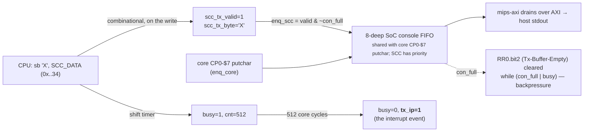
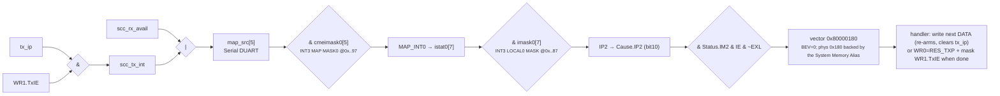

# SCC (Z8530) — Henry implementation model

Companion to [IOC2](ioc2.md), which specs the **register behavior** (the MAME-validated
"minimum to print"). This page documents **how the SCC is built** in `ioc.sv` — the register
pointer machine, the TX datapath, and the **Tx-buffer-empty interrupt** path through INT3 to
the CPU — i.e. what an interrupt-driven console driver (Linux `ip22zilog`) needs, beyond polled
output.

The SCC is an **8530-style** dual-channel UART. Naming is confusing but the addresses are not:
the Z8530/IRIX call the console **chanB**, `ioc.sv` indexes it **ch0**, Linux enumerates it
**ttyS0** — all the same port.

```
 phys 0x1fbd9830 (kseg1 0xbfbd9830)  = console channel (ioc ch0 / chanB / ttyS0)
 phys 0x1fbd9838                      = second  channel (ioc ch1 / chanA / ttyS1)
```

## 1. Register access — the pointer machine ✅

Each channel has just **two** addresses: a CONTROL reg and a DATA reg. CONTROL multiplexes 16
write regs (WR0..WR15) and 16 read regs (RR0..RR15) through a **pointer** set by writing WR0:

```
  CONTROL  (0x..30)                       DATA  (0x..34)
  ─────────────────                       ──────────────
  write, ptr==0 → WR0: cmd[5:3]           write → push a TX byte
        (e.g. RES_TXP=0x28)               read  → pop  an RX byte
        + new ptr = byte[2:0]
  write, ptr!=0 → WR[ptr], ptr→0          RR0 = status (Tx-empty bit2, Rx-avail bit0)
  read          → RR[ptr], ptr→0          RR3 = chip-wide interrupt-pending (gated by TxIE)

  Enable the Tx-buffer-empty interrupt (WR1.TxIE, bit1):
     CONTROL <= 0x01   ; WR0 "point to register 1"   ptr 0 → 1
     CONTROL <= 0x02   ; WR1 = 0x02 (TxIE)            ptr 1 → 0   ← carries the data byte
```

## 2. Address decode (16-byte bus line → channel / ctrl|data)

henry delivers device accesses as a 16-byte line (`offs = addr[7:0]` base, byte `b` via `mask[b]`).
`ioc.sv` classifies each masked byte:

```
   ch       = (b >> 3) & 1        // 0..7 = ch0, 8..15 = ch1
   is_data  = (b >> 2) & 1        // 0..3 = CONTROL, 4..7 = DATA
   wbyte    = wdata[8*b +: 8]

   b :  0    1   2   3 │ 4   5   6   7 │ 8 …          15
        └─ ch0 CTRL ───┘ └─ ch0 DATA ─┘ └─ ch1 CTRL/DATA ┘
   0x..30 ─────────────── 0x..34 ─────── 0x..38 / 0x..3c
   (console CONTROL)     (console DATA)  (ttyS1)
```

## 3. TX datapath — output is decoupled from the interrupt timer

A DATA write does **two independent things**. The byte reaches the console FIFO **immediately**
(so output works even with interrupts broken); the 512-cycle "shift" is a *separate* timer that
only raises `tx_ip` for the interrupt model.



- `SCC_RR0 = 0x44` (Tx-Buffer-Empty | All-Sent); **bit2** is what software polls.
- `TX_DRAIN = 512` gates `tx_ip` only, **not** output.
- Polled TX (`while(!(RR0 & 0x04)); DATA = c;`) never touches `tx_ip` — so polling works even
  when the interrupt path is broken (this is exactly how the §5 bug stayed hidden).

## 4. Interrupt path — `tx_ip` to the exception vector ✅



RR3 (read at ptr==3) exposes the **gated** per-channel int-pending bits: `CHATxIP=0x10`,
`CHBTxIP=0x02` (gated by `WR1.TxIE`).

## 5. ⚠️ Fixed bug: control-write data byte dropped → Tx interrupt dead

`ioc.sv` classified each masked byte but captured `w_scc_wbyte` **only on the data branch**:

```systemverilog
   w_scc_wbyte = 8'h0;                       // default
   for b: if mask[b]:
     ch = (b>>3)&1;
     if is_data: w_scc_data=1; w_scc_wbyte = wdata[8*b+:8];   // ◄ captured
     else        w_scc_ctrl=1;                                // ◄ BUG: byte lost
```

So **every CONTROL write was processed with command byte = 0**:

```
   CONTROL <= 0x01   seen as 0 → ptr stays 0      (never points to WR1)
   CONTROL <= 0x02   seen as 0 → WR0 = 0          (WR1.TxIE never set)
   CONTROL <= 0x28   seen as 0 → not RES_TXP
   ⇒ scc_tx_int = (TxIE=0) & tx_ip = 0  forever   ⇒  no Tx interrupt, ever
```

Symptoms: a bare-metal IRQ test could never route IP2 (`tx_ip` fired, but `scc_tx_int=0`); and
Linux's interrupt-driven `ip22zilog` TX **stalled** — the slow, lumpy userspace console — because
it could never enable Tx interrupts. Console *output* still worked (it rides DATA writes, which
captured the byte), which is why this hid for so long. `interp_mips`'s `sgi_scc.cc` captured the
byte correctly, so the ISS console was fast — the divergence was RTL-only.

Fix — capture the byte for **both** branches:

```systemverilog
   for b: if mask[b]:
     ch = (b>>3)&1;
     w_scc_wbyte = wdata[8*b+:8];           // always capture
     if is_data: w_scc_data=1; else w_scc_ctrl=1;
```

Found by a bare-metal throughput experiment (`r9999/tests/henry/contest.c`) that times 10000
chars via CP0-$7, SCC-polled, and SCC-Tx-IRQ; the IRQ path exposed the dead interrupt.
