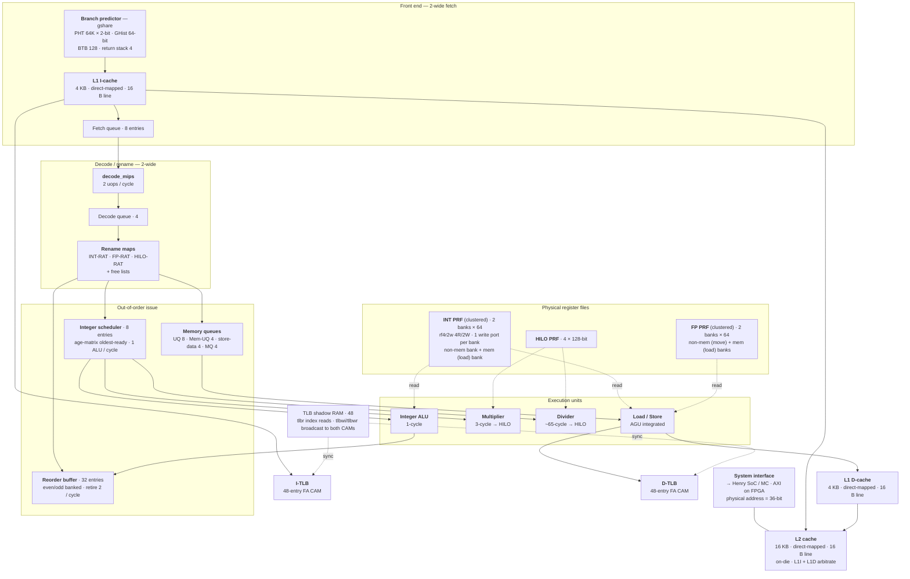

# r9999 microarchitecture

*The CPU at the center of Henry. `r9999` is an **out-of-order, superscalar MIPS** core — its name is a wink at the **R10000** (`9999 = 10000 − 1`), and its shape is deliberately R10000-flavored: register renaming, a reorder buffer, out-of-order issue, separate integer/FP register files. But it targets the **R4600 ISA** (so IRIX/Indy runs the right path), it's **2-wide** instead of 4, and it's tuned to **fit and close timing on an FPGA**.*

This page is the r9999 answer to the **R10000 block diagram (Fig. 1-5)** from the MIPS R10000 User's Manual — written in the spirit of [maizure.org's reverse-engineering writeups](https://www.maizure.org/projects/evolution_x86_context_switch_linux/). Every number below is from the RTL in the [`r9999`](https://github.com/dsheffie/r9999) submodule (canonical, non-`FORMAL` config); `machine.vh` is the parameter header.

## Block diagram

## Walking the pipeline

**Front end (2-wide).** Each cycle the **gshare** predictor indexes a **64K × 2-bit** pattern-history table by folding a **64-bit global history** against the PC, with a **128-entry BTB** and a **4-entry return stack**; speculative *and* architectural copies of the history/RAS are kept so a misprediction restarts cleanly. The **L1 I-cache** (4 KB, direct-mapped, 16 B lines) delivers up to **two instructions/cycle** into an **8-entry fetch queue**. *(`l1i.sv`, `compute_pht_idx`, `machine.vh`)*

**Decode / rename (2-wide).** `decode_mips` cracks up to two instructions into uops; a **4-entry decode queue** buffers them for the allocator, which renames through three maps — **integer**, **FP**, and **HILO** RATs with free lists — onto the physical register files. *(`decode_mips.sv`, `core.sv`)*

**Out-of-order issue.** Renamed uops allocate into a **32-entry reorder buffer** (split even/odd so two consecutive entries write different banks → 2 allocate and 2 retire per cycle). Integer ALU ops wait in an **8-entry scheduler** that picks the **oldest ready** entry via an age matrix; memory ops flow through dedicated queues (**UQ 8**, **Mem-UQ 4**, **store-data 4**, **MQ 4**). Issue is **1 ALU op + 1 memory op per cycle**. *(`core.sv`, `exec.sv`, `fair_sched.sv`)*

**Misprediction / exception recovery — no RAT checkpoints.** r9999 keeps two rename maps per register class: the speculative **allocation RAT** and a **retirement RAT** that follows the committed architectural map. On a branch mispredict or exception it does **not** roll back to a per-branch snapshot. Instead the machine **drains** (state `DRAIN`): younger uops are squashed and it waits for the offending op to reach the head of the 32-entry ROB — at which point the *retirement* RAT already holds the correct map. It then copies **retirement RAT → allocation RAT** in a single cycle (state `RAT`: `r_alloc_rat <= r_retire_rat`, and likewise for FP/HILO) and restarts fetch. No checkpoint storage, no finite-checkpoint allocation stall, and the *same* path handles both mispredictions and exceptions. *(`core.sv` — `DRAIN → RAT → ACTIVE` state machine, `t_rat_copy`)*

!!! note "Why skipping RAT checkpoints is fine"
    This was a **design judgment**, not a derived result. Per-branch **RAT checkpointing** — snapshot the logical→physical map, restore it in one cycle, and reclaim the physical registers allocated since — is fundamentally a **PRF-machine technique** (the R10000 is the classic example). Intel's **"data-in-ROB" P6 and Nehalem** can't use it: with no physical register file, speculative values live in ROB entries, so recovery instead falls out of rolling the ROB tail back and restoring the map from the retirement (committed) state. r9999 *is* PRF-based — so the R10000-style checkpoint scheme was on the table — but it deliberately borrows the **data-in-ROB-style restore-from-retirement** recovery (drain to commit, copy retirement RAT → allocation RAT), a ballpark call from P6/Nehalem experience that the modest drain latency is fine.

    **Henry Wong's thesis** gives the matching quantitative corroboration — *A Superscalar Out-of-Order x86 Soft Processor for FPGA*, U. Toronto 2017, in the repo as `Wong_Henry_T_201711_PhD_thesis.pdf` (Ch. 7, Register Renaming). Two advantages over checkpoints: **one mechanism covers both branch mispredictions and exceptions**, and there's **no cap on outstanding branches** (checkpoints are finite — the R10000 stalls when it runs out). The drawback — recovery isn't instantaneous; the bad branch must commit first — he measures at only **~2.3 % of cycles (≈ 4 clocks per pipeline flush)**, and that's an *upper bound* (the core is usually still retiring useful older work). It stays small because branches **resolve in program order** (mispredicts detected near commit) and a **long front end** delays corrected-path instructions until after the drain.

**Register files (clustered).** The integer PRF is a **clustered (banked) register file** (`rf4r2w`, 4 read / 2 write): it's split into **two single-write-port banks** selected by the high bit of the physical-register number — a **non-memory bank** written by ALU/move results (write port 0) and a **memory bank** written by load results (write port 1). That's the whole reason the physical-register count is large: **2 banks × 64 = 128**, not a deep rename window. It's the FPGA-friendly way to get two write ports per cycle out of plain single-write-port block RAMs (a Henry-Wong-style clustered RF) instead of paying for a true multi-write-port file. The **FP PRF** is banked the same way (non-memory = `mtc1`/moves, memory = FP loads), and a small **4 × 128-bit HILO PRF** holds multiply/divide results. The effective rename window is still bounded by the **32-entry ROB**. *(`rf4r2w.sv` — "Clustered (banked) register file"; `exec.sv`)*

**Execution units.** One **integer ALU** (1-cycle), a **3-cycle pipelined multiplier** and an **iterative ~65-cycle divider** (both writing the HILO PRF), and a **load/store unit** with address generation folded in (no separate AGU stage) feeding the L1 D-cache. **There is no FP arithmetic yet** — the FP path implements `mfc1/mtc1`-style moves and FP loads/stores only; the core still reports an R4000-family FPU id (`FIR`) so software probes succeed. *(`exec.sv`, `mul.sv`, `divider.sv`)*

**Memory & translation.** L1 D-cache is 4 KB direct-mapped (16 B lines); L1I and L1D arbitrate for a shared **on-die 16 KB direct-mapped L2**, which fronts the **system interface** out to the Henry SoC / memory controller (AXI on the FPGA), with **36-bit physical addresses**. Translation presents the R4x00 **48-entry fully-associative TLB** (dual-page even/odd, 4 KB pages, 8-bit ASID, global bit) — but it is **not** a single shared joint TLB. r9999 **duplicates the CAM per L1 cache** — an **I-TLB** in `l1i` and a **D-TLB** (`dtlb`) in `l1d` — so instruction fetch and load/store translate **in parallel** without contending for one structure, and keeps them coherent by **broadcasting every `tlbwi`/`tlbwr` to both CAMs** (`core_l1d_l1i.sv`). Because a content-addressed CAM can't be read by index, a separate **48-entry RAM shadow** (`r_shadow_tlb` in `exec.sv`) holds the entries so the index-addressed instructions — `tlbr` in particular — can read them back. No micro-TLB. *(`l1i.sv`, `l1d.sv`, `tlb.sv`, `exec.sv`, `core_l1d_l1i.sv`)*

## r9999 vs. the R10000 it's named after

| | **R10000** (1996) | **r9999** |
|---|---|---|
| ISA | MIPS IV (R10000) | MIPS III/IV, **presents as R4600** (`PRId 0x2020`) |
| Fetch / decode / issue / retire | 4-wide | **2-wide** |
| Branch prediction | 512-entry 2-bit BHT | **gshare**: 64K×2b PHT, 64-bit GHist, 128 BTB, 4 RAS |
| Physical registers | 64 int + 64 FP (true multiport RF) | **128 int + 128 FP** (clustered: 2 banks × 64) + 4 HILO |
| In-flight window | 32 (active list) | **32 (ROB)** |
| Mispredict / exception recovery | per-branch **RAT checkpoints** (finite → caps outstanding branches) | **copy committed RAT after drain** — no checkpoints; one path for mispredict + exception |
| Issue queues | 3 × 16 (address / integer / FP) | 8-entry integer scheduler + memory queues; **no FP queue** |
| Functional units | 2 ALU + addr-calc + FP add + FP mul | **1 ALU + mul + div + load/store**; no FP arithmetic |
| L1 I / D | 32 KB 2-way each | **4 KB direct-mapped each** |
| L2 | off-chip, 512 KB–16 MB, dedicated controller | **on-die 16 KB direct-mapped** |
| TLB | 64-entry, single shared | **48-entry FA CAM, duplicated per L1** (I-TLB + D-TLB) + RAM shadow; R4x00-style software model |
| Register width / FPU | 64-bit · full pipelined FPU | 64-bit · **no FPU yet** (moves + ld/st only) |

## Why it diverges from the R10000

- **It's an R4x00 *ISA* target, not an R10000.** IRIX's `/unix` branches on `PRId.IMP` in `start`; r9999 presents **R4600** so the kernel takes the Indy per-CPU path (see [MAME_QUESTIONS Q5](https://github.com/dsheffie/r9999)). The **48-entry TLB** mirrors the R4x00 (not the R10000's 64), which is also what IRIX's `wirepda`/refill code expects.
- **It's built for an FPGA.** 2-wide instead of 4, **direct-mapped** caches, and a modest on-die L2 keep LUT/BRAM/timing in budget on the Ultra96-v2 (Zynq UltraScale+). Conversely the **gshare PHT is much larger** than the R10000's BHT — block RAM is cheap on FPGA, so prediction accuracy is bought with BRAM rather than logic.
- **The big physical-register counts are a clustered RF, not a deep window.** 128 INT / 128 FP physical registers = **2 banks × 64**. Each register file is split into two single-write-port banks (non-memory results vs memory/load results), selected by the preg-number MSB, so the core gets two write ports per cycle from cheap single-write-port FPGA RAMs instead of a true multi-write-port file. The architectural rename window is still gated by the **32-entry ROB** — the count is an implementation artifact of the banking, not extra in-flight capacity.
- **No RAT checkpoints — even though it's a PRF machine.** RAT checkpointing is a PRF-machine technique, so the R10000-style scheme was available to r9999 — but it instead drains to the ROB head and restores the map from the retirement RAT, the data-in-ROB-style (P6/Nehalem) recovery chosen from experience and corroborated by Wong (Ch. 7). See the rename-recovery note above.
- **No hardware FPU yet.** The FP register file and the move / load-store path are in place; FP arithmetic is future work, and the core reports an R4000-family FPU id so software probes succeed.

!!! note "Known FPGA bottleneck"
The **fully-associative 48-entry TLB CAMs** — one per L1 cache, so every fetch *and* every load/store does a 48-way parallel CAM match — are the current critical path on the Ultra96-v2 build (negative WNS at 100 MHz). The 48-entry size is fixed by the architecture; the fix is a hardware **micro-TLB** in front of each CAM — a small fast L1 translation cache that removes the big CAM from the common-case path.

---

*All structural facts above are from the r9999 RTL (`*.sv`) and `machine.vh`, canonical (non-`FORMAL`) configuration. The [IRIX boot flow](irix-boot-flow.md) page covers what this core *runs*; this page covers what it *is*.*
