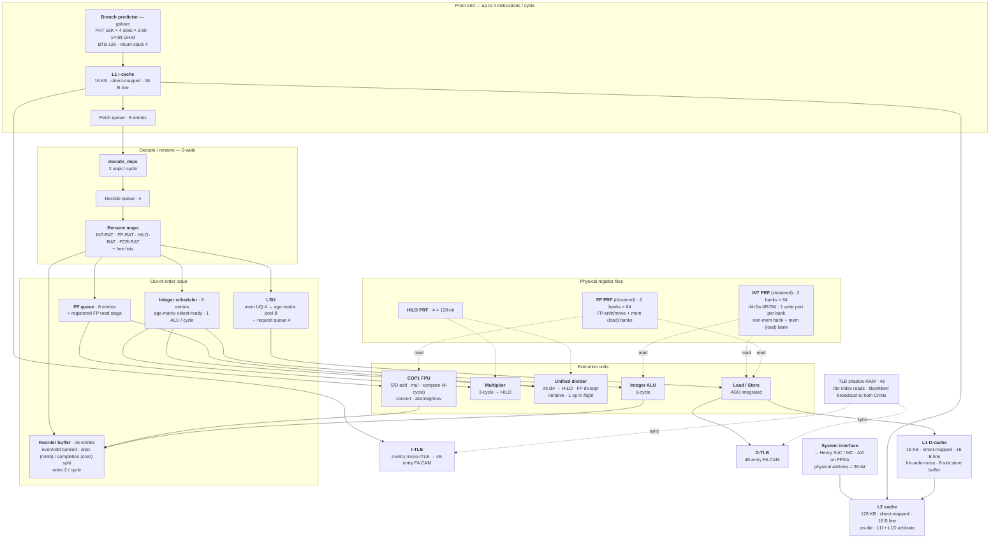

# r9999 microarchitecture

*The CPU at the center of Henry. `r9999` is an **out-of-order, superscalar MIPS** core — its name is a wink at the **R10000** (`9999 = 10000 − 1`), and its shape is deliberately R10000-flavored: register renaming, a reorder buffer, out-of-order issue, separate integer/FP register files. But it implements the **MIPS III** ISA and presents itself as an **R4400** (so IRIX/Indy runs the right path), it decodes, renames and retires **2 instructions/cycle** instead of 4, and it's tuned to **fit and close timing on an FPGA**.*

This page is the r9999 answer to the **R10000 block diagram (Fig. 1-5)** from the MIPS R10000 User's Manual — written in the spirit of [maizure.org's reverse-engineering writeups](https://www.maizure.org/projects/evolution_x86_context_switch_linux/). Every number below is from the RTL in the [`r9999`](https://github.com/dsheffie/r9999) submodule (canonical, non-`FORMAL` config, submodule @ `5c89b70`); `machine.vh` is the parameter header.

## Block diagram


```mermaid
flowchart TD
    SYS["<b>System interface</b><br/>→ Henry SoC / MC · AXI on FPGA<br/>physical address = 36-bit"]
    L2["<b>L2 cache</b><br/>128 KB · direct-mapped · 16 B line<br/>on-die · L1I + L1D arbitrate"]
    SYS --- L2

    subgraph FE["Front end — up to 4 instructions / cycle"]
        BP["<b>Branch predictor</b> — gshare<br/>PHT 16K × 4 slots × 2-bit · 14-bit GHist<br/>BTB 128 · return stack 4"]
        L1I["<b>L1 I-cache</b><br/>16 KB · direct-mapped · 16 B line"]
        FQ["Fetch queue · 8 entries"]
        BP --> L1I --> FQ
    end

    subgraph REN["Decode / rename — 2-wide"]
        DEC["<b>decode_mips</b><br/>2 uops / cycle"]
        DQ["Decode queue · 4"]
        MAP["<b>Rename maps</b><br/>INT-RAT · FP-RAT · HILO-RAT · FCR-RAT<br/>+ free lists"]
        DEC --> DQ --> MAP
    end

    subgraph OOO["Out-of-order issue"]
        ROB["<b>Reorder buffer</b> · 16 entries<br/>even/odd banked · alloc (mrob) / completion (crob) split<br/>retire 2 / cycle"]
        ISCH["<b>Integer scheduler</b> · 8 entries<br/>age-matrix oldest-ready · 1 ALU / cycle"]
        MQS["<b>LSU</b><br/>mem UQ 4 → age-matrix pool 8<br/>→ request queue 4"]
        FQS["<b>FP queue</b> · 8 entries<br/>+ registered FP read stage"]
    end

    subgraph PRF["Physical register files"]
        IPRF["<b>INT PRF</b> (clustered) · 2 banks × 64<br/>rf4r2w 4R/2W · 1 write port per bank<br/>non-mem bank + mem (load) bank"]
        FPRF["<b>FP PRF</b> (clustered) · 2 banks × 64<br/>FP-arith/move + mem (load) banks"]
        HILO["<b>HILO PRF</b> · 4 × 128-bit"]
    end

    subgraph EXU["Execution units"]
        ALU["<b>Integer ALU</b><br/>1-cycle"]
        MUL["<b>Multiplier</b><br/>3-cycle → HILO"]
        DIV["<b>Unified divider</b><br/>int div → HILO · FP div/sqrt<br/>iterative · 1 op in flight"]
        LSU["<b>Load / Store</b><br/>AGU integrated"]
        FPU["<b>COP1 FPU</b><br/>S/D add · mul · compare (4-cycle)<br/>convert · abs/neg/mov"]
    end

    ITLB["<b>I-TLB</b><br/>2-entry micro-ITLB → 48-entry FA CAM"]
    DTLB["<b>D-TLB</b><br/>48-entry FA CAM"]
    TSH["TLB shadow RAM · 48<br/>tlbr index reads · tlbwi/tlbwr broadcast to both CAMs"]
    L1D["<b>L1 D-cache</b><br/>16 KB · direct-mapped · 16 B line<br/>hit-under-miss · 8-slot store buffer"]

    FQ --> DEC
    MAP --> ROB
    MAP --> ISCH
    MAP --> MQS
    MAP --> FQS
    ISCH --> ALU
    ISCH --> MUL
    ISCH --> DIV
    MQS --> LSU
    FQS --> FPU
    FQS --> DIV
    IPRF -.->|read| ALU
    IPRF -.->|read| LSU
    FPRF -.->|read| LSU
    FPRF -.->|read| FPU
    HILO -.-> MUL
    HILO -.-> DIV
    FPU --> ROB
    ALU --> ROB
    LSU --> L1D
    LSU --> DTLB
    L1I --> ITLB
    L1I --> L2
    L1D --> L2
    TSH -.->|sync| ITLB
    TSH -.->|sync| DTLB
```

## Walking the pipeline

**Front end.** Each cycle the **gshare** predictor indexes a **16K-entry pattern-history table** by XORing a **14-bit global history** (history length = index width, `GBL_HIST_LEN = LG_PHT_SZ`) with the PC; each PHT entry packs **four 2-bit counters**, one per instruction slot of a 16 B fetch line (128 Kbit total). A **128-entry BTB** and a **4-entry return stack** complete the predictor; speculative *and* architectural copies of the history/RAS are kept so a misprediction restarts cleanly. (An earlier 64-bit history folded into the index tripled mispredicts on `compress` and was dropped — see the comment above `GBL_HIST_LEN` in `machine.vh`.) The **L1 I-cache** (16 KB, direct-mapped, 16 B lines) pushes **up to four instructions per cycle** — the rest of the line up to the first control transfer — into an **8-entry fetch queue**, which feeds decode two at a time. *(`l1i.sv` — `compute_pht_idx`, the `t_push_insn{,2,3,4}` paths; `machine.vh`)*

**Decode / rename (2-wide).** `decode_mips` cracks up to two instructions into uops; a **4-entry decode queue** buffers them for the allocator, which renames through four maps — **integer**, **FP**, **HILO**, and the FP condition-code (**FCR**) RATs with free lists — onto the physical register files. *(`decode_mips.sv`, `core.sv`)*

**Out-of-order issue.** Renamed uops allocate into a **16-entry reorder buffer**, banked even/odd so the two entries allocated (or retired) in a cycle always land in different banks → 2 allocate and 2 retire per cycle. The ROB's storage is further split rv64core-style into **alloc-only fields** (`mrob_entry_t`, one write port per bank, no reset → LUTRAM) and **completion-written fields** (`crob_entry_t`, multi-ported flops); `rob_merge` presents the union to readers. Integer ALU ops wait in an **8-entry scheduler** that picks the **oldest ready** entry via an age matrix. Memory ops go through an in-order **mem uop queue (4)** into the **LSU** (below), and FP-compute ops flow through a separate **8-entry FP queue** with a registered FP read stage feeding the COP1 FPU (or the divider, for div/sqrt). *(`core.sv` — `r_rob_even/odd`, `r_mrob_even/odd`; `exec.sv`)*

**Memory pipeline (LSU, non-blocking L1D).** The LSU is an **8-entry age-matrix pool** (`LG_MEM_SCHED_ENTRIES=3`) behind the mem uop queue. Simple loads stay in the pool until answered; plain stores do their **address pass at issue** (translation, fault check, PA/mask recorded in the L1D-side **store buffer**, one slot per LSU entry), capture their data separately, and are **written to the cache in program order after they retire**. A younger load compares its PA against the older stores' store-buffer slots and **forwards from the youngest fully covering store**; partial overlaps block the load until the store drains. Merge loads/stores (`lwl/lwr/ldl/ldr`, `swl/swr/sdl/sdr`) and `sc/scd` are LSU ops too (SC issues only when oldest). The **L1D** serves **hits under an outstanding miss** (port 2 keeps running while a fill is in flight), returns fill data straight to the owning load, and parks misses/conflicts in an **8-entry retry queue** (MRQ). Loads that are uncacheable — by segment *or* by the matched TLB entry's `C` attribute — are released by the MRQ only when non-speculative (at the ROB head, or the head's committable delay slot). Wrong-path memory ops are dropped by a 1-bit **restart color** rather than waited out, so a flush only waits for non-memory ops. CACHE hit-type ops (`Hit-Invalidate`/`Hit-WB-Invalidate`/`Hit-WB` on the D-side) are LSU ops translated through the D-TLB and admitted only at the ROB head. *(`exec.sv` LSU block; `l1d.sv` — store buffer `r_sb_*`, MRQ `r_mem_q`; `machine.vh`)*

**CP0 ordering.** CP0 writes commit **at retire**, not at execute: `mtc0`/`dmtc0` stage `{data, reg, 64-bit}` in a ROB-indexed buffer (`exec.sv r_cp0_stage_*`) that `core.sv` commits when the writer retires (a CP0 writer retires alone), so a wrong-path, squashed or nullified `mtc0` never changes CP0. All CP0 accesses are **totally ordered** as if CP0 were one renamed register: writers (`MTC0/DMTC0/TLBP/TLBR`) bump an allocation and a retirement sequence number, and readers (`MFC0/DMFC0/TLBR/TLBWI/TLBWR/TLBP/ERET`) snapshot the allocation sequence and issue once the committed sequence catches up. `mfc0` is therefore no longer oldest-first; `mtc0` to registers only software reads (`Index`, `EntryLo0/1`, `Context`, `PageMask`, `EPC`, `XContext`, `ErrorEPC`, the console reg) is a plain pipelined op, while writes to registers the machine consumes implicitly (`Status`, `EntryHi`, `Config`, `Cause`, `Count`, `Compare`, `Wired`, Watch) still serialize. *(`core.sv` — `r_cp0_alloc_seq`/`r_cp0_retire_seq`; `exec.sv`)*

**Misprediction / exception recovery — no RAT checkpoints.** r9999 keeps two rename maps per register class: the speculative **allocation RAT** and a **retirement RAT** that follows the committed architectural map. On a branch mispredict or exception it does **not** roll back to a per-branch snapshot. Instead the machine **drains** (state `DRAIN`): younger uops are squashed and it waits for the offending op to reach the head of the 16-entry ROB — at which point the *retirement* RAT already holds the correct map. It waits only for in-flight **non-memory** ops (dead memory ops are left to finish and their responses are discarded by restart color), then copies **retirement RAT → allocation RAT** in a single cycle (state `RAT`: `r_alloc_rat <= t_rat_copy ? r_retire_rat : …`, and likewise for FP/HILO/FCR) and restarts fetch. No checkpoint storage, no finite-checkpoint allocation stall, and the *same* path handles both mispredictions and exceptions. *(`core.sv` — `DRAIN → RAT → ACTIVE` state machine, `t_rat_copy`)*

!!! note "Why skipping RAT checkpoints is fine"
    This was a **design judgment**, not a derived result. Per-branch **RAT checkpointing** — snapshot the logical→physical map, restore it in one cycle, and reclaim the physical registers allocated since — is fundamentally a **PRF-machine technique** (the R10000 is the classic example). Intel's **"data-in-ROB" P6 and Nehalem** can't use it: with no physical register file, speculative values live in ROB entries, so recovery instead falls out of rolling the ROB tail back and restoring the map from the retirement (committed) state. r9999 *is* PRF-based — so the R10000-style checkpoint scheme was on the table — but it deliberately borrows the **data-in-ROB-style restore-from-retirement** recovery (drain to commit, copy retirement RAT → allocation RAT), a ballpark call from P6/Nehalem experience that the modest drain latency is fine.

    **Henry Wong's thesis** gives the matching quantitative corroboration — *A Superscalar Out-of-Order x86 Soft Processor for FPGA*, U. Toronto 2017 (Ch. 7, Register Renaming). Two advantages over checkpoints: **one mechanism covers both branch mispredictions and exceptions**, and there's **no cap on outstanding branches** (checkpoints are finite — the R10000 stalls when it runs out). The drawback — recovery isn't instantaneous; the bad branch must commit first — he measures at only **~2.3 % of cycles (≈ 4 clocks per pipeline flush)**, and that's an *upper bound* (the core is usually still retiring useful older work). It stays small because branches **resolve in program order** (mispredicts detected near commit) and a **long front end** delays corrected-path instructions until after the drain.

**Register files (clustered).** The integer PRF is a **clustered (banked) register file** (`rf4r2w`, 4 read / 2 write): it's split into **two single-write-port banks** selected by the high bit of the physical-register number — a **non-memory bank** written by ALU/move results (write port 0) and a **memory bank** written by load results (write port 1). That's the whole reason the physical-register count is large: **2 banks × 64 = 128**, not a deep rename window. It's the FPGA-friendly way to get two write ports per cycle out of plain single-write-port RAMs (a Henry-Wong-style clustered RF) instead of paying for a true multi-write-port file. The **FP PRF** (`fp_regfile.sv`) is banked the same way (bank 0 = FP-arithmetic and move results, bank 1 = FP loads, selected by the physical-reg MSB, with a registered read stage), the **FCR** (FP condition codes) has its own 4-entry rename domain, and a small **4 × 128-bit HILO PRF** holds multiply/divide results. The effective rename window is still bounded by the **16-entry ROB**. *(`rf4r2w.sv` — "Clustered (banked) register file"; `fp_regfile.sv`; `exec.sv`)*

**Execution units.** One **integer ALU** (1-cycle), a **3-cycle pipelined multiplier** (`MUL_LAT=3`), a **unified iterative divider** (`uni_divider.sv`, instance `d0`) and a **load/store unit** with address generation folded in (no separate AGU stage) feeding the L1 D-cache. The unified divider runs integer `div/divu/ddiv/ddivu` (writing the HILO PRF; a coarse leading-zero skip of 8/16/32 steps keeps small divides short, worst case reserved as `DIV32_LAT = 66` cycles) **and IEEE single/double `DIV` and `SQRT`** on one shared restoring recurrence, one op in flight; FP div/sqrt pop from the FP queue only when the unit is free and drain into the FP writeback port. The **COP1 FPU** proper is a unified single/double **`fpu_add`** (add+sub) and **`fpu_mul`** (mul) — the format bit selects S/D, **fixed 4-cycle latency** (`FPU_LAT=4`), FCSR.RM rounding — plus a unified **`fpu_compare`** (all 16 `C.cond` predicates, writes the FCR condition-code bit), single-cycle **abs/neg/mov**, and a single-cycle **convert path** (`fpu_f2f`/`fpu_f2i`/`fpu_i2f`: `CVT.S.D`/`CVT.D.S`, `CVT.{W,L}.{S,D}` with ROUND/TRUNC/CEIL/FLOOR, and `CVT.{S,D}.{W,L}`). The datapaths are **normalized-only**: a denormal operand or an underflowing result raises the **Unimplemented-Op (E)** bit, which traps as an **FP Exception** (`ExcCode 15`, `FCSR.Cause.E`) so the OS soft-float emulator finishes the op; a catch-all `FP_UNIMPL` uop does the same for any COP1 op not decoded in hardware (trap-and-emulate rather than `SIGILL`). The core reports an R4000-family FPU id (`FIR = 0x500`). *(`exec.sv`, `fpu.sv`, `fpu_add.sv`, `fpu_mul.sv`, `fpu_compare.sv`, `fpu_f2f.sv`, `fpu_f2i.sv`, `fpu_i2f.sv`, `mul.sv`, `uni_divider.sv`)*

**FP exceptions and control.** `Status.CU1` (R/W, resets 0) gates the FPU for **lazy context switch** — a COP1 op with `CU1=0` raises **Coprocessor-Unusable** (`Cause.CE=1`). `Status.FR` (R/W, resets 1) selects the register mode: **FR=1** (`n32`/`n64`, 32×64-bit) is the full path; **FR=0** (`o32`) is handled by decode-force — odd-register compute and doubleword ops become **Reserved Instruction**, while single-word `lwc1`/`swc1`/`mtc1`/`mfc1` do a half merge/extract through the even register. The IEEE flags `{V,Z,O,U,I}` (and the denorm-operand/result → E flag, which **always** traps) are carried ROB-side-band with each result: on a trap they set `FCSR.Cause`, otherwise they OR into the sticky `FCSR.Flags` at retire. FP moves (`mtc1`/`mfc1`, `dmtc1`/`dmfc1`, `cfc1`/`ctc1` with `FCR0=FIR`, `FCR31=FCSR`) and FP load/store (`lwc1`/`swc1`, `ldc1`/`sdc1`) round out the path; FP branches `BC1T`/`BC1F`/`BC1TL`/`BC1FL` read the FCR condition-code bit and resolve in the integer pipe. *(`decode_mips.sv`, `exec.sv`, `fpu.sv`, `uop.vh`)*

**Memory & translation.** L1 D-cache is 16 KB direct-mapped (16 B lines); L1I and L1D arbitrate for a shared **on-die 128 KB direct-mapped L2**, which fronts the **system interface** out to the Henry SoC / memory controller (AXI on the FPGA), with **36-bit physical addresses** (`PA_WIDTH=36`). Translation presents the R4x00 **48-entry fully-associative TLB** (dual-page even/odd, **variable page size 4 KB–16 MB via `PageMask`**, 8-bit ASID, global bit) — but it is **not** a single shared joint TLB. r9999 **duplicates the CAM per L1 cache** — an **I-TLB** in `l1i` and a **D-TLB** (`dtlb`) in `l1d` — so instruction fetch and load/store translate **in parallel** without contending for one structure, and keeps them coherent by **broadcasting every `tlbwi`/`tlbwr` to both CAMs** (`core_l1d_l1i.sv`). Because a content-addressed CAM can't be read by index, a separate **48-entry RAM shadow** (`r_shadow_tlb` in `exec.sv`) holds the entries so the index-addressed instructions — `tlbr` in particular — can read them back. The I-side additionally puts a small **2-entry micro-ITLB** (`itlb.sv`, `N_UITLB_ENTRIES=2`) in front of its CAM for a fast translation hit; it caches each entry's `PageMask` and reuses the CAM's masked compare, so large instruction pages translate correctly. The D-side is the bare 48-way CAM, driven from the request as it is presented to the L1D so the port-2 accept decision stays off the CAM path. *(`l1i.sv`, `l1d.sv`, `itlb.sv`, `tlb.sv`, `exec.sv`, `core_l1d_l1i.sv`)*

## r9999 vs. the R10000 it's named after

| | **R10000** (1996) | **r9999** |
|---|---|---|
| ISA | MIPS IV (R10000) | MIPS III, **presents as R4400** (`PRId 0x0440`) |
| Fetch / decode / issue / retire | 4-wide | fetch **up to 4**/cycle into an 8-entry queue; decode, rename, retire **2-wide** |
| Branch prediction | 512-entry 2-bit BHT | **gshare**: 16K × 4 × 2b PHT (128 Kbit), 14-bit GHist, 128 BTB, 4 RAS |
| Physical registers | 64 int + 64 FP (true multiport RF) | **128 int + 128 FP** (clustered: 2 banks × 64) + 4 HILO + 4 FCR |
| In-flight window | 32 (active list) | **16 (ROB)** |
| Mispredict / exception recovery | per-branch **RAT checkpoints** (finite → caps outstanding branches) | **copy committed RAT after drain** — no checkpoints; one path for mispredict + exception |
| Issue queues | 3 × 16 (address / integer / FP) | 8-entry integer scheduler + 8-entry LSU pool + 8-entry FP queue |
| Load/store | address queue, non-blocking | **LSU** with store buffer + store→load forwarding, hit-under-miss L1D, stores written after retire |
| Functional units | 2 ALU + addr-calc + FP add + FP mul | **1 ALU + mul + unified int/FP divider + load/store + COP1 FPU** (unified S/D add + mul + compare + convert; abs/neg/mov) |
| L1 I / D | 32 KB 2-way each | **16 KB direct-mapped each** |
| L2 | off-chip, 512 KB–16 MB, dedicated controller | **on-die 128 KB direct-mapped** |
| TLB | 64-entry, single shared | **48-entry FA CAM, duplicated per L1** (I-TLB + D-TLB) + RAM shadow + 2-entry micro-ITLB; R4x00-style software model |
| Register width / FPU | 64-bit · full pipelined FPU | 64-bit · **COP1 FPU**: unified S/D add + mul + compare + full convert set (4-cycle arith) + moves/ld-st/branches; **div/sqrt on the shared iterative divider**; denormals trap to soft-float via an Unimplemented-Op (E) trap |

## Why it diverges from the R10000

- **It's an R4x00 *ISA* target, not an R10000.** IRIX's `/unix` branches on `PRId.IMP` in `start`. r9999 presents an **R4400** (imp `0x04`, rev `0x40`): an earlier R4600 setting (imp `0x20`) was used to dodge what turned out to be a since-fixed TLB bug, and the R4400 is preferred because IRIX honors its `Config.DB` bit and manages **16-byte L1 lines** to match r9999's (`LG_L1D_CL_LEN=4`), whereas the R4600 path hardcodes 32-byte lines (see the comment above `PRID_VALUE` in `machine.vh`). The **48-entry TLB** mirrors the R4x00 (not the R10000's 64), which is also what IRIX's `wirepda`/refill code expects.
- **It's built for an FPGA.** 2-wide decode/retire instead of 4, **direct-mapped** caches, and a modest on-die L2 keep LUT/BRAM/timing in budget on the Ultra96-v2 (Zynq UltraScale+). Conversely the **gshare PHT is much larger** than the R10000's BHT — block RAM is cheap on FPGA, so prediction accuracy is bought with BRAM rather than logic.
- **The big physical-register counts are a clustered RF, not a deep window.** 128 INT / 128 FP physical registers = **2 banks × 64**. Each register file is split into two single-write-port banks (non-memory results vs memory/load results), selected by the preg-number MSB, so the core gets two write ports per cycle from cheap single-write-port FPGA RAMs instead of a true multi-write-port file. The architectural rename window is still gated by the **16-entry ROB** — the count is an implementation artifact of the banking, not extra in-flight capacity.
- **No RAT checkpoints — even though it's a PRF machine.** RAT checkpointing is a PRF-machine technique, so the R10000-style scheme was available to r9999 — but it instead drains to the ROB head and restores the map from the retirement RAT, the data-in-ROB-style (P6/Nehalem) recovery chosen from experience and corroborated by Wong (Ch. 7). See the rename-recovery note above.
- **The FPU shares one iterative divider with the integer side.** Unified single/double `fpu_add`/`fpu_mul` (4-cycle), a unified `fpu_compare`, single-cycle abs/neg/mov, and the full single-cycle convert path are pipelined datapath; **div and sqrt run on `uni_divider`**, the same restoring recurrence that does integer division (one op in flight), instead of a dedicated pipelined FP divide/sqrt like the R10000's. Before that unit existed every FP div/sqrt trapped to the OS emulator; now only **denormal** operands/results (and any COP1 op not decoded in HW) raise the **Unimplemented-Op (E)** bit and trap to soft-float. `Status.CU1` gives lazy-FPU context switching and `Status.FR` selects n32/n64 (FR=1) vs o32 (FR=0, decode-forced); the core reports an R4000-family FPU id so software probes succeed. Validation at FPU bring-up: `tests/fpu/*` co-sim clean, the FPU-enabled IP22 Linux kernel boots to `/init` under lazy-FPU, and an `awk` double-precision self-test runs correctly on Henry **silicon**. Current area/timing is on the [FPGA stats](fpga_stats.md) page.

!!! note "FPGA timing bottleneck"
    In most of the mid-2026 Ultra96-v2 builds the critical path was the **fully-associative 48-entry TLB CAM** behind instruction fetch (icache → 48-way ITLB match → `pa`), route-dominated. The 48-entry size is fixed by the architecture, so the fix was the **2-entry micro-ITLB** in front of the I-side CAM. As of the current bitstream (r9999 `5c89b70`, **WNS +0.120 ns @ 100 MHz**) the worst path is inside the **L1D port-2 pipeline** — `dcache/r_req2` → store-buffer/data-array select → D-TLB-dependent response/block decision → tag-RAM address → `r_hit_busy_addr` (35 logic levels, ~67 % route). The previous bitstream (`94e5e97`, WNS +0.177 ns) was limited by the micro-ITLB fast path (`icache/insn_array` → `r_ufast_pa`). See [FPGA stats](fpga_stats.md).

---

## Branch delay slots and the control FSM

The single biggest ISA difference between r9999 (MIPS) and its sibling RISC-V soft core `rv64core` isn't register width or opcodes — it's one architectural rule: **in MIPS the instruction after a branch (the *delay slot*) always enters the pipeline, and on a taken branch it executes *before* control reaches the target.** RISC-V has no such rule. That one rule is why r9999's primary control FSM (`core.sv`) carries a cluster of states `rv64core` simply doesn't have:

| Concern | r9999 states | rv64core |
|---|---|---|
| The delay slot itself | handled inside **`DRAIN`** (`r_ds_done`); a `DELAY_SLOT` enum value is declared but never entered | — |
| Precise exceptions with EPC + BD bit | **`ARCH_FAULT` → `WRITE_EPC` → `EXCEPTION_DRAIN`** | folded inline into `ACTIVE` → `DRAIN` |
| A redirecting branch whose serializing delay slot is not yet allocated | **`SERIALIZE_IN_FAULTED_DELAY_SLOT`, `WAIT_FOR_SERIALIZE_IN_FAULTED_DELAY_SLOT`** | — |

`rv64core` spends its "extra" states on RISC-V concerns instead — `WAIT_FOR_CSR_WRITE`, `WAIT_FOR_MMU`, and a legacy syscall-emulation monitor path — none of which touch control flow. Every corner case below is a place where r9999's FSM must do something the RISC-V machine never thinks about.

**1. The branch and its delay slot are one atomic unit.** When a branch reaches the ROB head needing a redirect, r9999 doesn't just restart — it captures the branch's metadata (`n_has_delay_slot`, `n_take_br`, `n_restart_pc`) and enters `DRAIN`, and `head_of_rob_ptr_valid` is held true in `DRAIN` *only while `!r_ds_done`* so the delay slot can still retire. The pair commit together (`retire`/`retire_two`); you can never retire the branch and squash its slot. `rv64core`'s branch path is one line — `n_restart_pc = t_rob_head.target_pc` — retire, redirect, done.

**2. Misprediction recovery must preserve the slot.** r9999 recovers `ACTIVE → DRAIN → RAT → ACTIVE` (the no-checkpoint recovery described above): it drains younger work *but lets the delay slot through*, then copies the retirement RAT back. The squash boundary is "after the delay slot," not "after the branch." In `rv64core` the boundary is simply "after the branch" — there's nothing in between.

**3. Branch-likely nullification.** MIPS `beql`/`bnel`/… *nullify* their delay slot when the branch is **not** taken. r9999 marks these `has_nullifying_delay_slot`, and `DRAIN` encodes the rule directly: if `r_take_br` the slot retires (`t_retire`) once it completes; if not, `t_retire` stays 0, the slot is dropped **without waiting for it to complete**, and `head_of_rob_ptr_valid` is withheld from it so an oldest-first op there (`tlbwr`, an uncached access, …) can never execute its side effect — `n_ds_done` is set either way. RISC-V has no branch-likely, so `rv64core` has no nullify concept at all.

**4. A fault in the delay slot blames the branch.** The famous one. In `ARCH_FAULT` → `WRITE_EPC`, r9999 computes `n_epc = in_delay_slot ? (pc − 4) : pc` and sets `n_exc_in_delay = in_delay_slot` — **EPC points at the branch, and `Cause.BD` is set.** On `eret` the kernel re-executes the branch, which re-executes the slot. `rv64core` writes `n_epc = t_mrob_head.pc` — always the faulting instruction's own PC, no BD bit, no `−4`. (This BD/EPC handling, and gating EPC on `Status.EXL` for nested refills, is exactly the bug class from `MAME_QUESTIONS` Q5 / round-7.)

**5. A branch *in* a delay slot — architecturally UNPREDICTABLE — is given a defined answer.** When the head instruction is itself in a delay slot, r9999 restarts to `r_last_branch_target` rather than its own `target_pc`: `n_restart_pc = in_delay_slot ? r_last_branch_target : t_rob_head.target_pc`. The *outer* branch wins; the inner branch's target is discarded. Tellingly, this exact ternary appears in **four** states — `ACTIVE`, `DRAIN` (a faulting delay slot), `WAIT_FOR_SERIALIZE_AND_RESTART`, and `CACHE_FLUSH` — every place a redirect is produced. `grep` for `in_delay_slot`/`last_branch_target` in `rv64core/core.sv` returns nothing.

**6. The exception boundary can't fall between the pair.** You may not take an interrupt or fault *between* a branch and its delay slot. r9999 enforces this at allocation: with a fault pending, the alloc condition is gated by `r_pending_fault ? r_in_delay_slot : 1'b1` — only the delay slot may still be allocated, nothing past it — so the machine resolves the pair before redirecting to a vector. `n_in_delay_slot` is threaded through rename from the just-allocated branch's `has_delay_slot`. `rv64core`'s alloc has no such guard.

**7. When the branch must redirect but its slot hasn't been allocated yet.** A serializing op (`mtc0`/`dmtc0` to a register the machine consumes implicitly) is held in the decode queue until the ROB is empty. If the branch ahead of it reaches the ROB head needing a redirect (`faulted` — e.g. a mispredict) while that serializing delay slot is still in the decode queue, the pair can't commit together. r9999 routes this through `SERIALIZE_IN_FAULTED_DELAY_SLOT` / `WAIT_FOR_SERIALIZE_IN_FAULTED_DELAY_SLOT`: allocate the slot alone, wait for it (`rob_next_head`) to complete, then resume the normal redirect. Two whole states exist solely for this ordering puzzle; `rv64core`, with no pair to order, has zero. (The "slot itself faulted" sub-case in the WAIT state is believed unreachable — the only serializing ops can't fault at execute — and carries a `//todo` in `core.sv`.)

**The tax.** r9999 needs a 3-state exception sequence (`ARCH_FAULT` → `WRITE_EPC` → `EXCEPTION_DRAIN`) where `rv64core` writes `epc`/`cause` inline and falls straight into `DRAIN`, plus two extra faulted-delay-slot states and delay-slot bookkeeping threaded through `DRAIN`, allocation and every redirect — all to honor one ISA rule. This is, literally, the control-complexity tax of branch delay slots that RISC-V was designed to avoid: a win for a scalar 5-stage R2000 pipeline, but on an out-of-order machine the delay slot turns every redirect, every exception, and every squash into a "…and the delay slot" special case.

## The TLB — translation datapath

r9999's MMU is a software-managed MIPS TLB: a **48-entry fully-associative JTLB**, instantiated **twice** — one copy in `l1i.sv` (the ITLB, fetch translation) and one in `l1d.sv` (the DTLB, load/store translation). Both are kept identical: every `TLBWR`/`TLBWI` broadcasts the written entry on `tlb_entry_out`/`tlb_entry_out_valid` (assembled in `exec.sv` from the CP0 staging regs) to **both** caches' `tlb_entry_in` ports, so one software write lands in both CAMs. The I-side puts a small **2-entry micro-ITLB** (`itlb.sv`, `N_UITLB_ENTRIES=2`) in front of its CAM — a fast path with LFSR-random replacement that caches each entry's `PageMask`, flushed on `TLBWI`/`TLBWR` and on an ASID change; the D-side is the bare 48-way CAM. Each CAM is the fully-associative match → priority encode → PFN mux; it was the design's worst timing path until the micro-ITLB took it off the fetch path (see the timing note above).

**Dual-page entries.** Each entry is a MIPS even/odd *pair*: one `VPN2` (page number, low bit dropped) plus two physical halves — `pfn0/v0/d0/c0/g0` (even) and `pfn1/v1/d1/c1/g1` (odd). **Variable page sizes (4 KB … 16 MB) are supported:** each slot stores `PageMask[24:13]`, the match ignores the masked VPN2 bits, and a size index selects which VA bit picks the even/odd half (`va[12]` for 4 KB) and how many VA bits pass through to the PA. `PageMask` reads back what was written (it is **not** RAZ/WI). The same masked compare and size mux are reused by the micro-ITLB.

### Two-stage lookup (and why conflating the stages bites)

A MIPS TLB lookup is **two independent stages**:

1. **Match** — does any slot's `(VPN2, R, ASID/Global)` equal the VA's? In `tlb.sv`:
   ```
   w_hit8k[i]         = (((r_tlb[i].vpn[26:0] ^ va[39:13]) & {15'h7fff, ~r_tlb[i].pagemask[11:0]}) == 27'd0)
                        & (r_tlb[i].r == va[63:62]);
   w_addr_space_match = (r_tlb[i].asid == asid) | (r_tlb[i].g0 & r_tlb[i].g1);
   w_hits[i]          = w_addr_space_match[i] & w_hit8k[i] & r_tlb_written[i];
   ```
   The compare is the **full** `VPN2 = va[39:13]` (27 bits, minus the `PageMask`-masked low bits) **plus region `R = va[63:62]`**, matching the Sail spec (`mips_tlb.sail tlbEntryMatch`) — not a 19-bit `va[31:13]` shortcut. **No match ⇒ TLB Refill.**
2. **Validity** — only *after* a match: the selected half's `V` (`va[12] ? v1 : v0` for 4 KB pages; a higher VA bit for larger pages). `V=0 ⇒ TLB-Invalid`; a store with `D=0 ⇒ TLB-Modified`; else `PA = {pfn, page offset}`.

The point that bites: **Refill ("no slot for this page") and Invalid ("slot exists but page not present") are different exceptions with different handlers.** Refill = "go look it up"; Invalid = "I have a slot marked not-present, go fault it in."

### The `r_tlb_written` slot bit (= Sail `entry.valid`)

A slot is matchable **once software has written it** (`TLBWR`/`TLBWI`), tracked by a per-slot `r_tlb_written` bit (set on write, cleared at reset) — **not** by `(v0|v1)`. This is load-bearing because **demand paging installs both-pages-invalid entries**: the refill handler, finding a not-yet-present PTE, does `tlbwr` with `v0=v1=0` (real VPN, zero PFN). That entry **must still match** so the retry takes **TLB-Invalid → `do_page_fault`**, which allocates the page; the next refill then installs `V=1`. The canonical first-touch of a user page:

```
fetch 0x120000230 → no slot     → Refill → tlbwr v0=v1=0 (PTE absent)
retry             → slot matches → V=0    → TLB-Invalid → do_page_fault (allocate)
retry             → Refill       → tlbwr V=1 (real PFN) → fetch hits → process runs
```

An earlier match used `& (v0|v1)` instead of `& r_tlb_written` — a cheap "is this slot real?" guard against power-on garbage VPNs. It worked for valid entries but **excluded the demand-paging `v0=v1=0` entry**, so the Invalid stage never fired: the retry re-refilled forever, `do_page_fault` was never reached, and the first user page was never allocated — an **infinite-refill livelock** that blocked Linux/IRIX from running `/init`. (Found by tracing `interp_mips` — which *does* map the page — and an RTL `[tlbinstall]` probe that showed `v0=0 v1=0` installs at the right `vpn=0x90000` that never matched.)

The fix splits the two meanings exactly as Sail does: `entry.valid` (`mips_tlb.sail:71`, set on every TLB write at `mips_insts.sail:1749`) gates the **match**, while per-page `v0/v1` drive the **Invalid** exception. `r_tlb_written` *is* `entry.valid`. It is a model/implementation bit, **not** an architectural register field — the R4400 manual has only `V0/V1`. Real hardware avoids needing it by requiring software to `tlb_init` all 48 slots to non-matching values at boot; r9999 carries the bit instead, so correctness can't be defeated by a forgotten init in firmware or a bare-metal test. **Timing-free:** a single flop bit replaces the `(v0|v1)` OR, so the critical CAM term stays a plain 3-input AND.

### CP0 state the refill handler reads (all must be full-width)

The IP22 kernel's runtime-generated XTLB refill handler is a **3-level page-table walk** reading three CP0 sources — a 32-bit truncation in any of them silently corrupts the walk:

| CP0 reg | r9999 contents | the handler uses it for |
|---|---|---|
| `BadVAddr` (8) | full 64-bit faulting VA (`dmfc0` returns `r_badvaddr`, not sign-extended) | PGD index (`BadVAddr>>27`) + PMD index (`BadVAddr>>18`) |
| `Context` (4) | `{PTEBase[31:23], BadVPN2=va[31:13], 0000}` (19-bit VPN2) | 32-bit-addressing PTE pointer |
| `XContext` (20) | `{XPTEBase[30:0], R[1:0], BadVPN2=va[39:13], 0000}` (27-bit VPN2) | 64-bit-addressing PTE index |

On any TLB fault, `save_to_tlb_regs` (asserted for **both** i-side fetch and d-side load/store misses, `core.sv`) auto-loads `EntryHi.VPN2 = core_badvaddr[39:13]`, `EntryHi.R = core_badvaddr[63:62]`, and `BadVPN2` — all full. The handler does **not** rewrite `EntryHi`; it relies on this auto-load, then only `dmtc0`s `EntryLo0/1` (the walked PTEs) before `tlbwr`. So the installed VPN comes entirely from the hardware auto-load.

### Vector selection

`core.sv` picks the refill vector by the **addressing mode of the faulting access**: the **XTLB** vector (`ebase+0x080`) when 64-bit addressing is active for that mode (`in_64b_kernel_mode | in_64b_supervisor_mode | in_64b_user_mode`), else the 32-bit **TLB** vector (`ebase+0x000`); both only when `EXL=0`. A nested miss (`EXL=1`) and TLB-Invalid/Modified fall to the general vector (`ebase+0x180`). n64 user processes run `UX=1`, so a user miss vectors to XTLB refill — which is why the handler reads `XContext`.

### Segment decode (`mipsseg.sv`)

Ahead of the CAM, `mipsseg` classifies the VA: **xkphys** (`va[63:62]=10`, needs `w_in_64b_mode`) → unmapped `PA=va[58:0]`; **xkuseg/xsseg/xkseg** (64-bit mode) → TLB-mapped; **32-bit compat** (sign-extended `va[63:32]=ffffffff`, or `!w_in_64b_mode`) → `kuseg/kseg0/kseg1/kseg2` by `va[31:29]`. `w_in_64b_mode = in_64b_kernel_mode | in_64b_supervisor_mode | in_64b_user_mode`, i.e. `(kernel & KX) | (supervisor & SX) | (user & UX)` (`exec.sv`). A mapped non-compat VA outside `SEGBITS` raises AdEL/AdES.

> **Doc note:** the older "match only the low-19-bit `VPN2` / ignore region" workaround (commit `e451d50`, described in [Cache, coherence & TLB](coherence-cache-tlb.md)) was **superseded** by the full Sail-conformant `va[39:13]+R` compare now in `tlb.sv`; the high-VA `wirepda` case it patched is handled correctly because `EntryHi` stores the full `VPN2`/`R` from the GPR (per Sail `MTC0`).

**TLB cacheability:** on the D-side the matched entry's `C` attribute decides cacheability of a mapped access (`C==3` cached, anything else uncached), and uncached-by-TLB loads are held until non-speculative (see the LSU paragraph above).

**Open TLB gaps:** the I-side ignores the TLB `C` attribute (instruction fetch is always cached) and has no out-of-range-PFN Address Error yet (`l1i.sv`: `cache_attr()`/`out_of_range()` left unconnected; the D-side has both).

---

*All structural facts above are from the r9999 RTL (`*.sv`) and `machine.vh`, canonical (non-`FORMAL`) configuration. The [IRIX boot flow](irix-boot-flow.md) page covers what this core *runs*; this page covers what it *is*.*
